# Agent 逻辑与主流程拆解

本文只描述当前仓库里已经存在、并且已经从代码与 `code-review-graph` 验证过的前后端主流程。

---

## 1. 前端主流程：`onboarding-handle`

`onboarding-handle` 是当前前端最大的社区，图谱里有 `166` 个节点，主体集中在 `frontend/src/components`，但真正的主链路会穿过页面层、上下文层、会话恢复层和视图层。

### 1.1 入口链路

当前入口顺序如下：

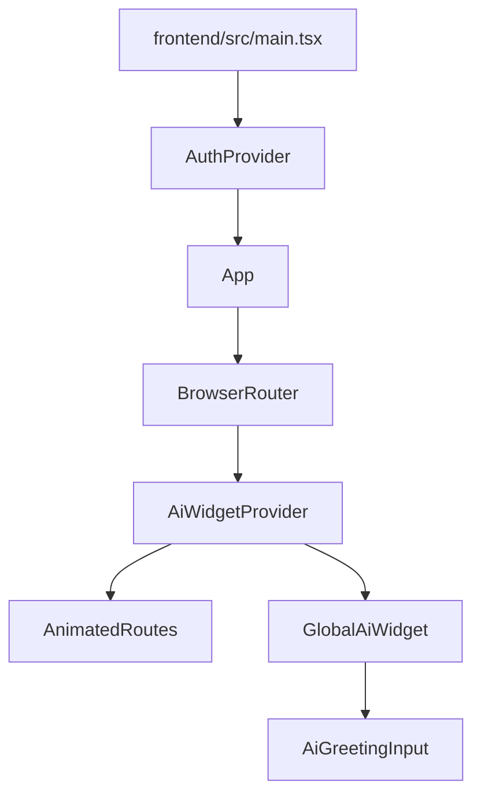
```mermaid
graph TD
  A["frontend/src/main.tsx"] --> B["AuthProvider"]
  B --> C["App"]
  C --> D["BrowserRouter"]
  D --> E["AiWidgetProvider"]
  E --> F["AnimatedRoutes"]
  E --> G["GlobalAiWidget"]
  G --> H["AiGreetingInput"]
```

对应文件：

- `frontend/src/main.tsx`
- `frontend/src/contexts/AuthContext.tsx`
- `frontend/src/App.tsx`
- `frontend/src/context/AiWidgetContext.tsx`
- `frontend/src/components/onboarding/GlobalAiWidget.tsx`
- `frontend/src/components/onboarding/AiGreetingInput.tsx`

这里还有一个当前代码里已经明确存在的总入口边界：

- `App`
  - 只负责建立：
    - `BrowserRouter`
    - `AiWidgetProvider`
    - `AnimatedRoutes + GlobalAiWidget`
- `AnimatedRoutes`
  - 负责把：
    - `/login`
    - `/onboarding`
    - `/sprout|/branch|/leaf|/forest|/canopy|/canvas`
    这些页面入口统一挂到一个路由切换点
  - 对 `/sprout|/branch|/leaf|/forest|/canopy|/canvas` 这组 app 路由，当前会统一使用 `routeKey = 'app'`
  - 这意味着这些页面之间切换时，动画分组和全局 AI 面板的宿主层不会因为 pathname 不同而被拆成多组入口

### 1.2 页面层

`AnimatedRoutes` 负责页面入口与主区域切换：

- `/login -> AuthPage`
- `/onboarding -> IcebreakerFlow`
- `MainLayout -> /sprout -> SproutPage`
- `MainLayout -> /branch -> BranchPage`
- `MainLayout -> /leaf|/forest|/canopy|/canvas`

其中与 `onboarding-handle` 主流程最相关的是 `SproutPage` 和 `BranchPage`。

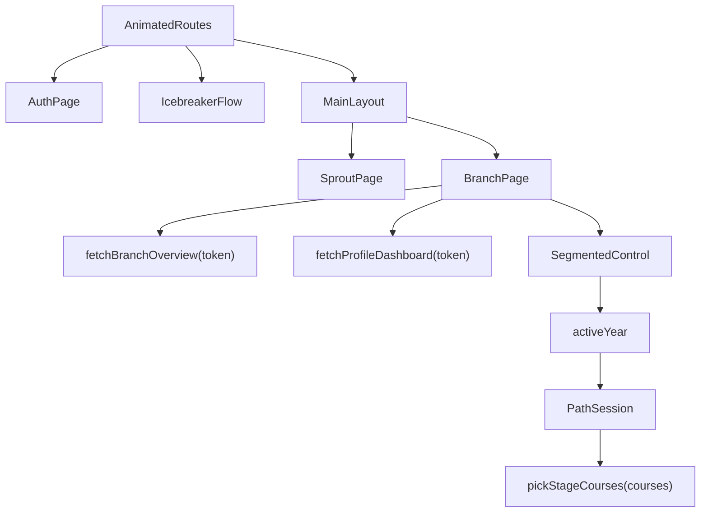
```mermaid
graph TD
  A["AnimatedRoutes"] --> B["AuthPage"]
  A --> C["IcebreakerFlow"]
  A --> D["MainLayout"]
  D --> E["SproutPage"]
  D --> F["BranchPage"]
  F --> G["fetchBranchOverview(token)"]
  F --> H["fetchProfileDashboard(token)"]
  F --> I["SegmentedControl"]
  I --> J["activeYear"]
  J --> K["PathSession"]
  K --> L["pickStageCourses(courses)"]
```

页面职责：

- `SproutPage` 负责首页主体和首次进入覆盖层。
- `BranchPage` 负责加载繁枝页真实路径总览、切换年级、并把每个年级的课程节点映射到同一套展示容器。

`BranchPage` 当前已经不再导入 `FreshmanView`、`SophomoreView`、`JuniorView`、`SeniorView` 这四个旧视图文件。当前真实关系如下：

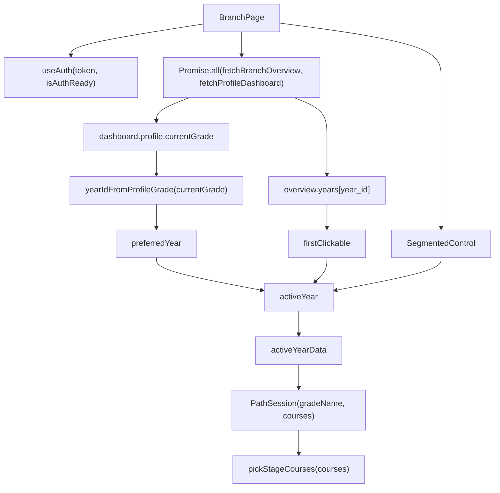
```mermaid
graph TD
  A["BranchPage"] --> B["SegmentedControl"]
  A --> C["useAuth(token, isAuthReady)"]
  A --> D["Promise.all(fetchBranchOverview, fetchProfileDashboard)"]
  D --> E["overview.years[year_id]"]
  D --> F["dashboard.profile.currentGrade"]
  F --> G["yearIdFromProfileGrade(currentGrade)"]
  G --> H["preferredYear"]
  E --> I["firstClickable"]
  H --> J["activeYear"]
  I --> J
  B --> J
  J --> K["activeYearData"]
  K --> L["PathSession(gradeName, courses)"]
  L --> M["pickStageCourses(courses)"]
```

这意味着 `BranchPage` 现在承担的是：

- 登录态门禁后的数据加载
- 并行读取繁枝页路径总览和首页画像 DTO
- 把 `profile.currentGrade` 精确映射为 `year_1` / `year_2` / `year_3` / `year_4`
- `activeYear` 切换
- `overview.years[year_id]` 到展示文案、课程节点、当前焦点的映射
- 单一 `PathSession` 模板下的年级切换动画
- 根据 `course.status` 和 `course.has_outline` 决定舞台中心节点与提示文案

当前默认年级选择规则已经由代码和页面测试确认：

1. 先读取 `/api/profile/dashboard` 返回的 `profile.currentGrade`
2. 用 `yearIdFromProfileGrade()` 做中文年级到 `year_*` 的映射
3. 如果映射成功，直接把该年级设为 `activeYear`
4. 如果映射失败，回退到 `overview.years` 里第一个 `is_clickable=true` 的年级
5. 如果一个可进入年级都没有，再回退到 `year_1`

这里有一个刚修过的真实 bug：

- 旧实现只会选“第一个可进入年级”
- 新实现会优先按 `profile.currentGrade` 定位默认年级
- 只有 `profile.currentGrade` 无法映射时，才退回到“第一个可进入年级”

这里还有一个当前实现边界已经确认：

- `is_clickable`
  - 表示“这个年级是否有课程路径，可不可以进入这个年级的路径舞台”
  - 当前只要求 `has_courses=true`
- `has_outline_content`
  - 表示“这个年级里是否已经有至少一门课存有课程大纲”
  - 只影响课程补充信息，不再阻止整个年级被点击进入

换句话说，当前 `BranchPage` 的真实语义是：

- 没有课程路径：整个年级不可进入
- 有课程路径但还没有课程大纲：年级仍可进入，路径舞台照常展示
- 有课程路径且已有课程大纲：年级可进入，并且部分课程节点会标记 `has_outline=true`

当前仓库里的 `frontend/src/pages/branch/views/FreshmanView.tsx`、`SophomoreView.tsx`、`JuniorView.tsx`、`SeniorView.tsx` 仍然存在，但知识图已经确认它们当前没有被任何文件导入。

`BranchPage` 当前真实读取链路如下：

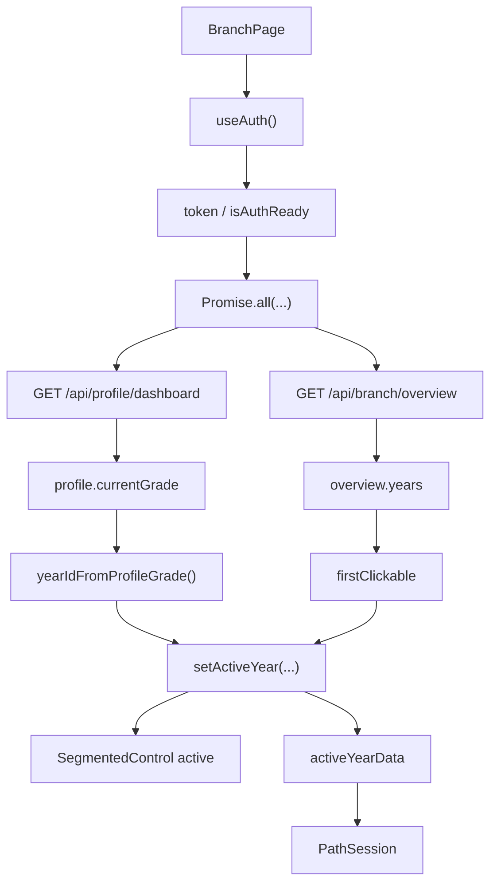
```mermaid
graph TD
  A["BranchPage"] --> B["useAuth()"]
  B --> C["token / isAuthReady"]
  C --> D["Promise.all(...)"]
  D --> E["GET /api/branch/overview"]
  D --> F["GET /api/profile/dashboard"]
  F --> G["profile.currentGrade"]
  G --> H["yearIdFromProfileGrade()"]
  E --> I["overview.years"]
  I --> J["firstClickable"]
  H --> K["setActiveYear(...)"]
  J --> K
  K --> L["SegmentedControl active"]
  K --> M["activeYearData"]
  M --> N["PathSession"]
```

### 1.3 上下文层

前端主流程依赖两个上下文：

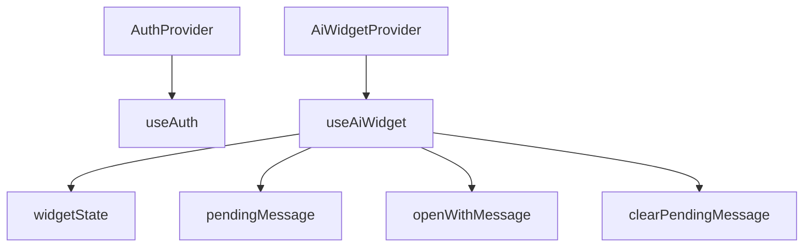
```mermaid
graph TD
  A["AuthProvider"] --> B["useAuth"]
  C["AiWidgetProvider"] --> D["useAiWidget"]
  D --> E["widgetState"]
  D --> F["pendingMessage"]
  D --> G["openWithMessage"]
  D --> H["clearPendingMessage"]
```

具体职责：

- `AuthProvider`
  - 从 `localStorage` 读取 `mutiagent-auth`
  - 提供 `user`、`token`、`isAuthReady`、`login()`、`logout()`
- `AiWidgetProvider`
  - 提供 `widgetState`
  - 提供 `pendingMessage`
  - 提供 `openWithMessage(text)`，它会把消息写入 `pendingMessage` 并切到 `EXPANDED`

这意味着：

- 登录态决定 AI 面板是否可见
- 页面组件并不直接发起对话，它们通过 `openWithMessage()` 把消息交给全局对话面板

### 1.4 页面到全局对话面板的桥接

`SproutPage` 这条链路目前最重要：

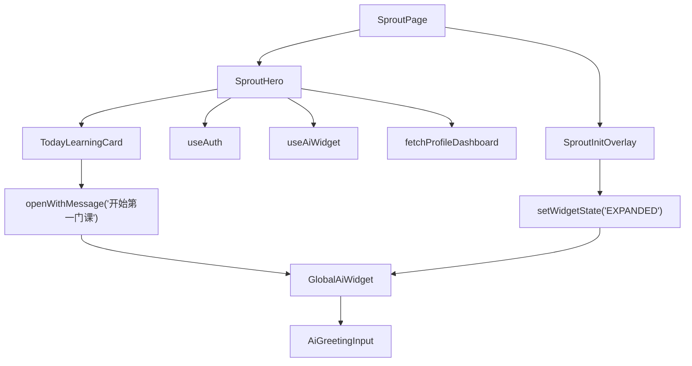
```mermaid
graph TD
  A["SproutPage"] --> B["SproutHero"]
  A --> C["SproutInitOverlay"]
  B --> D["useAuth"]
  B --> E["useAiWidget"]
  B --> F["fetchProfileDashboard"]
  B --> G["TodayLearningCard"]
  G --> H["openWithMessage('开始第一门课')"]
  C --> I["setWidgetState('EXPANDED')"]
  H --> J["GlobalAiWidget"]
  I --> J
  J --> K["AiGreetingInput"]
```

这里有两个重要入口：

- `SproutHero` 里的 `TodayLearningCard` 会通过 `openWithMessage('开始第一门课')` 打开全局面板
- `SproutInitOverlay` 在时间轴走到最后时，直接 `setWidgetState('EXPANDED')`

如果把 `onboarding-handle` 继续拆成“页面 / 上下文 / 视图”三层，当前真实关系如下：

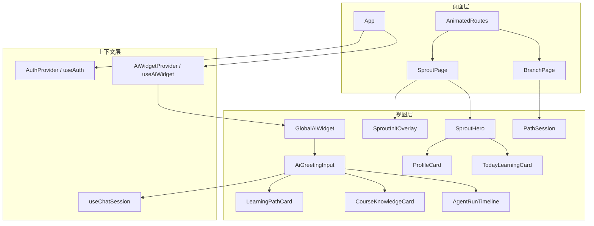
```mermaid
graph TD
  subgraph 页面层
    A["App"]
    B["AnimatedRoutes"]
    C["SproutPage"]
    D["BranchPage"]
  end

  subgraph 上下文层
    E["AuthProvider / useAuth"]
    F["AiWidgetProvider / useAiWidget"]
    G["useChatSession"]
  end

  subgraph 视图层
    H["SproutHero"]
    I["SproutInitOverlay"]
    J["GlobalAiWidget"]
    K["AiGreetingInput"]
    L["ProfileCard"]
    M["TodayLearningCard"]
    N["LearningPathCard"]
    O["CourseKnowledgeCard"]
    P["AgentRunTimeline"]
    Q["PathSession"]
  end

  A --> E
  A --> F
  B --> C
  B --> D
  C --> H
  C --> I
  D --> Q
  F --> J
  J --> K
  K --> G
  H --> L
  H --> M
  K --> N
  K --> O
  K --> P
```

这张图对应的职责边界是：

- 页面层只负责路由、首屏入口和数据加载边界：
  - `SproutPage`
  - `BranchPage`
- 上下文层只负责全局状态，不直接画业务卡片：
  - `useAuth`
  - `useAiWidget`
  - `useChatSession`
- 视图层只消费页面层或上下文层给出的状态：
  - 首页卡片
  - 全局聊天面板
  - 结构化学习结果卡片

### 1.5 `/sprout` 今日推荐的数据边界

`/api/profile/dashboard` 里的 `todayLearning` 当前已经有一条明确的数据来源规则：

- 必须以当前用户 `updated_at` 最新的那条 `UserYearLearningPath` 为准
- `currentLearningCourse`
  - 由这条最新学习路径里的 `current_learning_course` 派生
- `currentCourseDetail`
  - 由这条最新学习路径里与 `current_learning_course.course_node_id` 精确对应的 `course_nodes[*]` 派生
- `currentCourseOutline`
  - 只按这门当前课程的 `course_id` 精确读取

对应代码位置：

- `backend/app/services/learning_path_service.py`
  - `get_all_year_learning_paths()`
  - `get_latest_grade_year()`
- `backend/app/api/profile.py`
  - `_today_learning_from_path()`

这也是一个已经确认并修过的真实 bug：

- 旧实现直接遍历 `year_learning_paths.values()`
- 当用户同时存在多个年级路径时，`todayLearning` 可能拿到旧路径的当前课程
- 现在统一按 `updated_at desc` 选“最新学习路径”

当前学习路径读取链还新增了一层兼容约束：

- service 层会把旧数据统一归一化成：
  - `current_learning_course`
  - `current_learning_courses`
- 如果数据库里暂时只有旧字段 `current_learning_course`
  - 读取时会自动补成长度为 1 的 `current_learning_courses`
- 如果后续只写出 `current_learning_courses`
  - 读取时也会把 `current_learning_course` 对齐到列表第一项

对应代码位置：

- `backend/app/services/learning_path_service.py`
  - `_normalize_current_learning_courses()`
- `backend/app/api/branch.py`
  - `read_branch_overview()` 现在通过 service 读取归一化后的路径
  - 繁枝页路径舞台

`SproutHero` 本身还承担了首页画像与今日学习数据聚合的前端入口：

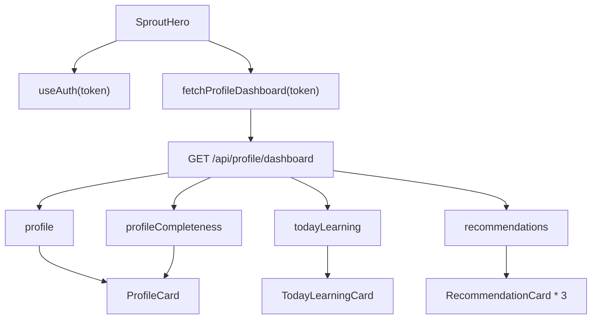
```mermaid
graph TD
  A["SproutHero"] --> B["useAuth(token)"]
  A --> C["fetchProfileDashboard(token)"]
  C --> D["GET /api/profile/dashboard"]
  D --> E["profile"]
  D --> F["profileCompleteness"]
  D --> G["todayLearning"]
  D --> H["recommendations"]
  E --> I["ProfileCard"]
  F --> I
  G --> J["TodayLearningCard"]
  H --> K["RecommendationCard * 3"]
```

这条链路的职责边界当前已经由代码确认：

- `SproutHero` 不自己拼画像数据，它只消费 `/api/profile/dashboard` 聚合好的首页 DTO。
- `ProfileCard` 使用：
  - `profile`
  - `profileCompleteness`
  - `profileSummaryText`
- `TodayLearningCard` 使用：
  - `todayLearning.currentLearningCourse`
  - `todayLearning.currentCourseDetail`
  - `todayLearning.currentCourseOutline`
  - `todayLearning.followingCourses`
- `RecommendationCard` 只消费后端返回的推荐数组，不再二次推导业务字段。

当前这条首登链路还有两个已经收口过的实现约束：

- `SproutInitOverlay` 的入场与文字切换现在只使用 `opacity` 和 `transform`
- `SproutInitOverlay` 在 `prefers-reduced-motion` 场景下会直接进入 `phase=10` 并展开全局聊天面板

### 1.5 `AiGreetingInput` 的内部角色

`AiGreetingInput` 不是单纯的输入框，它是前端会话编排器。

在它之前还有一层明确的全局桥接：

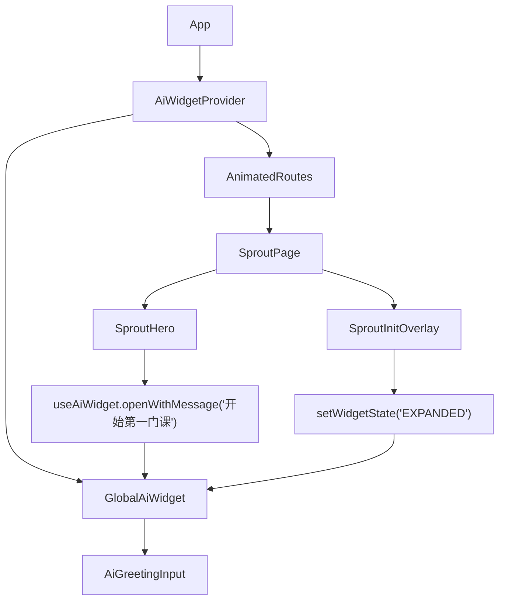
```mermaid
graph TD
  A["App"] --> B["AiWidgetProvider"]
  B --> C["AnimatedRoutes"]
  B --> D["GlobalAiWidget"]
  C --> E["SproutPage"]
  E --> F["SproutHero"]
  F --> G["useAiWidget.openWithMessage('开始第一门课')"]
  E --> H["SproutInitOverlay"]
  H --> I["setWidgetState('EXPANDED')"]
  G --> D
  I --> D
  D --> J["AiGreetingInput"]
```

这里的桥接职责已经从代码确认：

- `App` 把 `AiWidgetProvider` 包在 `AnimatedRoutes` 和 `GlobalAiWidget` 外层，所以页面树和全局对话面板共享同一个 widget 状态。
- `SproutHero` 不自己维护聊天 UI，只通过 `openWithMessage('开始第一门课')` 写入 `pendingMessage` 并把 widget 切到 `EXPANDED`。
- `SproutInitOverlay` 不直接创建消息，它只负责把 `widgetState` 切到 `EXPANDED`，真正的会话输入仍然由 `AiGreetingInput` 接管。
- `GlobalAiWidget` 只有在 `token` 存在且 `widgetState !== 'HIDDEN'` 时才会挂载，因此它同时承担了“登录态门禁”和“全局浮层容器”两层职责。

它的依赖关系可以拆成四层：

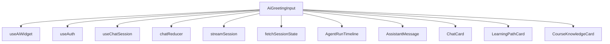
```mermaid
graph TD
  A["AiGreetingInput"] --> B["useAiWidget"]
  A --> C["useAuth"]
  A --> D["useChatSession"]
  A --> E["chatReducer"]
  A --> F["streamSession"]
  A --> G["fetchSessionState"]
  A --> H["AgentRunTimeline"]
  A --> I["AssistantMessage"]
  A --> J["ChatCard"]
  A --> K["LearningPathCard"]
  A --> L["CourseKnowledgeCard"]
```

按职责拆分：

- 输入与会话状态
  - `useReducer(chatReducer, initialChatStore)`
  - `useChatSession(store.currentSessionId, onSessionRecovered)`
- SSE 事件归并
  - `streamSession(...)`
  - `mergeSessionAgentStep(...)`
  - `eventToStep(...)`
- 结构化数据回填
  - `fetchSessionState(token, sessionId)`
- 渲染分发
  - 学习路径结果 -> `LearningPathCard`
  - 课程大纲结果 -> `CourseKnowledgeCard`
  - 结构化画像对话 -> `ChatCard`
  - 纯文本 / 错误 / 重试 -> `AssistantMessage`

当前这层已经确认了两个实现事实：

- 会话不会因为 `session_completed.has_profile=true` 就强制切新会话。
  - 前端后续追问仍然复用同一个 `session_id`
  - 这样“更新画像 -> 继续生成学习路径”才能落在同一条历史上下文里
- 如果同一轮同时拿到：
  - `structuredData.learningPath`
  - `structuredData.courseKnowledge`
  前端会把两者同时保留并渲染，而不是让后一张卡把前一张卡覆盖掉
- `fetchSessionState(token, sessionId)` 在挂载课程大纲前，会先校验：
  - `courseKnowledge.course_id`
  - `learningPath.current_learning_course.course_node_id`
  两者必须一致
  否则前端会丢弃这份课程大纲，避免把别的课程旧大纲挂到当前会话

如果只看 `AiGreetingInput` 自己的运行时主链，当前真实顺序已经可以单独拆成：

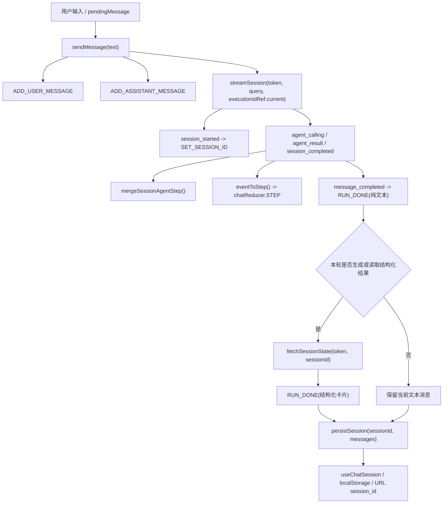
```mermaid
graph TD
  A["用户输入 / pendingMessage"] --> B["sendMessage(text)"]
  B --> C["ADD_USER_MESSAGE"]
  B --> D["ADD_ASSISTANT_MESSAGE"]
  B --> E["streamSession(token, query, executionIdRef.current)"]
  E --> F["session_started -> SET_SESSION_ID"]
  E --> G["agent_calling / agent_result / session_completed"]
  G --> H["mergeSessionAgentStep()"]
  G --> I["eventToStep() -> chatReducer.STEP"]
  G --> J["message_completed -> RUN_DONE(纯文本)"]
  J --> K{"本轮是否生成或读取结构化结果"}
  K -->|是| L["fetchSessionState(token, sessionId)"]
  L --> M["RUN_DONE(结构化卡片)"]
  K -->|否| N["保留当前文本消息"]
  M --> O["persistSession(sessionId, messages)"]
  N --> O
  O --> P["useChatSession / localStorage / URL session_id"]
```

这条顺序说明 `AiGreetingInput` 当前同时承担四层职责：

- 输入网关
  - 接收 textarea 输入
  - 接收 `pendingMessage`
  - 统一走 `sendMessage()`
- 流式事件归并
  - 把 SSE 事件拆成：
    - 面板进度
    - 时间线步骤
    - 最终文本
- 结构化结果回填
  - 只在“本轮确实生成或读取了结构化结果”时再请求 `session state`
- 会话锚点持久化
  - 负责把：
    - `session_id`
    - `messages`
    - `retryAction`
    - 结构化卡片
    同步到本地恢复层

### 1.6 会话恢复层

`useChatSession` 负责把当前对话和 URL 参数打通：

- URL 参数名固定为 `session_id`
- 如果 URL 带 `session_id`，它会先尝试从 `localStorage` 读取 `session-${sessionId}`
- 如果本地缓存不存在或损坏，并且当前已有登录 token，它会继续请求 `GET /api/chat/sessions/{session_id}` 做服务端恢复
- 只有本地和服务端都恢复失败时，才会从 URL 清掉 `session_id`
- 如果同一挂载周期里 URL 切换到另一个 `session_id`，它会按新的 `session_id` 重新恢复，而不是只恢复第一次
- 当 `storeSessionId` 存在时，会把它回写到 URL
- `session_started` 发出的 `session_id` 需要在前端立即记住；即使本轮后续在 `session_completed` 前失败，也必须保留这个会话锚点，保证重试继续落在同一条会话上
- 本地会话缓存不能只在成功态落盘；失败态消息如果带有 `retryAction`，也必须写入 `localStorage`，否则刷新后 `useChatSession` 会把 URL 中的 `session_id` 当成无缓存脏链接清掉

这层是当前前端会话连续性的关键边界。

当前真实恢复顺序如下：

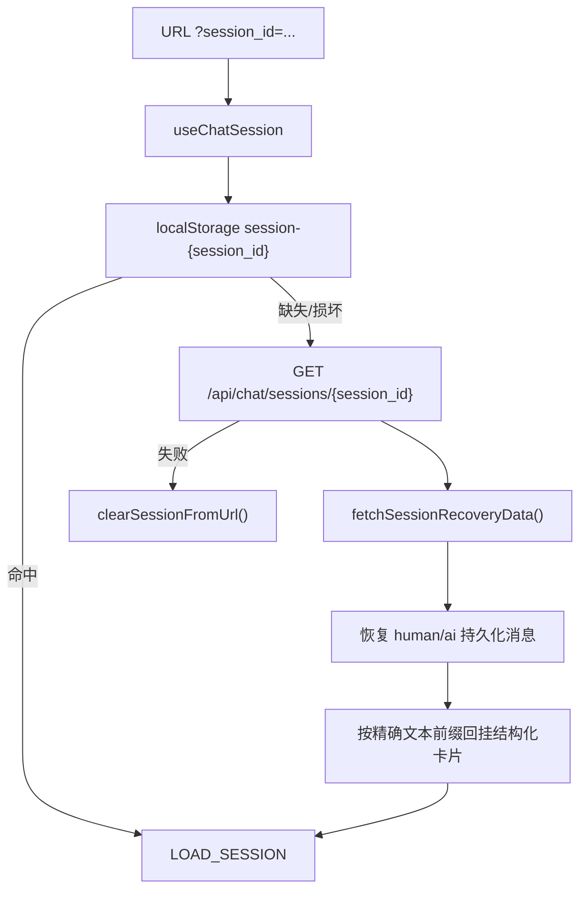
```mermaid
graph TD
  A["URL ?session_id=..."] --> B["useChatSession"]
  B --> C["localStorage session-{session_id}"]
  C -->|命中| D["LOAD_SESSION"]
  C -->|缺失/损坏| E["GET /api/chat/sessions/{session_id}"]
  E --> F["fetchSessionRecoveryData()"]
  F --> G["恢复 human/ai 持久化消息"]
  G --> H["按精确文本前缀回挂结构化卡片"]
  H --> D
  E -->|失败| I["clearSessionFromUrl()"]
```

当前这层已经额外确认了一个容易被忽略的事实：

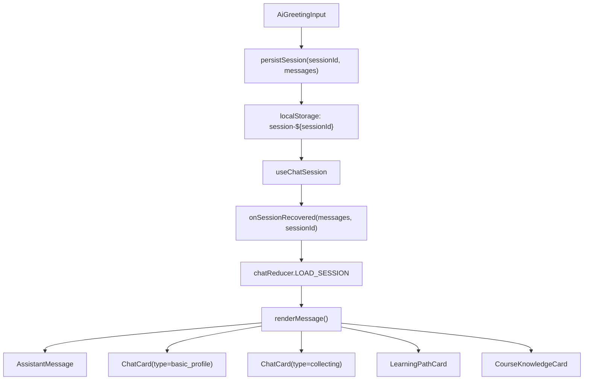
```mermaid
graph TD
  A["AiGreetingInput"] --> B["persistSession(sessionId, messages)"]
  B --> C["localStorage: session-${sessionId}"]
  C --> D["useChatSession"]
  D --> E["onSessionRecovered(messages, sessionId)"]
  E --> F["chatReducer.LOAD_SESSION"]
  F --> G["renderMessage()"]
  G --> H["AssistantMessage"]
  G --> I["ChatCard(type=basic_profile)"]
  G --> J["ChatCard(type=collecting)"]
  G --> K["LearningPathCard"]
  G --> L["CourseKnowledgeCard"]
```

这意味着当前本地恢复不只是“把一串纯文本消息放回来”，而是会恢复完整的消息对象形态，包括：

- `sessionMessage.type=basic_profile`
- `sessionMessage.type=collecting`
- `learningPath`
- `courseKnowledge`
- `retryAction`
- `runTrace`

因此当前刷新恢复后的真实表现已经被测试覆盖为：

- 刷新后可以直接恢复 `basic_profile` 画像卡片
- 刷新后可以直接恢复 `collecting` 追问卡片
- `collecting` 恢复后输入框占位仍保持未完成态：
  - `输入你的学习情况...`
- `basic_profile` 恢复后输入框占位保持已完成态：
  - `画像已生成，可以继续补充或追问...`

`session-state` 的前端回填链路当前已经可以单独拆出来：

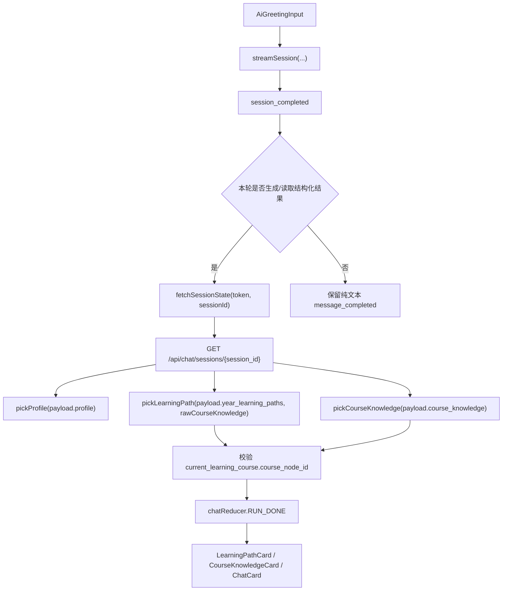
```mermaid
graph TD
  A["AiGreetingInput"] --> B["streamSession(...)"]
  B --> C["session_completed"]
  C --> D{"本轮是否生成/读取结构化结果"}
  D -->|是| E["fetchSessionState(token, sessionId)"]
  E --> F["GET /api/chat/sessions/{session_id}"]
  F --> G["pickProfile(payload.profile)"]
  F --> H["pickLearningPath(payload.year_learning_paths, rawCourseKnowledge)"]
  F --> I["pickCourseKnowledge(payload.course_knowledge)"]
  H --> J["校验 current_learning_course.course_node_id"]
  I --> J
  J --> K["chatReducer.RUN_DONE"]
  K --> L["LearningPathCard / CourseKnowledgeCard / ChatCard"]
  D -->|否| M["保留纯文本 message_completed"]
```

这条链路当前还有一个已经修过的真实 bug：

- 旧行为
  - 后端 `get_session_state` 在找不到“当前学习路径对应课程”的大纲时，会回退到用户最新一条课程大纲
  - 前端随后可能把别的课程旧大纲挂到当前会话
- 新行为
  - 后端 `get_session_state` 只返回当前学习路径对应课程的大纲
  - 前端 `fetchSessionState` 再做一层 `course_id` 一致性校验
  - 只有路径课程和大纲课程完全一致时，`CourseKnowledgeCard` 才会被挂载

### 1.7 当前前端结构结论

当前前端主流程可以概括成：

1. `main.tsx` 用 `AuthProvider` 包住全应用
2. `App` 用 `AiWidgetProvider` 把全局对话面板挂到路由层之外
3. `SproutPage`、`SproutHero`、`SproutInitOverlay` 只通过 `useAiWidget` 驱动全局面板，不自己维护聊天状态
4. `AiGreetingInput` 统一处理 SSE、结构化结果回填、错误展示和会话恢复

这也是为什么 `AiGreetingInput` 是当前前端最需要重点关注的枢纽点。

### 1.8 页面 / 上下文 / 视图关系总图

如果只保留 `onboarding-handle` 主流程真正会穿过的节点，当前前端主链可以进一步压缩成下面这张关系图：

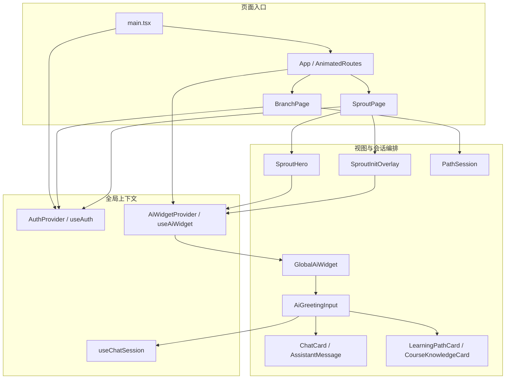
```mermaid
graph TD
  subgraph 页面入口
    A["main.tsx"]
    B["App / AnimatedRoutes"]
    C["SproutPage"]
    D["BranchPage"]
  end

  subgraph 全局上下文
    E["AuthProvider / useAuth"]
    F["AiWidgetProvider / useAiWidget"]
    G["useChatSession"]
  end

  subgraph 视图与会话编排
    H["SproutHero"]
    I["SproutInitOverlay"]
    J["GlobalAiWidget"]
    K["AiGreetingInput"]
    L["ChatCard / AssistantMessage"]
    M["LearningPathCard / CourseKnowledgeCard"]
    N["PathSession"]
  end

  A --> E
  A --> B
  B --> F
  B --> C
  B --> D
  C --> H
  C --> I
  D --> N
  F --> J
  J --> K
  K --> G
  K --> L
  K --> M
  H --> F
  I --> F
  D --> E
  C --> E
```

这张图对应的真实职责边界是：

- 页面层只决定：
  - 路由入口
  - 页面级数据加载
  - 首次触发全局 AI 面板的时机
- 上下文层只负责：
  - 登录态
  - widget 展开态
  - 会话恢复锚点
- 视图与会话编排层只负责：
  - 把消息、结构化画像、学习路径、课程大纲渲染成可恢复的 UI
  - 把 SSE 事件归并成同一条对话时间线

其中 `AiGreetingInput` 当前同时是：

- 全局面板内容宿主
- 对话发送入口
- SSE 事件归并器
- 结构化卡片回填入口
- 本地与服务端恢复结果的二次分发点

---

## 2. 后端请求入口：`api-path`

`api-path` 是后端 API 入口层，当前聊天主链路集中在：

- `backend/app/api/orchestration.py`

### 2.1 路由层职责

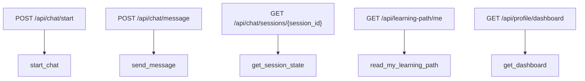
```mermaid
graph TD
  A["POST /api/chat/start"] --> B["start_chat"]
  C["POST /api/chat/message"] --> D["send_message"]
  E["GET /api/chat/sessions/{session_id}"] --> F["get_session_state"]
  G["GET /api/learning-path/me"] --> H["read_my_learning_path"]
  I["GET /api/profile/dashboard"] --> J["get_dashboard"]
```

具体职责：

- `start_chat`
  - 生成新的 `session_id`
  - 先调用 `load_or_create_session(...)`
  - 返回首轮欢迎文案
- `send_message`
  - 直接返回 `StreamingResponse`
  - 真正的执行逻辑在 `_stream_chat_events(...)`
- `get_session_state`
  - 聚合会话持久化消息、画像、学习路径、课程大纲
  - 同时服务于：
    - 前端的结构化卡片回填
    - 本地缓存缺失后的服务端会话恢复
- `read_my_learning_path`
  - 调用 `get_all_year_learning_paths(session, current_user.uid)`
  - 从 `UserYearLearningPath.path_data` 原样返回每个年级的学习路径
  - 再单独附带最新一条记录的 `updated_at`
- `get_dashboard`
  - 读取 `UserProfile`
  - 读取 `get_all_year_learning_paths(...)`
  - 必要时读取 `get_user_course_knowledge_outline(...)`
  - 把首页需要的：
    - `profile`
    - `profileCompleteness`
    - `profileSummaryText`
    - `todayLearning`
    - `recommendations`
    聚合成一个仪表板响应

这条接口已经由代码和测试共同确认：它返回的不是旧版 `grade_year/grade_name/courses` DTO，而是当前持久化的 `learning_path.v2.course_node` 结构。

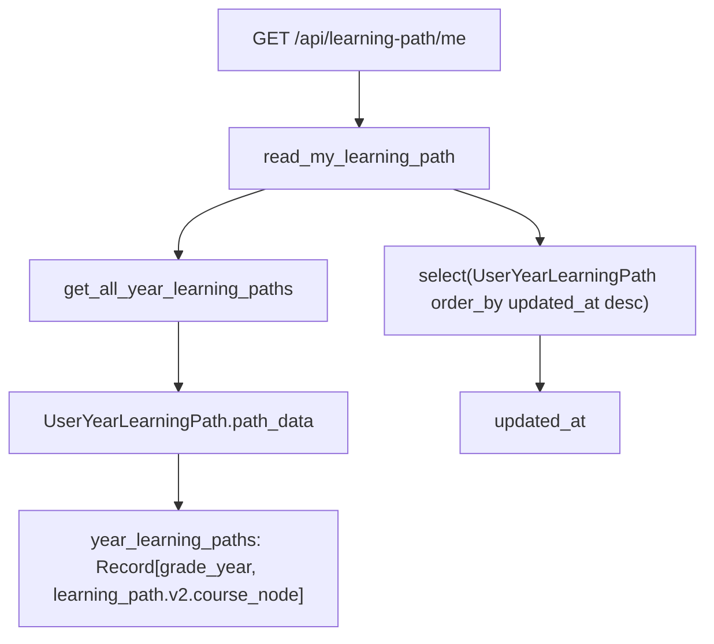
```mermaid
graph TD
  A["GET /api/learning-path/me"] --> B["read_my_learning_path"]
  B --> C["get_all_year_learning_paths"]
  C --> D["UserYearLearningPath.path_data"]
  B --> E["select(UserYearLearningPath order_by updated_at desc)"]
  D --> F["year_learning_paths: Record[grade_year, learning_path.v2.course_node]"]
  E --> G["updated_at"]
```

首页画像接口当前的真实链路如下：

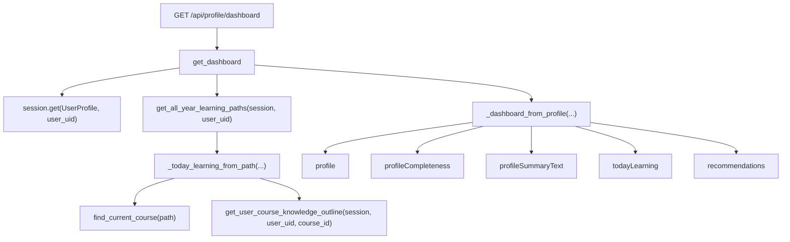
```mermaid
graph TD
  A["GET /api/profile/dashboard"] --> B["get_dashboard"]
  B --> C["session.get(UserProfile, user_uid)"]
  B --> D["get_all_year_learning_paths(session, user_uid)"]
  D --> E["_today_learning_from_path(...)"]
  E --> F["find_current_course(path)"]
  E --> G["get_user_course_knowledge_outline(session, user_uid, course_id)"]
  B --> H["_dashboard_from_profile(...)"]
  H --> I["profile"]
  H --> J["profileCompleteness"]
  H --> K["profileSummaryText"]
  H --> L["todayLearning"]
  H --> M["recommendations"]
```

繁枝页当前前端不是只读取一个 branch 接口，而是同时消费两个后端入口：

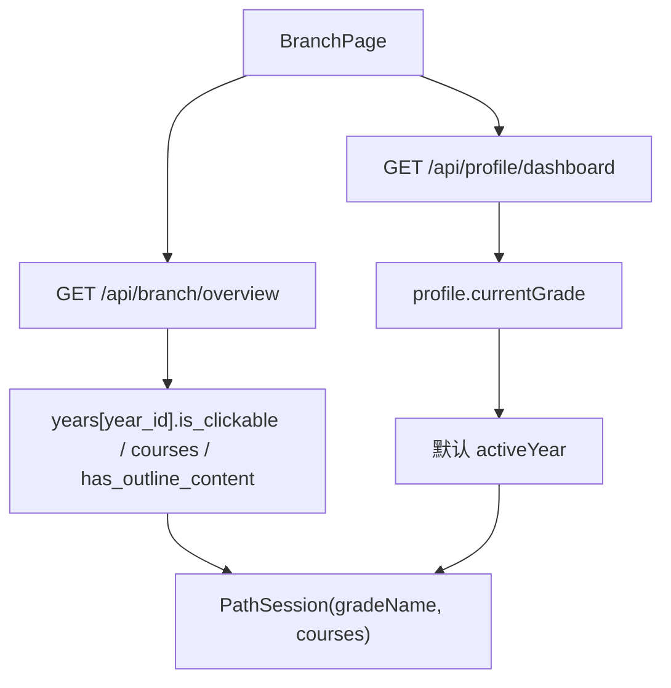
```mermaid
graph TD
  A["BranchPage"] --> B["GET /api/branch/overview"]
  A --> C["GET /api/profile/dashboard"]
  B --> D["years[year_id].is_clickable / courses / has_outline_content"]
  C --> E["profile.currentGrade"]
  E --> F["默认 activeYear"]
  D --> G["PathSession(gradeName, courses)"]
  F --> G
```

这条链路说明 `api-path` 对 `BranchPage` 的支撑不是单接口，而是两段职责分离的数据源：

- `/api/branch/overview`
  - 负责年级维度路径总览
  - 负责 `is_clickable`、`current_course_id`、`courses[].status`、`courses[].has_outline`
- `/api/profile/dashboard`
  - 负责当前用户画像摘要
  - 其中 `profile.currentGrade` 是繁枝页默认年级定位的真实来源

这条链路说明 `api-path` 里其实存在两类后端入口：

- 会话入口：
  - `/api/chat/start`
  - `/api/chat/message`
  - `/api/chat/sessions/{session_id}`
- 首页聚合入口：
  - `/api/profile/dashboard`
  - `/api/learning-path/me`

前者把请求送进 `agents-course`，后者把已持久化的画像、学习路径、课程大纲重新拼成首页和繁枝页直接可用的数据结构。

如果按“请求入口职责”再细拆一次，当前后端入口关系可以概括成：

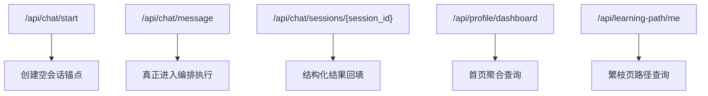
```mermaid
graph TD
  A["/api/chat/start"] --> B["创建空会话锚点"]
  C["/api/chat/message"] --> D["真正进入编排执行"]
  E["/api/chat/sessions/{session_id}"] --> F["结构化结果回填"]
  G["/api/profile/dashboard"] --> H["首页聚合查询"]
  I["/api/learning-path/me"] --> J["繁枝页路径查询"]
```

这里有一个当前已经对齐的实现边界：

- `/api/chat/start`
  - 只负责创建 `session_id` 和首轮欢迎语
  - 不写入用户这轮真实提问
- `/api/chat/message`
  - 才是真正接收 `message`、读取上下文、调用 Agent、落盘用户消息的入口
- 前端因此必须先拿到 `session_id`，再把真实用户消息发给 `/api/chat/message`

`/api/chat/sessions/{session_id}` 当前的真实职责边界也需要单独说明：

```mermaid
graph TD
  A["GET /api/chat/sessions/{session_id}"] --> B["load_conv(session, session_id)"]
  B --> C["校验会话属于当前用户"]
  C --> D["get_user_profile(session, user_uid)"]
  C --> E["get_all_year_learning_paths(session, user_uid)"]
  E --> F["_current_course_id_from_paths(year_paths)"]
  F --> G["get_user_course_knowledge_outline(session, user_uid, current_course_id)"]
  D --> H["profile"]
  E --> I["year_learning_paths"]
  G --> J["course_knowledge"]
  H --> K["SessionStateResponse"]
  I --> K
  J --> K
```

这里当前已经明确收口的约束是：

- `get_session_state`
  - 只返回当前学习路径对应课程的课程大纲
  - 不再回退到“当前用户最新一条课程大纲”
- 这样做的原因是：
  - `session state` 的职责是恢复当前会话的结构化视图
  - 不是为当前会话猜一份“可能相关”的最新历史大纲

---

## 3. 后端编排层：`agents-course`

`agents-course` 是后端核心社区，图谱里有 `125` 个节点，主要位于：

- `backend/app/orchestration/graph.py`
- `backend/app/orchestration/agents/supervisor.py`
- `backend/app/orchestration/agents/profile.py`
- `backend/app/orchestration/agents/learning_path.py`
- `backend/app/orchestration/agents/course_knowledge.py`
- `backend/app/orchestration/llm.py`

### 3.1 请求到 Agent 的真实链路

```mermaid
graph TD
  A["POST /api/chat/message"] --> B["send_message"]
  B --> C["_stream_chat_events"]
  C --> D["load_or_create_session"]
  C --> E["get_user_profile"]
  C --> F["get_all_year_learning_paths"]
  C --> G["get_user_course_knowledge_outline(current_course_id)"]

  C --> H{"是否命中数据库直返分支"}
  H -->|课程大纲回顾| I["data_update(course_knowledge_loaded)"]
  H -->|学习路径回顾| J["data_update(learning_path_loaded)"]
  I --> K["message_completed"]
  J --> K
  K --> L["session_completed"]
  L --> M["append_messages"]

  H -->|否| N["stream_orchestration_events"]
  N --> O["build_orchestration_graph"]
  O --> P["supervisor"]
  P --> Q{"route_after_supervisor"}
  Q --> R["profile_agent"]
  Q --> S["learning_path_agent"]
  Q --> T["course_knowledge_agent"]
  R --> U["END"]
  S --> U
  T --> U
  U --> V["message_completed / session_completed"]
  V --> M
```

这里有一个本轮新确认的恢复边界：

- `GET /api/chat/sessions/{session_id}`
  - 当前除了返回：
    - `messages`
    - `profile`
    - `year_learning_paths`
    - `course_knowledge`
  - 现在还会显式返回：
    - `latest_grade_year`
- 这样前端在多年份恢复时，除了“按当前课程大纲匹配路径”之外，还能明确知道“当前应优先恢复哪一个年级的最新路径”，不再依赖对象顺序

### 3.2 `_stream_chat_events` 的职责边界

`_stream_chat_events(...)` 做了四件事：

1. 先装入历史上下文
   - 历史消息
   - 用户画像
   - 学习路径
   - 当前学习路径对应课程的大纲
2. 判断是否命中“数据库直返”
   - 课程大纲回顾
   - 学习路径回顾
3. 未命中时，进入 `stream_orchestration_events(state)`
4. 根据事件结果决定是否把本轮用户消息和 AI 回复持久化

它是 API 层和编排层的真正交界点。

如果再细拆，当前顺序已经由代码确认如下：

```mermaid
graph TD
  A["_stream_chat_events"] --> B["load_or_create_session"]
  A --> C["messages_from_dict(conv_session.messages)"]
  A --> D["get_user_profile"]
  A --> E["get_all_year_learning_paths"]
  A --> F["_current_course_id_from_paths(year_paths)"]
  F --> G["get_user_course_knowledge_outline(user_uid, current_course_id)"]
  A --> H["组装 state.user_id / session_id / query / messages"]
  H --> I{"_is_outline_review_query"}
  H --> J{"_is_learning_path_review_query"}
  I -->|是| K["_format_course_outline_text"]
  J -->|是| L["_format_learning_path_text"]
  K --> M["append_messages(user + ai)"]
  L --> M
  H -->|都未命中| N["stream_orchestration_events(state)"]
  N --> O["收集 completed_text / had_error"]
  O --> P["append_messages(user)"]
  O --> Q["append_messages(user + ai)"]
```

这里还有一个持久化边界已经被测试锁住：

- 如果 `stream_orchestration_events(state)` 正常跑完且没有 `error`，会写入 `user + ai`
- 如果编排流抛异常，仍然会先持久化当前用户消息，再发 SSE `error`
- 如果本轮只有错误没有 `message_completed`，不会把失败回复伪装成成功 AI 消息写入会话
- 如果当前学习路径课程没有对应大纲：
  - `_stream_chat_events` 不会再回退装载别的课程最新大纲
  - 这样“普通聊天 / 路径回顾 / 会话恢复”都不会被错课大纲污染

### 3.3 LangGraph 结构

`build_orchestration_graph()` 当前结构很简单：

```mermaid
graph TD
  A["__start__"] --> B["supervisor"]
  B -->|profile_agent| C["profile_agent"]
  B -->|learning_path_agent| D["learning_path_agent"]
  B -->|course_knowledge_agent| E["course_knowledge_agent"]
  B -->|END| F["__end__"]
  C -->|画像更新后需续跑路径| B
  C -->|普通情况| F
  D --> F
  E --> F
```

关键点：

- `route_after_supervisor()` 根据最后一条 `AIMessage.tool_calls` 决定目标 worker
- 默认情况下，`route_after_worker()` 结束当前回合
- 但当会话命中“当前所有任务已经完成 -> 先更新个人画像 -> 再重新生成学习路径”这条后续链路时：
  - `profile_agent` 完成后不会直接结束
  - `route_after_worker()` 会把流程送回 `supervisor`
  - `rule_engine.should_auto_continue_learning_path_after_profile()` 会强制继续调用 `learning_path_agent`

### 3.4 `supervisor` 的职责

`create_supervisor_node()` 的顺序是：

1. `evaluate_rules(state)` 先跑规则引擎
2. 如果 `force_call` 命中，直接构造工具调用，绕过 LLM
3. 否则拼接：
   - `build_system_prompt(state)`
   - 历史消息
   - 规则提示
4. `llm.bind_tools(tools)` 后调用模型
5. 如果模型调用了被规则引擎屏蔽的 Agent，再次过滤

当前 supervisor 暴露的工具只有三个：

- `profile_agent`
- `learning_path_agent`
- `course_knowledge_agent`

其中已经确认的两个 force-call 收口分支是：

- 当用户要求“换一门课 / 生成一门新课”，但当前课程已经是该年级最后一门课时，`supervisor` 不再把空 `course_id` 传给 `course_knowledge_agent`，而是直接返回：
  - `当前所有任务已经完成。...`
- 当画像和学习路径都已存在，且用户只说“更新个人画像”或“修改画像方向”，但没有给出任何具体字段时，`supervisor` 不会直接改画像，而是直接追问用户补充：
  - 年级
  - 专业
  - 学习方向
  - 短期目标
  - 长期目标
  - 每周可投入时间
  - 学习节奏
  - 当前限制

这两个分支都是 `rule_engine -> force_call -> _force_call_response()` 完成的，不经过 LLM 自由发挥。

当前这条“任务已完成后的后续追问”分支还有一个本轮补出来的实现细节：

- 当上一轮回复以：
  - `当前所有任务已经完成。`
  开头时
- 只要用户下一轮没有去看路径、开始课程或换新课
- `rule_engine` 就会把这一轮优先视为“先更新画像，再决定是否刷新路径”
- 因此即使用户只补一条单字段输入，例如：
  - `专业改成计算机科学`
- 这一轮仍会先强制走 `profile_agent`
- 画像更新完成后，再由 `should_auto_continue_learning_path_after_profile()` 把流程送回 `learning_path_agent`

如果把 `supervisor` 到 worker 的职责边界单独拆出来，当前关系如下：

```mermaid
graph TD
  A["supervisor"] --> B["evaluate_rules(state)"]
  B --> C{"是否 force_call"}
  C -->|是| D["_force_call_response()"]
  C -->|否| E["build_system_prompt(state)"]
  E --> F["llm.bind_tools(profile / learning_path / course_knowledge)"]
  F --> G["AIMessage.tool_calls"]
  G --> H["route_after_supervisor()"]
  H --> I["profile_agent"]
  H --> J["learning_path_agent"]
  H --> K["course_knowledge_agent"]
```

三个 worker 当前的真实输入边界分别是：

- `profile_agent`
  - 输入来源：最近几轮 `HumanMessage` + `query` + 已有 `profile.confirmed_info`
  - 最低完成条件：至少能确认 `current_grade` 和 `major`
  - 不足时回到 `collecting`
- `learning_path_agent`
  - 输入来源：完整画像、`grade_year`、`learning_topic`
  - 结果要满足 `learning_path.v2.course_node`
  - 持久化落点：`UserYearLearningPath.path_data`
- `course_knowledge_agent`
  - 输入来源：`course_id` 或 `current_learning_course`
  - 指定了 `course_id` 时必须精确命中
  - 持久化落点：课程大纲表对应的 outline 数据

### 3.5 `stream_orchestration_events` 的事件翻译职责

它不是简单透传 LangGraph 事件，而是把底层事件翻译成前端认识的 SSE 协议。

核心顺序如下：

```mermaid
sequenceDiagram
  participant FE as Frontend
  participant API as _stream_chat_events
  participant ORCH as stream_orchestration_events
  participant SUP as supervisor
  participant WK as worker agent

  API->>FE: session_started
  API->>FE: memory agent_calling / agent_result
  API->>ORCH: state
  ORCH->>FE: agent_calling(intent-routing)
  ORCH->>FE: supervisor_thinking
  ORCH->>FE: data_update(profile_loaded/paths_loaded)
  SUP-->>ORCH: tool_call or text
  ORCH->>FE: supervisor_plan
  ORCH->>FE: agent_calling(worker)
  WK-->>ORCH: ToolMessage output
  ORCH->>FE: agent_progress / agent_result
  ORCH->>FE: message_completed
  ORCH->>FE: session_completed
```

具体翻译规则：

- `on_chat_model_stream(supervisor + tool_call_chunks)`
  - 生成 `supervisor_plan`
  - 紧接着生成一次 `agent_calling`
- `on_chain_start(worker)`
  - 首次进入 worker 时会生成 `agent_calling`
- `on_chain_end(worker)`
  - 成功分支：`agent_progress` + `agent_result(success=True)`
  - 失败分支：`agent_result(success=False)`
  - `hard_error` 分支：`agent_result(success=False)` + `error`，并立即结束
- `on_chain_end(LangGraph)`
  - 统一生成 `message_completed`
  - 然后生成 `session_completed`

### 3.6 worker 的真实输出边界

当前三个 worker 的输出边界并不完全一致：

- `profile_agent`
  - 可能返回 `profile(type=collecting)`
  - 也可能返回 `profile(type=basic_profile)`
  - 也可能只返回 `error`
- `learning_path_agent`
  - 前置条件不满足时返回 `error + hard_error`
  - 正常失败时优先降级到本地学习路径
- `course_knowledge_agent`
  - 可能返回普通 `error`
  - 也可能返回 `error + hard_error`
  - 当 tool args 明确携带 `course_id` 时，必须精确命中对应课程；找不到时直接报错，不能静默回退到 `current_learning_course`

这意味着前端不能把 `agent_result` 一律当成功步骤。

其中 `profile_agent` 当前已经确认存在两种稳定状态：

```mermaid
graph TD
  A["profile_agent"] --> B{"关键信息是否足够"}
  B -->|不足| C["collecting"]
  C --> D["question_mode=question_md"]
  C --> E["text=继续追问缺失字段"]
  C --> F["session_completed.has_profile=false"]
  B -->|足够| G["basic_profile"]
  G --> H["stage=generated"]
  G --> I["question_mode=question_box"]
  G --> J["session_completed.has_profile=true"]
```

当前“关键信息是否足够”的本地判定，至少要求：

- `current_grade`
- `major`

如果这两个字段还没齐，`profile_agent` 不会直接生成完整画像，而是先回到 `collecting` 继续追问。

### 3.7 从 API 入口到 Agent 执行的精确调用边

如果只按当前代码里的真实函数边来看，`api-path -> agents-course` 的执行主链还可以压成下面这张图：

```mermaid
graph TD
  A["POST /api/chat/start"] --> B["start_chat()"]
  B --> C["load_or_create_session()"]
  B --> D["ChatResponse(session_id, reply_text)"]

  E["POST /api/chat/message"] --> F["send_message()"]
  F --> G["StreamingResponse(...)"]
  G --> H["_stream_chat_events(session_id, user_uid, user_message, db_session)"]

  H --> I["load_or_create_session()"]
  H --> J["get_user_profile()"]
  H --> K["get_all_year_learning_paths()"]
  H --> L["get_latest_grade_year()"]
  H --> M["get_user_course_knowledge_outline(current_course_id)"]
  H --> N{"数据库直返 or 编排执行"}

  N -->|数据库直返| O["message_completed / session_completed / append_messages"]
  N -->|编排执行| P["stream_orchestration_events(state)"]
  P --> Q["build_orchestration_graph()"]
  Q --> R["supervisor"]
  R --> S["profile_agent"]
  R --> T["learning_path_agent"]
  R --> U["course_knowledge_agent"]
  S --> V["route_after_worker()"]
  T --> V
  U --> V
  V --> W["message_completed / session_completed"]
  W --> X["append_messages(...)"]
```

这里当前已经由代码、图谱和测试共同确认的边界是：

- `start_chat()`
  - 只负责创建会话锚点和欢迎语
  - 不会写入本轮真实用户问题
- `send_message()`
  - 只负责把请求包进 `StreamingResponse`
  - 真正的上下文装载、数据库直返、LangGraph 执行都在 `_stream_chat_events()` 里
- `_stream_chat_events()`
  - 是 API 层和 `agents-course` 的真实交界面
  - 先装上下文，再决定“直返”还是“进入 supervisor -> worker”
- `route_after_worker()`
  - 默认结束当前回合
  - 但命中“任务已完成 -> 更新画像 -> 自动刷新学习路径”时，会把 `profile_agent` 的结果送回 `supervisor`

---

## 4. 已验证的风险点与回归

### 4.1 前端：`agent_result success:false` 被当成成功完成

已修复位置：

- `frontend/src/components/onboarding/AiGreetingInput.tsx`

已验证行为：

- 面板步骤在 `success:false` 时显示为 `error`
- 时间线步骤在 `success:false` 时显示为 `error`
- 顶部状态不再显示“本轮智能体调用已完成”

相关测试：

- `frontend/src/components/onboarding/__tests__/AiGreetingInput.test.tsx`
- `frontend/src/components/onboarding/GlobalAiWidget.test.tsx`
- `frontend/src/pages/SproutPage.test.tsx`

### 4.2 后端：编排流的测试空档

本次补充并验证了两类回归：

- `supervisor_plan -> agent_calling` 的工具调用事件形状
- worker 软失败时，`stream_orchestration_events()` 会保留 `agent_result(success=False)` 和最终回复链路
- 学习路径回顾短语现在由 `api/orchestration.py` 直接复用 `rule_engine.is_review_plan_query()` 判断，避免 API 入口和规则引擎各自维护一套短语

相关测试：

- `backend/tests/test_orchestration_sse_errors.py`
- `backend/tests/test_orchestration_api.py`
- `backend/tests/test_rule_engine.py`

已验证命令：

- `backend/.venv/bin/pytest backend/tests/test_orchestration_sse_errors.py -q`
- `backend/.venv/bin/pytest backend/tests/test_orchestration_api.py -q`
- `backend/.venv/bin/pytest backend/tests/test_rule_engine.py -q`

### 4.3 前端：首登引导层违反动效与字体规范

已修复位置：

- `frontend/src/components/onboarding/SproutInitOverlay.tsx`
- `frontend/src/pages/SproutPage.tsx`

修复内容：

- `SproutInitOverlay` 不再动画 `backdropFilter` 和 `filter`
- `SproutPage` 退出态不再动画 `filter`
- `SproutInitOverlay` 增加了 `useReducedMotion()` 降级
- `one-tree` 标识的字重从 `600` 收回到字体系统允许范围内

相关测试：

- `frontend/src/components/onboarding/__tests__/SproutInitOverlay.test.tsx`
- `frontend/src/pages/SproutPage.test.tsx`
- `frontend/src/components/onboarding/GlobalAiWidget.test.tsx`

### 4.4 前端：`/api/learning-path/me` 仍按旧版 DTO 读取

已修复位置：

- `frontend/src/api/learningPath.ts`

修复内容：

- `getMyLearningPath()` 现在直接对齐 `LearningPathResult`
- `yearLearningPaths` 现在是 `Record<string, LearningPathResult>`
- 对接口返回值增加结构校验，旧版 `grade_year/courses/recommended_sequence` 结构会直接抛错

相关测试：

- `frontend/src/api/orchestration.session.test.ts`

### 4.5 前端：`useChatSession` 在同一挂载周期只能恢复第一次会话

已修复位置：

- `frontend/src/onboarding/hooks/useChatSession.ts`

### 4.6 前端：`openWithMessage()` 高频触发会丢第二条待发送消息

已修复位置：

- `frontend/src/context/AiWidgetContext.tsx`

问题根因：

- `openWithMessage()` 原先使用 `Date.now()` 作为 `pendingMessage.id`
- `AiGreetingInput` 使用 `consumedPendingMessageIdRef.current === pendingMessage.id` 防重复消费
- 如果两次 `openWithMessage()` 落在同一毫秒，第二条消息会被误判为“已经消费过”

修复方式：

- `AiWidgetProvider` 内部改为维护单调递增的本地计数器
- 每次 `openWithMessage(text)` 都分配新的递增 `pendingMessage.id`

相关测试：

- `frontend/src/context/__tests__/AiWidgetContext.test.tsx`

### 4.7 前端：结构化画像曾经只存在类型和卡片，但不会稳定落到真实流式 UI

已修复位置：

- `frontend/src/api/orchestration.ts`
- `frontend/src/components/onboarding/AiGreetingInput.tsx`

当前已经确认的真实链路：

```mermaid
graph TD
  A["streamSession()"] --> B["session_completed"]
  B --> C{"本轮是否生成 profile / path / outline"}
  C -->|是| D["fetchSessionState(session_id)"]
  D --> E["profile / learningPath / courseKnowledge"]
  E --> F["RUN_DONE"]
  F --> G["renderMessage()"]
  G --> H["ChatCard / LearningPathCard / CourseKnowledgeCard"]
```

这条链路现在已经覆盖两种画像状态：

- `basic_profile`
  - 前端显示“画像已整理成可继续更新的学习底稿”
- `collecting`
  - 前端显示“已确认 + 接下来”追问卡片
  - `session_completed.has_profile=false`，输入框占位文案仍保持“输入你的学习情况...”

相关测试：

- `frontend/src/components/onboarding/__tests__/AiGreetingInput.test.tsx`
- `frontend/src/api/orchestration.test.ts`

### 4.8 前端：画像完成后后续追问错误新建会话，导致同一条编排链路断开

已修复位置：

- `frontend/src/components/onboarding/AiGreetingInput.tsx`

问题根因：

- 前端曾把 `session_completed.has_profile=true` 当成“当前会话已经完成，下一轮必须重新 start”
- 这会让后续“继续补充画像 / 继续生成学习路径”重新调用 `/api/chat/start`
- 结果是：
  - 新建 `session_id`
  - 断开同一条历史上下文
  - 与后端“画像更新后继续生成学习路径”的设计目标不一致

修复方式：

- 前端现在只要已有 `executionIdRef.current`，后续消息就继续复用该 `session_id`
- `has_profile` 只用于：
  - 输入框占位文案
  - 首页画像刷新事件
  不再决定是否切新会话

相关测试：

- `frontend/src/components/onboarding/__tests__/AiGreetingInput.test.tsx`

### 4.9 前端：同一轮同时拿到学习路径和课程大纲时，后一份结构化结果会覆盖前一份

已修复位置：

- `frontend/src/components/onboarding/AiGreetingInput.tsx`
- `frontend/src/onboarding/chatReducer.test.ts`

问题根因：

- `fetchSessionState(...)` 回填时曾使用：
  - 有课程大纲就把 `learningPath` 置空
- 这样一来如果同一轮先生成学习路径、再生成课程大纲：
  - 最终消息里只剩 `CourseKnowledgeCard`
  - `LearningPathCard` 会被覆盖掉

修复方式：

- 回填时分别按：
  - `shouldFetchLearningPath`
  - `shouldFetchCourseOutline`
  独立决定是否保留两份结构化结果
- 渲染层在 `message.learningPath && message.courseKnowledge` 时会同时渲染两张卡

相关测试：

- `frontend/src/onboarding/chatReducer.test.ts`
- `frontend/src/components/onboarding/__tests__/AiGreetingInput.test.tsx`

修复内容：

- 恢复去重从“全局布尔值”改成“按 `session_id` 去重”
- 当 URL 从一个已缓存会话切到另一个已缓存会话时，会重新执行恢复
- 当当前 store 已经拿到新的 `storeSessionId` 时，仍然会优先以 store 为准并回写 URL

相关测试：

- `frontend/src/onboarding/hooks/useChatSession.test.tsx`
- `frontend/src/components/onboarding/__tests__/AiGreetingInput.test.tsx`

### 4.6 前端：`fetchSessionState()` 在多年份路径场景下吞掉学习路径卡片

已修复位置：

- `frontend/src/api/orchestration.ts`

修复内容：

- `get_session_state()` 返回的是整包 `year_learning_paths`，前端不再要求“恰好只有一条合法路径”才显示学习路径
- 当前优先用 `course_knowledge.course_id` 去匹配 `current_learning_course.course_node_id`，拿到与当前课程大纲一致的学习路径
- 如果当前没有课程大纲，或匹配不到对应路径，则退回第一条合法学习路径，避免真实路径结果被直接吞掉

相关测试：

- `frontend/src/api/orchestration.test.ts`
- `frontend/src/components/onboarding/__tests__/AiGreetingInput.test.tsx`

### 4.7 后端：换新课请求在最后一门课程处退化成重复生成当前课程

已修复位置：

- `backend/app/orchestration/agents/supervisor.py`
- `backend/app/orchestration/rule_engine.py`

修复前行为：

- 用户说“换一门课 / 生成一门新课”时
- 规则引擎会强制 `course_knowledge_agent`
- `supervisor._next_course_id_for_course_change()` 如果已经没有下一门课程，会返回空字符串
- `supervisor` 仍然会把空 `course_id` 发给 `course_knowledge_agent`
- `course_knowledge_agent` 随后回退到 `current_learning_course`
- 最终重复生成当前课程大纲，而不是告诉用户当前阶段已经结束

修复后行为：

- 只要用户表达“换新课”，规则仍然优先走课程切换分支
- 但如果当前课程已经是该年级最后一门课程，`supervisor` 不再强制调用 worker
- 本轮直接返回一条普通文本回复：
  - 当前所有任务已经完成
  - 可以继续更新个人画像
  - 可以基于更新后的画像重新生成学习路径
  - 如果信息不完整，后续由画像更新路径继续向用户追问

相关测试：

- `backend/tests/test_supervisor_force_call.py`

### 4.8 后端：已有学习路径后无法进入“更新画像 / 重算路径”分支

已修复位置：

- `backend/app/orchestration/rule_engine.py`

修复前行为：

- 只要 `profile + year_learning_paths` 都已存在
- 规则引擎就把这类对话基本看成“开始课程 / 看路径 / 普通回复”
- 用户即使明确说“修改画像方向”“更新个人画像”“继续生成学习路径”
- 也不会优先走 `profile_agent` 或 `learning_path_agent`

修复后行为：

- 在“已有画像 + 已有路径”状态下：
- `修改画像方向`、`更新个人画像`、以及带画像字段补充形状的输入，会优先强制 `profile_agent`
- `继续生成学习路径`、`更新学习路径` 会优先强制 `learning_path_agent`
- 这样“已完成当前阶段 -> 更新画像 -> 重新规划下一阶段”这条链就能继续跑通

相关测试：

- `backend/tests/test_rule_engine.py`

### 4.9 后端：重算学习路径请求把整句用户输入误当成 `learning_topic`

已修复位置：

- `backend/app/orchestration/agents/supervisor.py`

修复前行为：

- 用户在已有路径场景下说“继续生成学习路径”或“更新学习路径”
- 规则引擎会正确强制 `learning_path_agent`
- 但 `supervisor._force_call_response()` 会把整句 `query` 直接塞进 `learning_topic`
- 结果是 `learning_path_agent` 可能收到：
  - `learning_topic = "继续生成学习路径"`
  - 或 `learning_topic = "更新学习路径，我想加强部署与监控"`
- 这会把“用户想重新规划”这种控制语句误当成真正的学习方向

修复后行为：

- 通用刷新语句：
  - `继续生成学习路径`
  - `更新学习路径`
  现在不会再污染 `learning_topic`
- 这类请求会把：
  - `learning_topic = ""`
  - `specific_requirements = ""`
  留给 `learning_path_agent` 从画像里恢复真实主题
- 如果用户在刷新请求里带了明确约束，例如“更新学习路径，我想加强部署与监控”
  - `learning_topic` 仍保持为空
  - `specific_requirements` 会保留整句要求
  - 这样主题仍来自画像，约束来自本轮输入

相关测试：

- `backend/tests/test_supervisor_force_call.py`

### 4.10 前端：流式回合在 `session_completed` 前失败时丢失会话 ID

已修复位置：

- `frontend/src/components/onboarding/AiGreetingInput.tsx`
- `frontend/src/onboarding/chatReducer.ts`

修复前行为：

- 前端只有在 `session_completed` 到达时才把 `session_id` 写入当前会话状态
- 如果流式回合已经收到 `session_started(session_id)`，但随后被 `error` 提前打断
- 当前会话 ID 会丢失
- “重试生成学习路径” 会重新走一次 `/api/chat/start`
- 从而把失败回合和重试回合错误拆成两条会话

修复后行为：

- 只要收到 `session_started.session_id`，前端就立即把它保存为当前执行会话
- `RUN_ERROR` 现在也会保留已经拿到的 `sessionId`
- 因此学习路径失败后的重试会继续调用同一个 `/api/chat/message` 会话，而不是重新开新会话

相关测试：

- `frontend/src/onboarding/chatReducer.test.ts`
- `frontend/src/components/onboarding/__tests__/AiGreetingInput.test.tsx`
- `frontend/src/api/orchestration.test.ts`
- `frontend/src/api/orchestration.session.test.ts`

### 4.11 前端：失败态不持久化，刷新后丢失重试入口

已修复位置：

- `frontend/src/components/onboarding/AiGreetingInput.tsx`

修复前行为：

- `persistSession()` 只在 `store.state === 'idle'` 时写入本地缓存
- 如果一次流式回合已经拿到 `session_id`，但以 `error` 结束
- URL 中虽然会保留 `session_id`
- 但本地没有对应 `session-${sessionId}` 缓存
- 刷新页面后，`useChatSession` 会把这个 `session_id` 当成无缓存脏链接直接清掉
- 错误消息里的 `retry_learning_path` 按钮也随之丢失

修复后行为：

- `idle` 和 `error` 两种会话终态都会持久化本地消息
- 失败态消息里的 `retryAction`、错误文本和会话 ID 会一起保留下来
- 刷新后仍能通过 `useChatSession` 恢复失败消息和“重试生成学习路径”入口

相关测试：

- `frontend/src/components/onboarding/__tests__/AiGreetingInput.test.tsx`

### 4.12 前端：本地缓存丢失后，URL 中已有的合法会话会被错误清掉

已修复位置：

- `frontend/src/onboarding/hooks/useChatSession.ts`
- `frontend/src/api/orchestration.ts`
- `backend/app/api/orchestration.py`
- `backend/app/schemas.py`

修复前行为：

- 页面 URL 中带有 `session_id`
- 但如果 `localStorage` 中没有对应的 `session-${sessionId}`
- `useChatSession` 会把这个会话直接当成脏链接清掉
- 即使后端数据库里的 `ConversationSession.messages` 仍然存在，前端也不会去恢复

修复后行为：

- `useChatSession` 先读本地缓存
- 本地没有，再调用 `GET /api/chat/sessions/{session_id}`
- 后端除了返回 `profile / year_learning_paths / course_knowledge`，现在还会一起返回持久化的 `messages`
- 前端用 `fetchSessionRecoveryData()` 把这些 `human/ai` 消息还原成 `ChatMessage[]`
- 然后只按当前代码里已经存在的精确文本前缀，回挂学习路径卡片或课程大纲卡片
- 只有本地和服务端都恢复失败时，才会清掉 URL 中的 `session_id`

相关测试：

- `frontend/src/onboarding/hooks/useChatSession.test.tsx`
- `frontend/src/api/orchestration.test.ts`
- `backend/tests/test_orchestration_api.py`

### 4.13 后端：任务完成后已刷新学习路径，但最终回复仍停在画像摘要

已修复位置：

- `backend/app/orchestration/graph.py`
- `backend/app/orchestration/agents/learning_path.py`

修复前行为：

- 会话先命中：
  - `当前所有任务已经完成。...`
- 用户下一轮补充画像字段后：
  - `rule_engine` 会强制走 `profile_agent`
  - `route_after_worker()` 会回到 `supervisor`
  - `should_auto_continue_learning_path_after_profile()` 会继续强制走 `learning_path_agent`
- 学习路径实际上已经刷新成功，SSE 里也会出现：
  - `profile_agent`
  - `learning_path_agent`
  - `session_completed.has_paths = true`
- 但 `message_completed.full_text` 仍然优先取 `profile.text / profile.summary_text`
- 结果就是前端最后看到的自然语言回复仍是画像摘要，而不是新的学习路径结果

修复后行为：

- `learning_path_agent` 产出新路径时，会显式把本轮 `grade_year` 同步回状态
- 同时清空上一段 worker 遗留的自然语言 `response`
- `graph._final_response_from_state()` 的收口顺序也改成：
  - 先看显式 `response`
  - 再看 `supervisor` 流式文本
  - 再看课程大纲结果
  - 再看学习路径结果
  - 最后才回退到画像摘要
- 因此当“更新画像 -> 自动刷新学习路径”这条链在同一轮里跑通时，最终回复会稳定落到：
  - `学习路径已生成，当前建议先学习《...》`

相关测试：

- `backend/tests/test_orchestration_api.py`

### 4.14 后端：画像本地解析把节奏词误识别成专业

已修复位置：

- `backend/app/orchestration/agents/profile.py`

修复前行为：

- 当用户在已完成任务后的 follow-up 里直接输入：
  - `大四，计算机科学，AI，周末集中`
- `profile_agent._extract_profile_updates()` 会按倒序扫描分段
- 因为 `周末集中` 出现在最后，且当时还没被识别为 `constraints`
- 它会先命中 `major` 分支
- 最终落库结果变成：
  - `current_grade = 大四`
  - `major = 周末集中`
  - `constraints` 可能仍为空或不稳定

修复后行为：

- `PACE_SEGMENTS` 现在优先作为：
  - `constraints`
  - `experience`
 处理
- 并且这些节奏词被显式排除出 `major` 候选
- 因此同样输入现在会稳定解析为：
  - `current_grade = 大四`
  - `major = 计算机科学`
  - `constraints = 周末集中`

相关测试：

- `backend/tests/test_profile_agent_contract.py`
- `backend/tests/test_orchestration_api.py`

### 4.15 前后端：多年份会话恢复曾隐式依赖对象顺序，而不是显式最新路径

已修复位置：

- `backend/app/api/orchestration.py`
- `backend/app/schemas.py`
- `frontend/src/api/orchestration.ts`

修复前行为：

- `/api/chat/sessions/{session_id}` 会返回：
  - `year_learning_paths`
  - `course_knowledge`
  - `messages`
- 但不会显式返回：
  - `latest_grade_year`
- 前端 `pickLearningPath()` 在没有课程大纲可对齐时，只会取：
  - `year_learning_paths` 里的第一条合法路径
- 这意味着多年份恢复能否选中“最新路径”，实际上取决于对象顺序是否刚好与后端最新年级一致

修复后行为：

- `get_session_state()` 现在显式返回：
  - `latest_grade_year`
- 前端恢复结构化数据时，优先级变成：
  - 先按 `course_knowledge.course_id` 匹配路径
  - 匹配不到时，再按 `latest_grade_year` 选路径
  - 只有两者都不可用时，才回退到第一条合法路径
- 这样多年份场景下：
  - “当前课程大纲属于哪条路径”
  - “当前最新应该恢复哪条路径”
  都不再依赖对象顺序

相关测试：

- `backend/tests/test_orchestration_api.py`
- `frontend/src/api/orchestration.test.ts`

### 4.16 后端：任务完成后只补单个画像字段时，本地画像更新会把整句误写进字段值

已修复位置：

- `backend/app/orchestration/agents/profile.py`
- `backend/tests/test_profile_agent_contract.py`
- `backend/tests/test_orchestration_api.py`

修复前行为：

- 会话先命中：
  - `当前所有任务已经完成。...`
- 用户下一轮如果不是一次性给出多段画像信息，而是只补一个显式字段，例如：
  - `专业改成计算机科学`
- `rule_engine` 会正确强制走 `profile_agent`
- 但 `profile_agent._extract_profile_updates()` 只会按逗号、顿号、空白分段后倒序猜测
- 这类整句输入不会命中：
  - 年级提取
  - 节奏提取
- 最后整句会落入 `major` 分支，变成：
  - `major = 专业改成计算机科学`
- 随后 `learning_path_agent` 会继续基于这份脏画像刷新路径，把整句错误写进：
  - `learner_baseline.major`

修复后行为：

- `profile_agent` 现在会先读取显式字段前缀：
  - `专业改成`
  - `专业调整为`
  - `我的专业是`
  - `专业是`
- 命中后会先把值清洗成纯字段值，再进入通用分段解析
- 因此同样输入现在会稳定落成：
  - `major = 计算机科学`
- 并且“任务完成 -> 更新画像 -> 自动刷新学习路径”整条链也会把：
  - `UserProfile.confirmed_info.major`
  - `UserYearLearningPath.path_data.learner_baseline.major`
  同步更新成同一个精确值

相关测试：

- `backend/tests/test_profile_agent_contract.py`
- `backend/tests/test_orchestration_api.py`

### 4.17 前端：会话恢复链存在类型漂移，运行时测试通过但 `tsc` 构建会失败

已修复位置：

- `frontend/src/api/orchestration.ts`
- `frontend/src/onboarding/hooks/useChatSession.ts`

修复前行为：

- 运行态和 Vitest 回归可以通过
- 但 `npm run build` 会直接报出三类真实类型错误：
  - `ChatStartResponse` 没声明 `latest_grade_year`，而 `startSession()` 已经在读取它
  - `parsePersistedMessages()` 用 `flatMap()` 混合返回 `user` / `assistant` 两种消息数组时，TypeScript 会把回调错误收窄成只接受 `user` 形状
  - `useChatSession()` 里 `URLSearchParams.get()` 返回的 `sessionId` 在闭包里没有被重新收窄，导致：
    - `onSessionRecovered(messages, sessionId)`
    - `fetchSessionRecoveryData(token, sessionId)`
    这些调用在 `tsc` 看来仍然可能传入 `null`

修复后行为：

- `ChatStartResponse` 现在显式声明：
  - `latest_grade_year?: string | null`
- `parsePersistedMessages()` 改成显式构建 `ChatMessage[]`
  - 不再依赖 `flatMap()` 对联合数组返回值的错误推断
- `useChatSession()` 先把 URL 里的 `sessionId` 固定为：
  - `const recoveredSessionId = sessionId`
  再在恢复闭包里使用，保证后续调用点都拿到非空字符串

当前验证结果：

- `npm run build`
- `npm test -- --run src/api/orchestration.test.ts`
- `npm test -- --run src/onboarding/hooks/useChatSession.test.tsx`

都已通过。

---

## 5. 当前结构判断

前端主核心：

- `AuthProvider -> App -> AiWidgetProvider -> GlobalAiWidget -> AiGreetingInput`

后端主核心：

- `send_message -> _stream_chat_events -> stream_orchestration_events -> supervisor -> worker agent`

如果继续拆，优先级最高的两个点仍然是：

1. `AiGreetingInput` 的职责继续下沉，拆出更清晰的事件归并层
2. `stream_orchestration_events` 继续补 SSE 事件顺序和失败语义测试
