# Agent 逻辑与主流程拆解

本文只描述当前仓库中已经存在的前后端主流程。

---

## 1. 前端主流程：`onboarding-handle`

这里沿用需求里的 `onboarding-handle` 作为讨论标签。

### 1.1 入口链路

当前入口顺序如下：

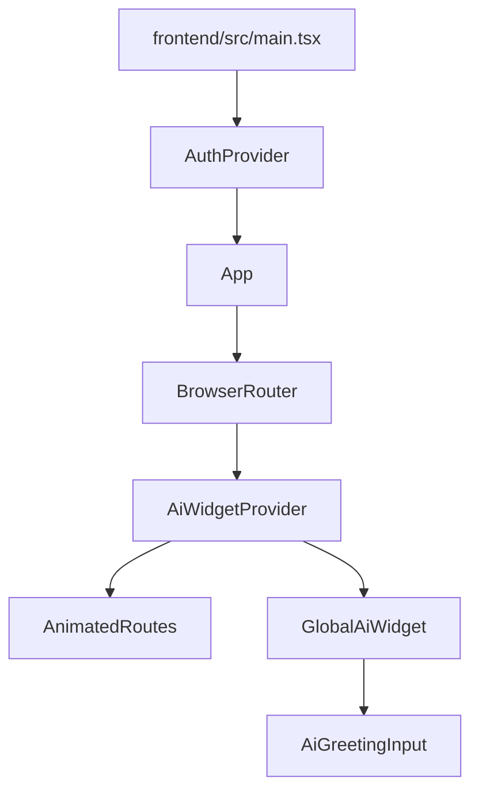
```mermaid
graph TD
  A["frontend/src/main.tsx"] --> B["AuthProvider"]
  B --> C["App"]
  C --> D["BrowserRouter"]
  D --> E["AiWidgetProvider"]
  E --> F["AnimatedRoutes"]
  E --> G["GlobalAiWidget"]
  G --> H["AiGreetingInput"]
```

对应文件：

- `frontend/src/main.tsx`
- `frontend/src/contexts/AuthContext.tsx`
- `frontend/src/App.tsx`
- `frontend/src/context/AiWidgetContext.tsx`
- `frontend/src/components/onboarding/GlobalAiWidget.tsx`
- `frontend/src/components/onboarding/AiGreetingInput.tsx`

这里还有一个当前代码里已经明确存在的总入口边界：

- `App`
  - 只负责建立：
    - `BrowserRouter`
    - `AiWidgetProvider`
    - `AnimatedRoutes + GlobalAiWidget`
- `AnimatedRoutes`
  - 负责把：
    - `/login`
    - `/onboarding`
    - `/sprout|/branch|/leaf|/forest|/canopy|/canvas`
    这些页面入口统一挂到一个路由切换点
  - 对 `/sprout|/branch|/leaf|/forest|/canopy|/canvas` 这组 app 路由，当前会统一使用 `routeKey = 'app'`
  - 这意味着这些页面之间切换时，动画分组和全局 AI 面板的宿主层不会因为 pathname 不同而被拆成多组入口

### 1.2 页面层

`AnimatedRoutes` 负责页面入口与主区域切换：

- `/login -> AuthPage`
- `/onboarding -> IcebreakerFlow`
- `MainLayout -> /sprout -> SproutPage`
- `MainLayout -> /branch -> BranchPage`
- `MainLayout -> /leaf|/forest|/canopy|/canvas`

其中与 `onboarding-handle` 主流程最相关的是 `SproutPage` 和 `BranchPage`。

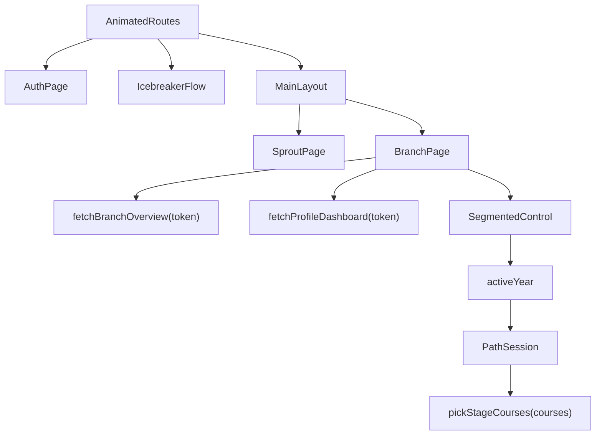
```mermaid
graph TD
  A["AnimatedRoutes"] --> B["AuthPage"]
  A --> C["IcebreakerFlow"]
  A --> D["MainLayout"]
  D --> E["SproutPage"]
  D --> F["BranchPage"]
  F --> G["fetchBranchOverview(token)"]
  F --> H["fetchProfileDashboard(token)"]
  F --> I["SegmentedControl"]
  I --> J["activeYear"]
  J --> K["PathSession"]
  K --> L["pickStageCourses(courses)"]
```

页面职责：

- `SproutPage` 负责首页主体和首次进入覆盖层。
- `BranchPage` 负责加载繁枝页真实路径总览、切换年级、并把每个年级的课程节点映射到同一套展示容器。

`BranchPage` 当前已经不再导入 `FreshmanView`、`SophomoreView`、`JuniorView`、`SeniorView` 这四个旧视图文件。当前真实关系如下：

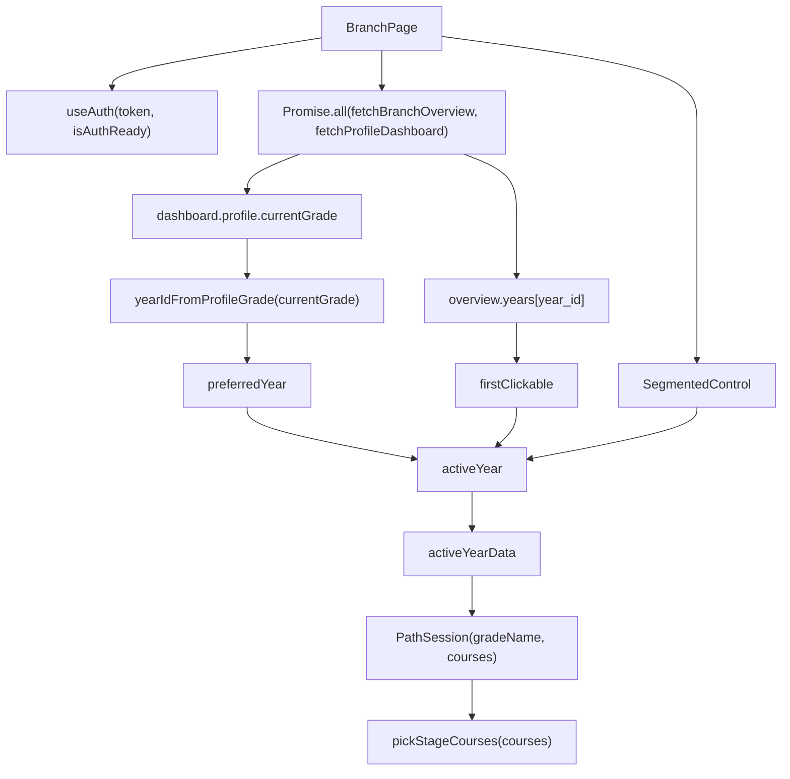
```mermaid
graph TD
  A["BranchPage"] --> B["SegmentedControl"]
  A --> C["useAuth(token, isAuthReady)"]
  A --> D["Promise.all(fetchBranchOverview, fetchProfileDashboard)"]
  D --> E["overview.years[year_id]"]
  D --> F["dashboard.profile.currentGrade"]
  F --> G["yearIdFromProfileGrade(currentGrade)"]
  G --> H["preferredYear"]
  E --> I["firstClickable"]
  H --> J["activeYear"]
  I --> J
  B --> J
  J --> K["activeYearData"]
  K --> L["PathSession(gradeName, courses)"]
  L --> M["pickStageCourses(courses)"]
```

这意味着 `BranchPage` 现在承担的是：

- 登录态门禁后的数据加载
- 并行读取繁枝页路径总览和首页画像 DTO
- 把 `profile.currentGrade` 精确映射为 `year_1` / `year_2` / `year_3` / `year_4`
- `activeYear` 切换
- `overview.years[year_id]` 到展示文案、课程节点、当前焦点的映射
- 单一 `PathSession` 模板下的年级切换动画
- 根据 `course.status` 和 `course.has_outline` 决定舞台中心节点与提示文案

当前默认年级选择规则已经由代码和页面测试确认：

1. 先读取 `/api/profile/dashboard` 返回的 `profile.currentGrade`
2. 用 `yearIdFromProfileGrade()` 做中文年级到 `year_*` 的映射
3. 如果映射成功，并且该年级 `is_clickable=true`，就把该年级设为 `activeYear`
4. 如果映射失败，或者映射到的年级当前不可进入，回退到 `overview.years` 里第一个 `is_clickable=true` 的年级
5. 如果一个可进入年级都没有，再回退到 `year_1`

这里有一个刚修过的真实 bug：

- 旧实现只会选“第一个可进入年级”
- 新实现会优先按 `profile.currentGrade` 定位默认年级
- 但如果 `profile.currentGrade` 对应年级当前不可进入，仍然必须退回到“第一个可进入年级”

这里还有一个当前实现边界已经确认：

- `is_clickable`
  - 表示“这个年级是否有课程路径，可不可以进入这个年级的路径舞台”
  - 当前只要求 `has_courses=true`
- `has_outline_content`
  - 表示“这个年级里是否已经有至少一门课存有课程大纲”
  - 只影响课程补充信息，不再阻止整个年级被点击进入

换句话说，当前 `BranchPage` 的真实语义是：

- 没有课程路径：整个年级不可进入
- 有课程路径但还没有课程大纲：年级仍可进入，路径舞台照常展示
- 有课程路径且已有课程大纲：年级可进入，并且部分课程节点会标记 `has_outline=true`

当前仓库里的 `frontend/src/pages/branch/views/FreshmanView.tsx`、`SophomoreView.tsx`、`JuniorView.tsx`、`SeniorView.tsx` 仍然存在，但知识图已经确认它们当前没有被任何文件导入。

`BranchPage` 当前真实读取链路如下：

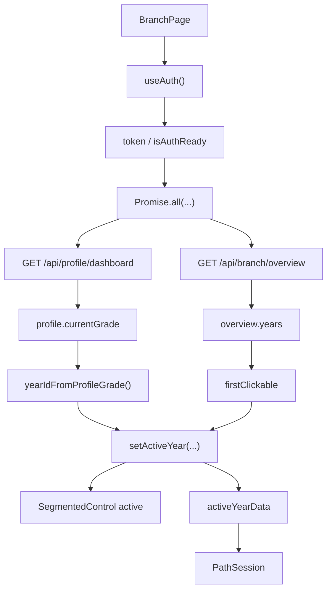
```mermaid
graph TD
  A["BranchPage"] --> B["useAuth()"]
  B --> C["token / isAuthReady"]
  C --> D["Promise.all(...)"]
  D --> E["GET /api/branch/overview"]
  D --> F["GET /api/profile/dashboard"]
  F --> G["profile.currentGrade"]
  G --> H["yearIdFromProfileGrade()"]
  E --> I["overview.years"]
  I --> J["firstClickable"]
  H --> K["setActiveYear(...)"]
  J --> K
  K --> L["SegmentedControl active"]
  K --> M["activeYearData"]
  M --> N["PathSession"]
```

### 1.3 上下文层

前端主流程依赖两个上下文：

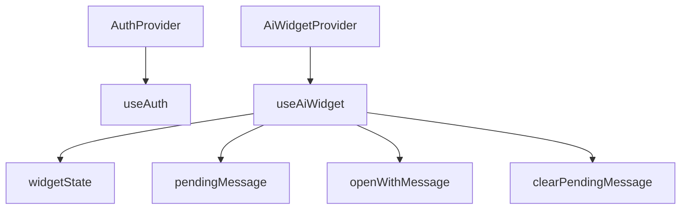
```mermaid
graph TD
  A["AuthProvider"] --> B["useAuth"]
  C["AiWidgetProvider"] --> D["useAiWidget"]
  D --> E["widgetState"]
  D --> F["pendingMessage"]
  D --> G["openWithMessage"]
  D --> H["clearPendingMessage"]
```

具体职责：

- `AuthProvider`
  - 从 `localStorage` 读取 `mutiagent-auth`
  - 提供 `user`、`token`、`isAuthReady`、`login()`、`logout()`
- `AiWidgetProvider`
  - 提供 `widgetState`
  - 提供 `pendingMessage`
  - 提供 `openWithMessage(text)`，它会把消息写入 `pendingMessage` 并切到 `EXPANDED`

这意味着：

- 登录态决定 AI 面板是否可见
- 页面组件并不直接发起对话，它们通过 `openWithMessage()` 把消息交给全局对话面板

`GlobalAiWidget` 本身还承担了两条已经由真实代码确认的门禁逻辑：

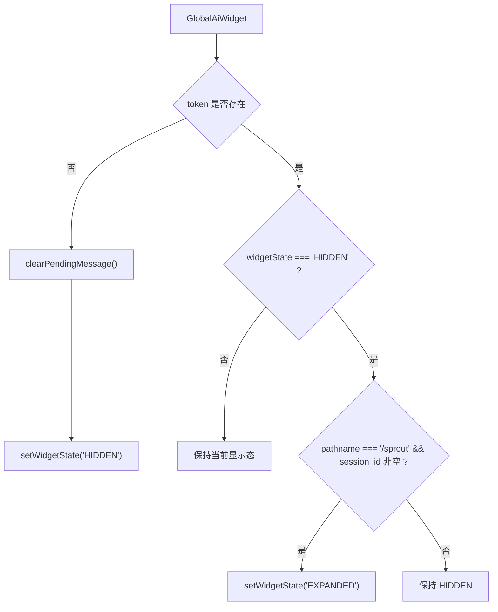
```mermaid
graph TD
  A["GlobalAiWidget"] --> B{"token 是否存在"}
  B -->|否| C["clearPendingMessage()"]
  C --> D["setWidgetState('HIDDEN')"]
  B -->|是| E{"widgetState === 'HIDDEN' ?"}
  E -->|否| F["保持当前显示态"]
  E -->|是| G{"pathname === '/sprout' && session_id 非空 ?"}
  G -->|是| H["setWidgetState('EXPANDED')"]
  G -->|否| I["保持 HIDDEN"]
```

对应文件：

- `frontend/src/components/onboarding/GlobalAiWidget.tsx`

当前语义非常具体：

- 一旦没有登录 token：
  - 会先清掉 `pendingMessage`
  - 再把 widget 强制收回 `HIDDEN`
- 只有在以下条件同时满足时，隐藏态 widget 才会被自动重新展开：
  - 当前已登录
  - 当前 `widgetState === 'HIDDEN'`
  - 当前 URL 位于 `/sprout`
  - URL 里存在非空 `session_id`

所以当前自动展开逻辑不是“任何情况下看到 `session_id` 都重开面板”，而是：

- 只针对已登录的 `/sprout?session_id=...` 会话恢复入口
- 并且只在 widget 还处于 `HIDDEN` 时接管展开

### 1.4 页面到全局对话面板的桥接

`SproutPage` 这条链路目前最重要：

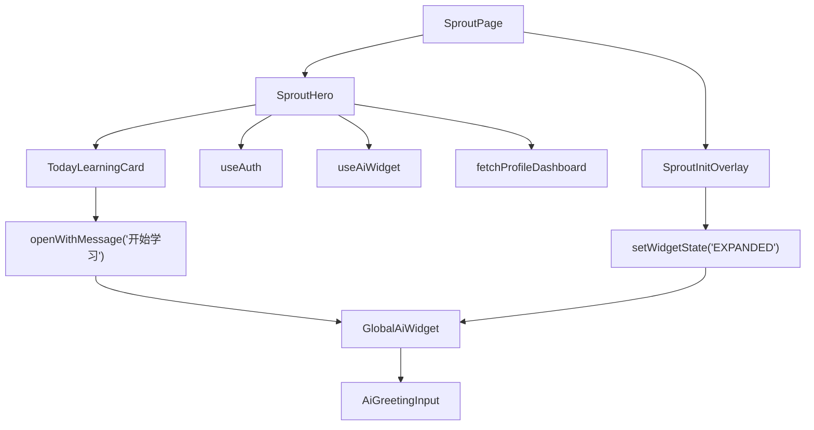
```mermaid
graph TD
  A["SproutPage"] --> B["SproutHero"]
  A --> C["SproutInitOverlay"]
  B --> D["useAuth"]
  B --> E["useAiWidget"]
  B --> F["fetchProfileDashboard"]
  B --> G["TodayLearningCard"]
  G --> H["openWithMessage('开始学习')"]
  C --> I["setWidgetState('EXPANDED')"]
  H --> J["GlobalAiWidget"]
  I --> J
  J --> K["AiGreetingInput"]
```

这里有两个重要入口：

- `SproutHero` 里的 `TodayLearningCard` 会通过 `openWithMessage('开始学习')` 打开全局面板
- `SproutInitOverlay` 在时间轴走到最后时，直接 `setWidgetState('EXPANDED')`

把这条前端桥接链再压到函数级，当前真实顺序如下：

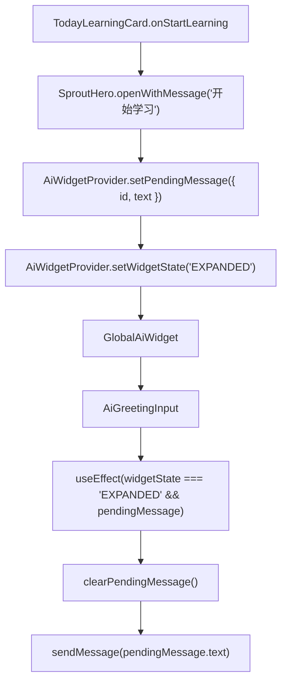
```mermaid
graph TD
  A["TodayLearningCard.onStartLearning"] --> B["SproutHero.openWithMessage('开始学习')"]
  B --> C["AiWidgetProvider.setPendingMessage({ id, text })"]
  C --> D["AiWidgetProvider.setWidgetState('EXPANDED')"]
  D --> E["GlobalAiWidget"]
  E --> F["AiGreetingInput"]
  F --> G["useEffect(widgetState === 'EXPANDED' && pendingMessage)"]
  G --> H["clearPendingMessage()"]
  H --> I["sendMessage(pendingMessage.text)"]
```

这条函数级链路当前说明了三个具体事实：

1. `SproutHero`
   - 只负责把“开始学习”写入全局 widget 上下文
   - 不自己维护对话请求
2. `AiWidgetProvider`
   - `openWithMessage(text)` 的真实行为不是“立即发消息”
   - 而是：
     - 先写入 `pendingMessage`
     - 再把 widget 切到 `EXPANDED`
3. `AiGreetingInput`
   - 才是真正消费 `pendingMessage` 并触发 `sendMessage()` 的地方
   - 发送前会先 `clearPendingMessage()`，避免同一条预置消息被重复消费

如果把 `onboarding-handle` 继续拆成“页面 / 上下文 / 视图”三层，当前真实关系如下：

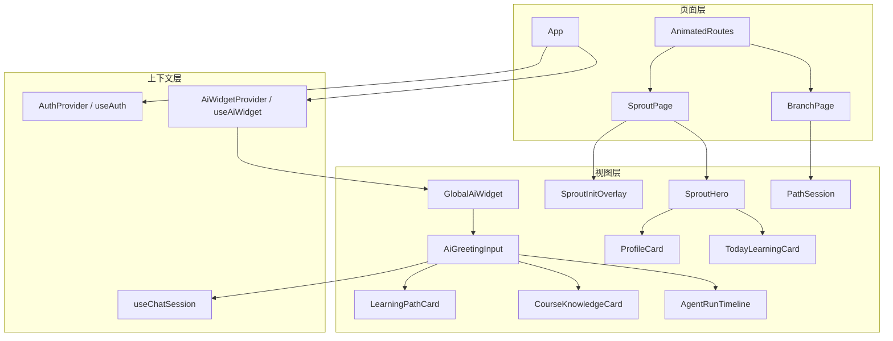
```mermaid
graph TD
  subgraph 页面层
    A["App"]
    B["AnimatedRoutes"]
    C["SproutPage"]
    D["BranchPage"]
  end

  subgraph 上下文层
    E["AuthProvider / useAuth"]
    F["AiWidgetProvider / useAiWidget"]
    G["useChatSession"]
  end

  subgraph 视图层
    H["SproutHero"]
    I["SproutInitOverlay"]
    J["GlobalAiWidget"]
    K["AiGreetingInput"]
    L["ProfileCard"]
    M["TodayLearningCard"]
    N["LearningPathCard"]
    O["CourseKnowledgeCard"]
    P["AgentRunTimeline"]
    Q["PathSession"]
  end

  A --> E
  A --> F
  B --> C
  B --> D
  C --> H
  C --> I
  D --> Q
  F --> J
  J --> K
  K --> G
  H --> L
  H --> M
  K --> N
  K --> O
  K --> P
```

这张图对应的职责边界是：

- 页面层只负责路由、首屏入口和数据加载边界：
  - `SproutPage`
  - `BranchPage`
- 上下文层只负责全局状态，不直接画业务卡片：
  - `useAuth`
  - `useAiWidget`
  - `useChatSession`
- 视图层只消费页面层或上下文层给出的状态：
  - 首页卡片
  - 全局聊天面板
  - 结构化学习结果卡片

### 1.4.1 前端 API 边界：`api-session -> onboarding-session`

如果把页面层和会话层之间的 API 边界单独拎出来，当前前端真实调用边如下：

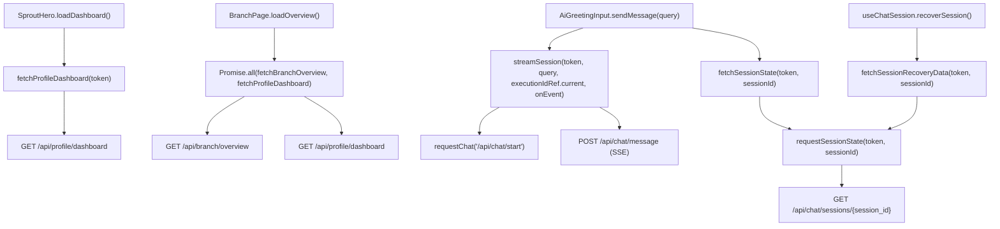
```mermaid
graph TD
  A["SproutHero.loadDashboard()"] --> B["fetchProfileDashboard(token)"]
  B --> C["GET /api/profile/dashboard"]

  D["BranchPage.loadOverview()"] --> E["Promise.all(fetchBranchOverview, fetchProfileDashboard)"]
  E --> F["GET /api/branch/overview"]
  E --> G["GET /api/profile/dashboard"]

  H["AiGreetingInput.sendMessage(query)"] --> I["streamSession(token, query, executionIdRef.current, onEvent)"]
  I --> J["requestChat('/api/chat/start')"]
  I --> K["POST /api/chat/message (SSE)"]
  H --> L["fetchSessionState(token, sessionId)"]
  L --> M["requestSessionState(token, sessionId)"]
  M --> N["GET /api/chat/sessions/{session_id}"]

  O["useChatSession.recoverSession()"] --> P["fetchSessionRecoveryData(token, sessionId)"]
  P --> M
```

这条边界当前已经由代码确认成四个精确入口：

1. 首页画像入口
   - `SproutHero.loadDashboard()`
   - 只调用：
     - `fetchProfileDashboard(token)`
   - 再把 `/api/profile/dashboard` 返回的聚合 DTO 直接分发给：
     - `ProfileCard`
     - `TodayLearningCard`
     - `RecommendationCard`
2. 繁枝页并行入口
   - `BranchPage.loadOverview()`
   - 当前固定走：
     - `Promise.all([fetchBranchOverview(token), fetchProfileDashboard(token)])`
   - `fetchBranchOverview(token)`
     - 提供 `years[year_id].is_clickable / current_course_id / courses[*]`
   - `fetchProfileDashboard(token)`
     - 额外提供 `dashboard.profile.currentGrade`
     - 再由 `yearIdFromProfileGrade()` 决定默认 `activeYear`
3. 对话执行入口
   - `AiGreetingInput.sendMessage(query)`
   - 先走：
     - `streamSession(token, query, executionIdRef.current, onEvent)`
   - 如果这一轮确认生成或读取了结构化结果，再补走：
     - `fetchSessionState(token, finalSessionId)`
   - 也就是说：
     - SSE 负责过程事件和最终文本
     - `GET /api/chat/sessions/{session_id}` 负责结构化卡片回填
4. 会话恢复入口
   - `useChatSession.recoverSession()`
   - 本地缓存不足或命中“半流式快照”分支时，会调用：
     - `fetchSessionRecoveryData(token, recoveredSessionId)`
   - `fetchSessionRecoveryData()` 内部再统一走：
     - `requestSessionState(token, sessionId)`
   - 然后把：
     - `messages`
     - `profile`
     - `learningPath`
     - `courseKnowledge`
     - `hasCompleteProfile`
     重新挂回前端消息对象

这层 API 边界当前还有一条统一的鉴权与错误收口：

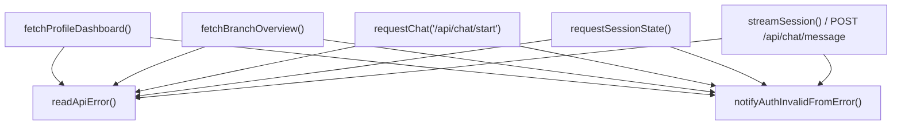
```mermaid
graph TD
  A["fetchProfileDashboard()"] --> B["readApiError()"]
  A --> C["notifyAuthInvalidFromError()"]

  D["fetchBranchOverview()"] --> B
  D --> C

  E["requestChat('/api/chat/start')"] --> B
  E --> C

  F["requestSessionState()"] --> B
  F --> C

  G["streamSession() / POST /api/chat/message"] --> B
  G --> C
```

这说明当前前端不是每个页面自己散着判断 `401`，而是：

- API 层先统一读取：
  - `readApiError(response)`
- 然后统一判断：
  - `notifyAuthInvalidFromError(response.status, error)`
- 最后才把页面级错误文本交回：
  - `SproutHero`
  - `BranchPage`
  - `AiGreetingInput`

当前这层边界上还叠了三种运行时校验：

- `fetchProfileDashboard()`
  - 先用 `isProfileDashboardData(payload)` 校验首页 DTO
- `fetchBranchOverview()`
  - 先逐层归一化：
    - `years`
    - `grade`
    - `course`
- `requestSessionState()` / `requestChat('/api/chat/start')`
  - 先经过：
    - `normalizeSessionStateResponse(payload)`
    - `normalizeChatStartResponse(payload)`

所以 `api-session -> onboarding-session` 当前不是“组件直接吃后端 JSON”，而是：

- 页面层负责触发 API
- API 层负责鉴权、错误、运行时壳校验
- `AiGreetingInput` / `useChatSession` 负责把通过校验的数据翻译回消息对象和结构化卡片

### 1.5 `/sprout` 今日推荐的数据边界

`/api/profile/dashboard` 里的 `todayLearning` 当前已经有一条明确的数据来源规则：

- 必须以当前用户 `updated_at` 最新的那条 `UserYearLearningPath` 为准
- `currentLearningCourse`
  - 由这条最新学习路径里的 `current_learning_course` 派生
- `currentCourseDetail`
  - 由这条最新学习路径里与 `current_learning_course.course_node_id` 精确对应的 `course_nodes[*]` 派生
- `currentCourseOutline`
  - 只按这门当前课程的 `course_id` 精确读取

对应代码位置：

- `backend/app/services/learning_path_service.py`
  - `get_all_year_learning_paths()`
  - `get_latest_grade_year()`
- `backend/app/api/profile.py`
  - `_today_learning_from_path()`

这也是一个已经确认并修过的真实 bug：

- 旧实现直接遍历 `year_learning_paths.values()`
- 当用户同时存在多个年级路径时，`todayLearning` 可能拿到旧路径的当前课程
- 现在统一按 `updated_at desc` 选“最新学习路径”

当前学习路径读取链还新增了一层兼容约束：

- service 层会把旧数据统一归一化成：
  - `current_learning_course`
  - `current_learning_courses`
- 如果数据库里暂时只有旧字段 `current_learning_course`
  - 读取时会自动补成长度为 1 的 `current_learning_courses`
- 如果后续只写出 `current_learning_courses`
  - 读取时也会把 `current_learning_course` 对齐到列表第一项

对应代码位置：

- `backend/app/services/learning_path_service.py`
  - `_normalize_current_learning_courses()`
- `backend/app/api/branch.py`
  - `read_branch_overview()` 现在通过 service 读取归一化后的路径
  - 繁枝页路径舞台

这里还有一条这轮刚确认并修掉的状态一致性约束：

- `todayLearning.currentCourseOutline`
  - 只读取“当前课程”的 outline
  - 所以如果旧 outline 挂在别的课程上，首页未必会直接露出问题
- `branch/overview`
  - 会按整年 `courses[*].course_node_id` 去匹配 `UserCourseKnowledgeOutline`
  - 只要数据库里还残留旧 outline，该年级的
    - `has_outline_content`
    - `courses[*].has_outline`
    就会继续显示为 `true`

这意味着画像被重新改写时，哪怕暂时保留旧学习路径，旧课程大纲也不能继续保留。

当前真实约束已经变成：

- `profile` 被重写成 `basic_profile`
  - 旧课程大纲全部失效
- `profile` 被重写成 `collecting`
  - 旧课程大纲同样全部失效
  - 但旧学习路径是否暂时保留，仍按各接口当前契约决定

对应代码位置：

- `backend/app/orchestration/agents/profile.py`
  - `_persist_profile()`
- `backend/app/api/profile.py`
  - `_today_learning_from_path()`
- `backend/app/api/branch.py`
  - `read_branch_overview()`

`SproutHero` 本身还承担了首页画像与今日学习数据聚合的前端入口：

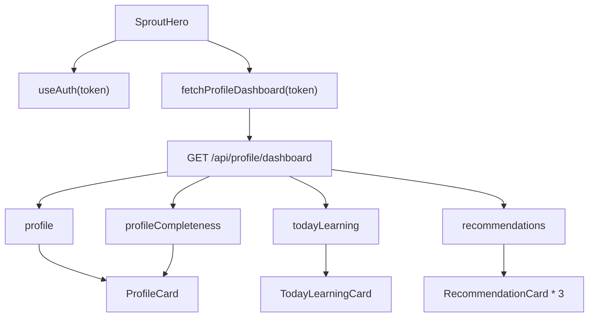
```mermaid
graph TD
  A["SproutHero"] --> B["useAuth(token)"]
  A --> C["fetchProfileDashboard(token)"]
  C --> D["GET /api/profile/dashboard"]
  D --> E["profile"]
  D --> F["profileCompleteness"]
  D --> G["todayLearning"]
  D --> H["recommendations"]
  E --> I["ProfileCard"]
  F --> I
  G --> J["TodayLearningCard"]
  H --> K["RecommendationCard * 3"]
```

这条链路的职责边界当前已经由代码确认：

- `SproutHero` 不自己拼画像数据，它只消费 `/api/profile/dashboard` 聚合好的首页 DTO。
- `ProfileCard` 使用：
  - `profile`
  - `profileCompleteness`
  - `profileSummaryText`
- `TodayLearningCard` 使用：
  - `todayLearning.currentLearningCourse`
  - `todayLearning.currentCourseDetail`
  - `todayLearning.currentCourseOutline`
  - `todayLearning.followingCourses`
- `RecommendationCard` 只消费后端返回的推荐数组，不再二次推导业务字段。

当前首页与繁枝页还共享了一条前端 DTO 契约边界：

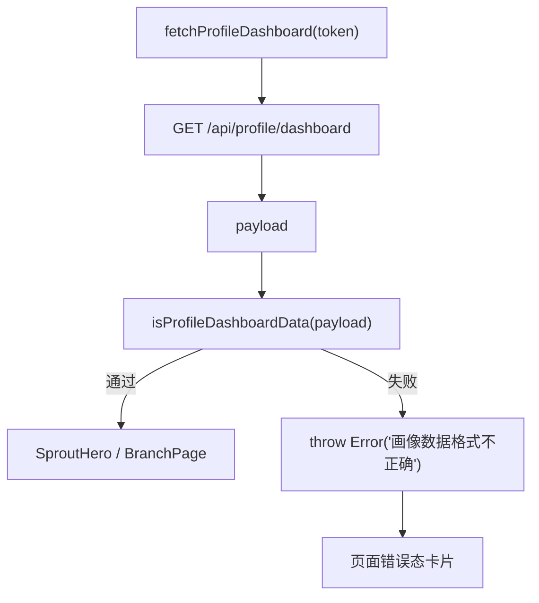
```mermaid
graph TD
  A["fetchProfileDashboard(token)"] --> B["GET /api/profile/dashboard"]
  B --> C["payload"]
  C --> D["isProfileDashboardData(payload)"]
  D -->|通过| E["SproutHero / BranchPage"]
  D -->|失败| F["throw Error('画像数据格式不正确')"]
  F --> G["页面错误态卡片"]
```

对应文件：

- `frontend/src/api/profile.ts`
- `frontend/src/types/profile.ts`
- `frontend/src/components/home/SproutHero.tsx`
- `frontend/src/pages/branch/BranchPage.tsx`

这层边界是这轮刚补上的真实修复：

- 旧实现
  - `fetchProfileDashboard()` 直接把 `response.json()` 强转成 `ProfileDashboardData`
  - 如果后端返回了非法 `todayLearning.currentLearningCourse.progress_state`
    - 例如 `paused`
    - 这份脏数据会直接流入 `SproutHero` 和 `BranchPage`
- 新实现
  - `fetchProfileDashboard()` 会先走 `isProfileDashboardData(payload)` 运行时校验
  - `currentLearningCourse.progress_state` 现在前端只接受：
    - `in_progress`
    - `completed`
  - 一旦 DTO 结构不合法，页面会走统一错误态，而不是在视图层继续消费不一致数据

换句话说，现在 `/api/profile/dashboard` 对前端来说已经不只是“类型上声明成 `ProfileDashboardData`”，而是：

- 先经过 API 层运行时校验
- 再交给 `SproutHero`
- 再交给 `BranchPage`

这也是当前首页画像卡片、今日学习卡片和繁枝页默认年级定位共享的同一条数据入口边界。

当前这条首登链路还有两个已经收口过的实现约束：

- `SproutInitOverlay` 的入场与文字切换现在只使用 `opacity` 和 `transform`
- `SproutInitOverlay` 在 `prefers-reduced-motion` 场景下会直接进入 `phase=10` 并展开全局聊天面板

### 1.5 `AiGreetingInput` 的内部角色

`AiGreetingInput` 不是单纯的输入框，它是前端会话编排器。

在它之前还有一层明确的全局桥接：

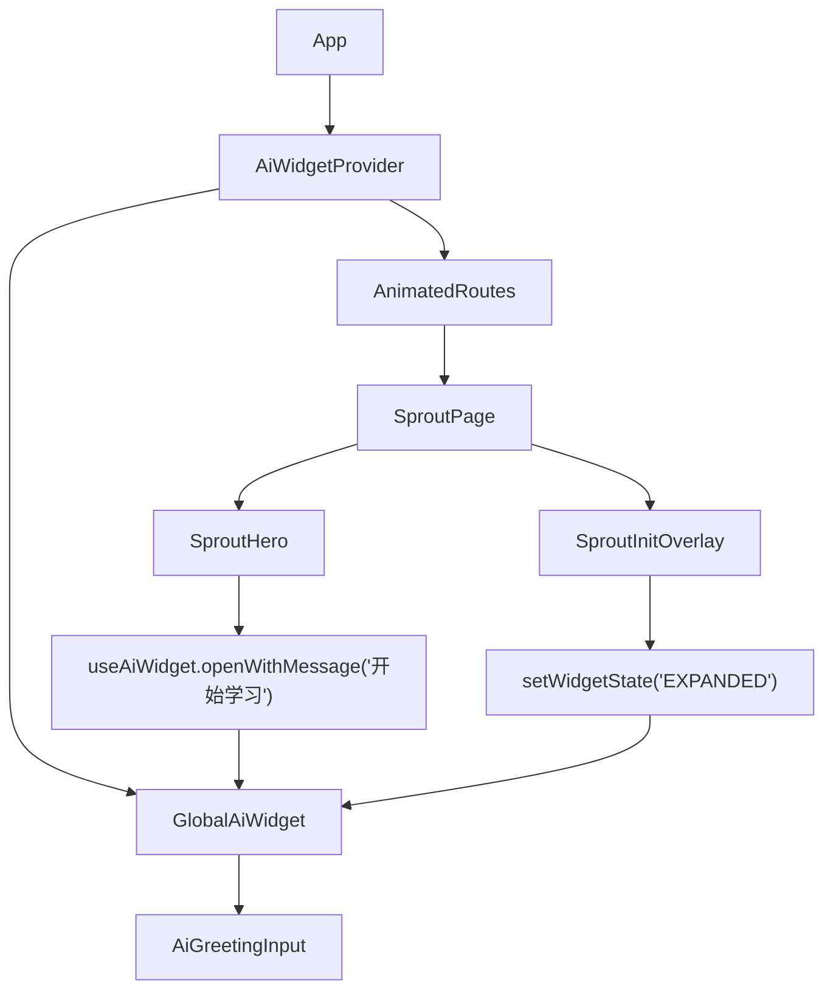
```mermaid
graph TD
  A["App"] --> B["AiWidgetProvider"]
  B --> C["AnimatedRoutes"]
  B --> D["GlobalAiWidget"]
  C --> E["SproutPage"]
  E --> F["SproutHero"]
  F --> G["useAiWidget.openWithMessage('开始学习')"]
  E --> H["SproutInitOverlay"]
  H --> I["setWidgetState('EXPANDED')"]
  G --> D
  I --> D
  D --> J["AiGreetingInput"]
```

这里的桥接职责已经从代码确认：

- `App` 把 `AiWidgetProvider` 包在 `AnimatedRoutes` 和 `GlobalAiWidget` 外层，所以页面树和全局对话面板共享同一个 widget 状态。
- `SproutHero` 不自己维护聊天 UI，只通过 `openWithMessage('开始学习')` 写入 `pendingMessage` 并把 widget 切到 `EXPANDED`。
- `SproutInitOverlay` 不直接创建消息，它只负责把 `widgetState` 切到 `EXPANDED`，真正的会话输入仍然由 `AiGreetingInput` 接管。
- `GlobalAiWidget` 只有在 `token` 存在且 `widgetState !== 'HIDDEN'` 时才会挂载，因此它同时承担了“登录态门禁”和“全局浮层容器”两层职责。

它的依赖关系可以拆成四层：

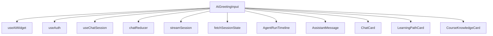
```mermaid
graph TD
  A["AiGreetingInput"] --> B["useAiWidget"]
  A --> C["useAuth"]
  A --> D["useChatSession"]
  A --> E["chatReducer"]
  A --> F["streamSession"]
  A --> G["fetchSessionState"]
  A --> H["AgentRunTimeline"]
  A --> I["AssistantMessage"]
  A --> J["ChatCard"]
  A --> K["LearningPathCard"]
  A --> L["CourseKnowledgeCard"]
```

按职责拆分：

- 输入与会话状态
  - `useReducer(chatReducer, initialChatStore)`
  - `useChatSession(store.currentSessionId, onSessionRecovered)`
- SSE 事件归并
  - `streamSession(...)`
  - `mergeSessionAgentStep(...)`
  - `eventToStep(...)`
- 结构化数据回填
  - `fetchSessionState(token, sessionId)`
- 渲染分发
  - 学习路径结果 -> `LearningPathCard`
  - 课程大纲结果 -> `CourseKnowledgeCard`
  - 结构化画像对话 -> `ChatCard`
  - 纯文本 / 错误 / 重试 -> `AssistantMessage`

当前这层已经确认了两个实现事实：

- 会话不会因为 `session_completed.has_profile=true` 就强制切新会话。
  - 前端后续追问仍然复用同一个 `session_id`
  - 这样“更新画像 -> 继续生成学习路径”才能落在同一条历史上下文里
- 如果同一轮同时拿到：
  - `structuredData.learningPath`
  - `structuredData.courseKnowledge`
  前端会把两者同时保留并渲染，而不是让后一张卡把前一张卡覆盖掉
- `fetchSessionState(token, sessionId)` 在挂载课程大纲前，会先校验：
  - `courseKnowledge.course_id`
  - `learningPath.current_learning_course.course_node_id`
  两者必须一致
  否则前端会丢弃这份课程大纲，避免把别的课程旧大纲挂到当前会话
- `requestSessionState(token, sessionId)` 现在还会先校验 `session state` 的外层响应壳：
  - `session_id`
  - `user_uid`
  - `updated_at`
  - `profile`
  - `year_learning_paths`
  - `course_knowledge`
  - `messages`
  必须满足当前前端恢复链的最小契约
  - 如果 `messages` 缺省，前端会归一化成 `[]`
  - 如果 `messages` 存在但不是数组，前端会直接抛出：
    - `会话数据格式不正确`
  - 这样不会再把底层类型错误直接泄漏成：
    - `rawMessages.forEach is not a function`
- `/api/chat/start` 现在也走了同一类前端外层响应壳归一化：
  - `startSession(token, query)`
  - `streamSession(token, query, null, onEvent)`
  这两个入口都会先校验：
  - `session_id`
  - `reply_text`
  - `profile`
  - `year_learning_paths`
  - `latest_grade_year`
  - `course_knowledge`
  是否满足当前前端启动会话的最小契约
  - 如果 `session_id` 缺失，或这些字段的外层类型被污染
  - 前端会稳定返回：
    - `会话数据格式不正确`
  - 不会再把坏的 `/api/chat/start` 响应继续放行成：
    - `sessionId: undefined`

如果只看 `AiGreetingInput` 自己的运行时主链，当前真实顺序已经可以单独拆成：

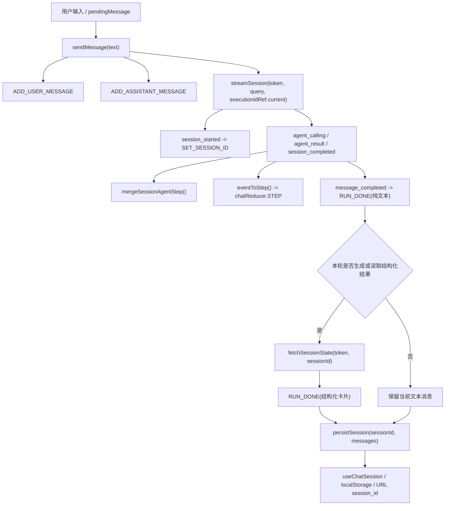
```mermaid
graph TD
  A["用户输入 / pendingMessage"] --> B["sendMessage(text)"]
  B --> C["ADD_USER_MESSAGE"]
  B --> D["ADD_ASSISTANT_MESSAGE"]
  B --> E["streamSession(token, query, executionIdRef.current)"]
  E --> F["session_started -> SET_SESSION_ID"]
  E --> G["agent_calling / agent_result / session_completed"]
  G --> H["mergeSessionAgentStep()"]
  G --> I["eventToStep() -> chatReducer.STEP"]
  G --> J["message_completed -> RUN_DONE(纯文本)"]
  J --> K{"本轮是否生成或读取结构化结果"}
  K -->|是| L["fetchSessionState(token, sessionId)"]
  L --> M["RUN_DONE(结构化卡片)"]
  K -->|否| N["保留当前文本消息"]
  M --> O["persistSession(sessionId, messages)"]
  N --> O
  O --> P["useChatSession / localStorage / URL session_id"]
```

这条顺序说明 `AiGreetingInput` 当前同时承担四层职责：

- 输入网关
  - 接收 textarea 输入
  - 接收 `pendingMessage`
  - 统一走 `sendMessage()`
- 流式事件归并
  - 把 SSE 事件拆成：
    - 面板进度
    - 时间线步骤
    - 最终文本
- 结构化结果回填
  - 只在“本轮确实生成或读取了结构化结果”时再请求 `session state`
- 会话锚点持久化
  - 负责把：
    - `session_id`
    - `messages`
    - `retryAction`
    - 结构化卡片
    同步到本地恢复层

### 1.6 会话恢复层

`useChatSession` 负责把当前对话和 URL 参数打通：

- URL 参数名固定为 `session_id`
- 如果 URL 带 `session_id`，它会先尝试从 `localStorage` 读取 `session-${sessionId}`
- 本地缓存只有在 `cached.userUid === 当前登录 user.uid` 时才允许直接恢复
- 如果本地缓存里仍然残留：
  - `assistant.status = pending/streaming`
  - 或 `activeStepId`
  - 或 `runTrace.status = running`
  这类“半流式快照”，前端不会直接把它当成稳定恢复源，而是优先走服务端恢复
- 如果缓存缺少 `userUid`，或 `userUid` 与当前登录用户不一致，前端不会直接吃这份本地缓存，而是继续走服务端恢复
- 如果本地缓存不存在或损坏，并且当前已有登录 token，它会继续请求 `GET /api/chat/sessions/{session_id}` 做服务端恢复
- 只要这次服务端恢复请求成功返回，哪怕当前 `messages` 还是空数组，这条 `session_id` 也会被保留为有效会话锚点
  - 因为 `/api/chat/start` 本来就会先创建空的 `ConversationSession`
  - 所以“远端存在但暂时还没有任何持久化消息”是合法状态，不是脏链接
- 但如果本地缓存仍然握着当前用户自己的“半流式快照”，而服务端此时还是合法空会话：
  - 前端不会用空数组把本地中间态直接覆盖掉
  - 而是回退到本地快照，保住：
    - 错误消息
    - `retryAction`
    - 以及尚未完全落库前的会话上下文
- 只有本地和服务端都恢复失败时，才会从 URL 清掉 `session_id`
- 如果同一挂载周期里 URL 切换到另一个 `session_id`，它会按新的 `session_id` 重新恢复，而不是只恢复第一次
- 当 `storeSessionId` 存在时，会把它回写到 URL
- `session_started` 发出的 `session_id` 需要在前端立即记住；即使本轮后续在 `session_completed` 前失败，也必须保留这个会话锚点，保证重试继续落在同一条会话上
- 本地会话缓存不能只在成功态落盘；失败态消息如果带有 `retryAction`，也必须写入 `localStorage`，否则刷新后 `useChatSession` 会把 URL 中的 `session_id` 当成无缓存脏链接清掉
- `persistSession(sessionId, messages, hasCompleteProfile)` 当前会连同：
  - `userUid`
  - `hasCompleteProfile`
  一起落盘
  - `userUid` 用来避免退出登录后新用户误恢复到上一个用户的本地会话
  - `hasCompleteProfile` 用来避免刷新恢复时只能靠消息里是否带 `basic_profile` 卡片去猜当前输入框是否处于“画像已完成”态

这层是当前前端会话连续性的关键边界。

当前真实恢复顺序如下：

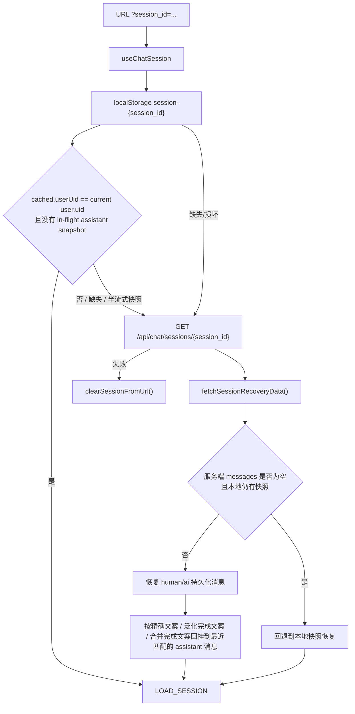
```mermaid
graph TD
  A["URL ?session_id=..."] --> B["useChatSession"]
  B --> C["localStorage session-{session_id}"]
  C --> D{"cached.userUid == current user.uid\n且没有 in-flight assistant snapshot"}
  D -->|是| E["LOAD_SESSION"]
  D -->|否 / 缺失 / 半流式快照| F["GET /api/chat/sessions/{session_id}"]
  C -->|缺失/损坏| F
  F --> G["fetchSessionRecoveryData()"]
  G --> H{"服务端 messages 是否为空\n且本地仍有快照"}
  H -->|否| I["恢复 human/ai 持久化消息"]
  I --> J["按精确文案 / 泛化完成文案 / 合并完成文案回挂到最近匹配的 assistant 消息"]
  J --> E
  H -->|是| K["回退到本地快照恢复"]
  K --> E
  F -->|失败| L["clearSessionFromUrl()"]
```

当前这层已经额外确认了一个容易被忽略的事实：

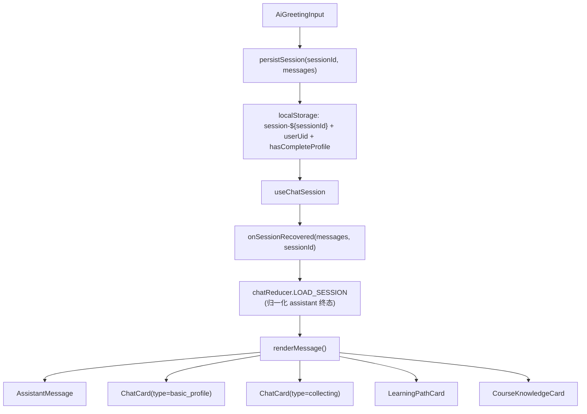
```mermaid
graph TD
  A["AiGreetingInput"] --> B["persistSession(sessionId, messages)"]
  B --> C["localStorage: session-${sessionId} + userUid + hasCompleteProfile"]
  C --> D["useChatSession"]
  D --> E["onSessionRecovered(messages, sessionId)"]
  E --> F["chatReducer.LOAD_SESSION\n(归一化 assistant 终态)"]
  F --> G["renderMessage()"]
  G --> H["AssistantMessage"]
  G --> I["ChatCard(type=basic_profile)"]
  G --> J["ChatCard(type=collecting)"]
  G --> K["LearningPathCard"]
  G --> L["CourseKnowledgeCard"]
```

这意味着当前本地恢复不只是“把一串纯文本消息放回来”，而是会恢复完整的消息对象形态，包括：

- `sessionMessage.type=basic_profile`
- `sessionMessage.type=collecting`
- `learningPath`
- `courseKnowledge`
- `retryAction`
- `runTrace`

因此当前刷新恢复后的真实表现已经被测试覆盖为：

- 刷新后可以直接恢复 `basic_profile` 画像卡片
- 刷新后可以直接恢复 `collecting` 追问卡片
- 刷新后如果持久化 assistant 文本是：
  - `课程大纲已生成`
  现在也会稳定恢复：
  - `courseKnowledge`
- 刷新后如果持久化 assistant 文本是：
  - `学习路径和课程大纲已生成`
  同一条 assistant 消息现在会同时恢复：
  - `learningPath`
  - `courseKnowledge`
- `collecting` 恢复后输入框占位仍保持未完成态：
  - `输入你的学习情况...`
- `basic_profile` 恢复后输入框占位保持已完成态：
  - `画像已生成，可以继续补充或追问...`

`session-state` 的前端回填链路当前已经可以单独拆出来：

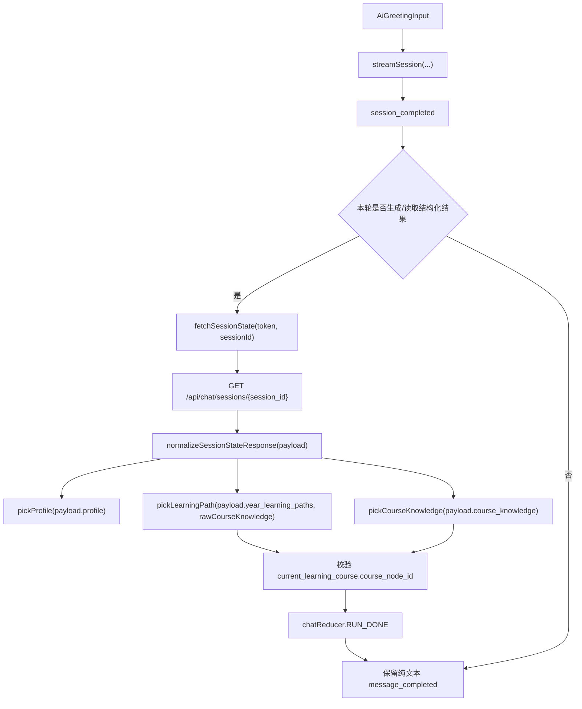
```mermaid
graph TD
  A["AiGreetingInput"] --> B["streamSession(...)"]
  B --> C["session_completed"]
  C --> D{"本轮是否生成/读取结构化结果"}
  D -->|是| E["fetchSessionState(token, sessionId)"]
  E --> F["GET /api/chat/sessions/{session_id}"]
  F --> G["normalizeSessionStateResponse(payload)"]
  G --> H["pickProfile(payload.profile)"]
  G --> I["pickLearningPath(payload.year_learning_paths, rawCourseKnowledge)"]
  G --> J["pickCourseKnowledge(payload.course_knowledge)"]
  I --> K["校验 current_learning_course.course_node_id"]
  J --> K
  K --> L["chatReducer.RUN_DONE"]
  L --> M["LearningPathCard / CourseKnowledgeCard / ChatCard"]
  D -->|否| M["保留纯文本 message_completed"]
```

这条链路当前还有一个已经修过的真实 bug：

- 旧行为
  - 后端 `get_session_state` 在找不到“当前学习路径对应课程”的大纲时，会回退到用户最新一条课程大纲
  - 前端随后可能把别的课程旧大纲挂到当前会话
- 新行为
  - 后端 `get_session_state` 只返回当前学习路径对应课程的大纲
  - 前端 `fetchSessionState` 再做一层 `course_id` 一致性校验
  - 只有路径课程和大纲课程完全一致时，`CourseKnowledgeCard` 才会被挂载
- 这轮新增的行为
  - 前端 `requestSessionState()` 会先做外层响应壳归一化
  - `messages` 缺省时，仍允许结构化结果回填链继续工作
  - 但只要 `messages` 被污染成非数组，恢复链会稳定返回：
    - `会话数据格式不正确`
  - 不再把原生 JavaScript 类型错误直接暴露到 UI

如果继续往下挖到“消息对象本身”的层级，当前前端主链还可以拆成下面这张生命周期图：

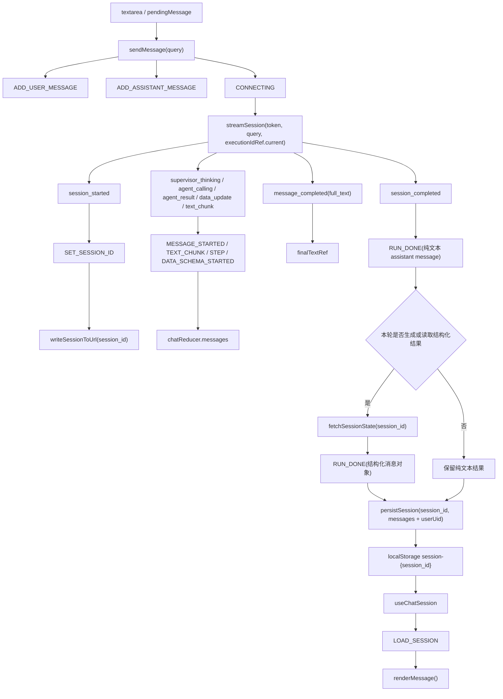
```mermaid
graph TD
  A["textarea / pendingMessage"] --> B["sendMessage(query)"]
  B --> C["ADD_USER_MESSAGE"]
  B --> D["ADD_ASSISTANT_MESSAGE"]
  B --> E["CONNECTING"]
  E --> F["streamSession(token, query, executionIdRef.current)"]

  F --> G["session_started"]
  G --> H["SET_SESSION_ID"]
  H --> I["writeSessionToUrl(session_id)"]

  F --> J["supervisor_thinking / agent_calling / agent_result / data_update / text_chunk"]
  J --> K["MESSAGE_STARTED / TEXT_CHUNK / STEP / DATA_SCHEMA_STARTED"]
  K --> L["chatReducer.messages"]

  F --> M["message_completed(full_text)"]
  M --> N["finalTextRef"]

  F --> O["session_completed"]
  O --> P["RUN_DONE(纯文本 assistant message)"]
  P --> Q{"本轮是否生成或读取结构化结果"}
  Q -->|是| R["fetchSessionState(session_id)"]
  R --> S["RUN_DONE(结构化消息对象)"]
  Q -->|否| T["保留纯文本结果"]

  S --> U["persistSession(session_id, messages + userUid)"]
  T --> U
  U --> V["localStorage session-{session_id}"]
  V --> W["useChatSession"]
  W --> X["LOAD_SESSION"]
  X --> Y["renderMessage()"]
```

这张图对应当前已经由代码和测试共同确认的几个边界：

- `session_started`
  - 一到达就先落：
    - `currentSessionId`
    - URL `session_id`
  - 不会等到 `session_completed` 才保存会话锚点
- `message_completed`
  - 只负责确定最终文本
  - 不直接决定结构化卡片是否回填
- `session_completed`
  - 会先让当前 assistant message 结束为可见文本
  - 然后才判断要不要补拉 `fetchSessionState(session_id)`
- `persistSession`
  - 当前落盘的是完整消息对象，不只是字符串文本
  - 因此刷新恢复后可以直接回到：
    - `AssistantMessage`
    - `ChatCard`
    - `LearningPathCard`
    - `CourseKnowledgeCard`
- `useChatSession`
  - 只负责恢复一条已有会话
  - 不负责驱动新的消息发送
  - 但它现在会额外分发一份恢复元数据：
    - `hasCompleteProfile`
  - 供 `AiGreetingInput` 决定刷新后输入框应该保持：
    - `输入你的学习情况...`
    - 还是 `画像已生成，可以继续补充或追问...`
- `LOAD_SESSION`
  - 不会保留“无法继续流式”的本地中间态
  - assistant message 如果来自本地恢复且仍是：
    - `pending`
    - `streaming`
    现在会统一归一化成：
    - `completed`
  - 对应 `runTrace.status=running` 也会同步归一化成：
    - `success`

### 1.7 当前前端结构结论

当前前端主流程可以概括成：

1. `main.tsx` 用 `AuthProvider` 包住全应用
2. `App` 用 `AiWidgetProvider` 把全局对话面板挂到路由层之外
3. `SproutPage`、`SproutHero`、`SproutInitOverlay` 只通过 `useAiWidget` 驱动全局面板，不自己维护聊天状态
4. `AiGreetingInput` 统一处理 SSE、结构化结果回填、错误展示和会话恢复

这也是为什么 `AiGreetingInput` 是当前前端最需要重点关注的枢纽点。

### 1.8 页面 / 上下文 / 视图关系总图

如果只保留 `onboarding-handle` 主流程真正会穿过的节点，当前前端主链可以进一步压缩成下面这张关系图：

```mermaid
graph TD
  subgraph 页面入口
    A["main.tsx"]
    B["App / AnimatedRoutes"]
    C["SproutPage"]
    D["BranchPage"]
  end

  subgraph 全局上下文
    E["AuthProvider / useAuth"]
    F["AiWidgetProvider / useAiWidget"]
    G["useChatSession"]
  end

  subgraph 视图与会话编排
    H["SproutHero"]
    I["SproutInitOverlay"]
    J["GlobalAiWidget"]
    K["AiGreetingInput"]
    L["ChatCard / AssistantMessage"]
    M["LearningPathCard / CourseKnowledgeCard"]
    N["PathSession"]
  end

  A --> E
  A --> B
  B --> F
  B --> C
  B --> D
  C --> H
  C --> I
  D --> N
  F --> J
  J --> K
  K --> G
  K --> L
  K --> M
  H --> F
  I --> F
  D --> E
  C --> E
```

这张图对应的真实职责边界是：

- 页面层只决定：
  - 路由入口
  - 页面级数据加载
  - 首次触发全局 AI 面板的时机
- 上下文层只负责：
  - 登录态
  - widget 展开态
  - 会话恢复锚点
- 视图与会话编排层只负责：
  - 把消息、结构化画像、学习路径、课程大纲渲染成可恢复的 UI
  - 把 SSE 事件归并成同一条对话时间线

其中 `AiGreetingInput` 当前同时是：

- 全局面板内容宿主
- 对话发送入口
- SSE 事件归并器
- 结构化卡片回填入口
- 本地与服务端恢复结果的二次分发点

### 1.9 全局 AI 面板状态机与恢复边界

如果把 `AiWidgetProvider -> GlobalAiWidget -> AiGreetingInput` 单独当成一个状态机来看，当前真实关系如下：

```mermaid
graph TD
  A["AiWidgetProvider"] --> B["widgetState"]
  A --> C["pendingMessage"]
  A --> D["openWithMessage(text)"]
  A --> E["clearPendingMessage()"]

  D --> F["pendingMessage = { id, text }"]
  D --> G["widgetState = EXPANDED"]

  B --> H["GlobalAiWidget"]
  H --> I{"token 是否存在"}
  I -->|否| J["隐藏 shell"]
  I -->|是| K{"widgetState"}
  K -->|HIDDEN| J
  K -->|CENTER_INPUT| L["frame translateY(...)"]
  K -->|EXPANDED| M["overlay + shell + AiGreetingInput"]
  K -->|WIDGET| N["右下角停靠布局"]

  M --> O["AiGreetingInput"]
  O --> P["useChatSession"]
  O --> Q["chatReducer"]
  O --> R["消费 pendingMessage"]
  R --> E
```

这张图对应的实现边界已经由当前代码确认：

- `AiWidgetProvider`
  - 只维护：
    - `widgetState`
    - `pendingMessage`
  - 不维护聊天消息本体
- `GlobalAiWidget`
  - 只负责：
    - 根据 `token` 和 `widgetState` 决定是否挂载外层 shell
    - 根据 `CENTER_INPUT / EXPANDED / WIDGET` 决定布局和动画
- `AiGreetingInput`
  - 才真正持有：
    - `chatReducer` 状态
    - `currentSessionId`
    - 结构化消息卡片
    - SSE 流式过程

这也解释了当前“会话状态”和“面板状态”为什么是分层的：

- 面板状态在 `AiWidgetProvider`
- 对话状态在 `AiGreetingInput`

两者不会自动等价。

当前这条状态机还有一个已经确认并修过的边界：

- `AiWidgetProvider` 包在 `App` 的整棵路由树外面
- 因此它不会因为页面切换或登出自动卸载
- 如果只清 `auth.token`，不主动清 widget 状态
  - 下一次重新登录时，旧的 `widgetState=EXPANDED` 会直接复活

现在 `GlobalAiWidget` 已经在检测到 `token` 为空时统一执行：

- `clearPendingMessage()`
- `setWidgetState('HIDDEN')`

所以当前登录态切换的真实行为变成：

```mermaid
graph TD
  A["已登录 + widgetState=EXPANDED"] --> B["logout()"]
  B --> C["AuthContext.token = null"]
  C --> D["GlobalAiWidget useEffect"]
  D --> E["clearPendingMessage()"]
  D --> F["setWidgetState('HIDDEN')"]
  F --> G["shell 卸载"]
  G --> H["下一次 login()"]
  H --> I["widgetState 仍为 HIDDEN"]
```

这意味着现在：

- 登出后不会保留旧的展开面板
- 重新登录后不会自动继承上一次的 widget 展开态
- `pendingMessage` 也不会跨登录态残留

### 1.10 前端主流程汇总

按关键节点压缩后，前端主流程如下：

```mermaid
graph TD
  A["App"] --> B["AnimatedRoutes"]
  A --> C["AiWidgetProvider"]
  B --> D["SproutPage"]
  B --> E["BranchPage"]
  D --> F["SproutHero"]
  D --> G["SproutInitOverlay"]
  C --> H["GlobalAiWidget"]
  H --> I["AiGreetingInput"]
  I --> J["useChatSession"]
  I --> K["CourseKnowledgeCard"]
  I --> L["LearningPathCard"]
  I --> M["AssistantMessage / ChatCard"]
  E --> N["PathSession"]
  E --> O["loadOverview"]
```

这条 flow 当前说明了三个非常具体的事实：

1. `SproutPage`
   - 不是聊天状态宿主
   - 它只负责：
     - 首页 Hero
     - 首登覆盖层
     - 打开全局 AI 面板的时机
2. `AiGreetingInput`
   - 是前端真正的会话编排节点
   - 它同时连着：
     - `useChatSession`
     - `LearningPathCard`
     - `CourseKnowledgeCard`
     - `AssistantMessage / ChatCard`
3. `BranchPage`
   - 已经和旧的 `FreshmanView` / `JuniorView` 分视图体系解耦
   - 现在真实走的是：
     - `loadOverview`
     - `PathSession`
     - `pickStageCourses`
     这一套单模板舞台流

如果把这条 flow 和前面的“页面 / 上下文 / 视图关系图”叠起来看，当前 `onboarding-handle` 的主链已经不是散点组件集合，而是：

- `App / AnimatedRoutes`
  - 决定页面入口
- `AiWidgetProvider`
  - 决定全局面板壳层状态
- `AiGreetingInput`
  - 决定会话执行、结构化结果和恢复分发
- `SproutPage / BranchPage`
  - 分别承接首页入口和路径舞台入口
- `LearningPathCard / CourseKnowledgeCard / ChatCard`
  - 承接最终结构化视图

### 1.11 `onboarding-handle` 再压一层：页面 / 上下文 / 视图的真实调用边

如果只保留当前前端主流程里真正会穿过的“页面节点 / 上下文节点 / 视图节点 / 会话节点”，并且按当前代码里的真实函数边继续下钻，`onboarding-handle` 可以再压成下面这张图：

```mermaid
graph TD
  A["App"] --> B["AnimatedRoutes"]
  A --> C["AiWidgetProvider"]
  A --> D["GlobalAiWidget"]

  B --> E["SproutPage"]
  B --> F["BranchPage"]

  E --> G["SproutHero"]
  E --> H["SproutInitOverlay"]
  F --> I["loadOverview()"]
  F --> J["PathSession"]

  G --> K["fetchProfileDashboard(token)"]
  G --> L["TodayLearningCard"]
  L --> M["openWithMessage('开始学习')"]
  H --> N["setWidgetState('EXPANDED')"]

  C --> O["useAiWidget()"]
  D --> P["token + widgetState gate"]
  P --> Q["AiGreetingInput"]

  Q --> R["useAuth()"]
  Q --> S["useChatSession()"]
  Q --> T["chatReducer"]
  Q --> U["streamSession()"]
  Q --> V["fetchSessionState()"]

  U --> W["/api/chat/start or /api/chat/message"]
  S --> X["localStorage / URL session_id / GET session state"]
  T --> Y["renderMessage()"]
  Y --> Z["ChatCard / AssistantMessage / LearningPathCard / CourseKnowledgeCard"]

  M --> D
  N --> D
  I --> J
  K --> G
  O --> D
```

这张图当前能说明四个已经被代码和测试同时验证的边界：

1. 页面入口和全局聊天入口已经分离。
   - `SproutPage` 只负责“什么时候打开聊天面板”
   - 真正的消息对象创建、SSE 处理、结构化结果回填都不在 `SproutPage`
2. `AiWidgetProvider` 是页面层和会话层之间唯一的全局桥。
   - `TodayLearningCard -> openWithMessage('开始学习')`
   - `SproutInitOverlay -> setWidgetState('EXPANDED')`
   最终都会汇到 `GlobalAiWidget -> AiGreetingInput`
3. `AiGreetingInput` 是前端主流程的真实汇流点。
   - 输入
   - 会话锚点
   - SSE 事件
   - 结构化卡片
   - 失败重试
   都在这里收口
4. `useChatSession` 不是附属工具，而是视图恢复分发层。
   - 它把：
     - URL `session_id`
     - `localStorage`
     - 服务端 `GET /api/chat/sessions/{session_id}`
     统一翻译成 `chatReducer.LOAD_SESSION`

相关调用关系如下：

- `useChatSession`
  - 运行时代码 caller 当前只有：
    - `AiGreetingInput`
  - 另一条 caller 是：
    - `useChatSession.test.tsx` 里的测试 harness
- `AiGreetingInput`
  - 运行时代码 caller 当前只有：
    - `GlobalAiWidget`
  - 其余 caller 都来自测试文件

这说明当前前端主链在运行时的真实收口比组件目录看起来更窄：

- 页面层不会直接调用 `useChatSession`
- `useChatSession` 不会绕过 `AiGreetingInput` 直接给别的页面喂会话
- `GlobalAiWidget -> AiGreetingInput -> useChatSession`
  才是当前全局会话恢复与执行的唯一运行时主链

如果按“页面 / 上下文 / 视图”三层重新收口，当前真实划分已经比较稳定：

- 页面层：
  - `App`
  - `AnimatedRoutes`
  - `SproutPage`
  - `BranchPage`
- 上下文层：
  - `AuthProvider / useAuth`
  - `AiWidgetProvider / useAiWidget`
  - `useChatSession`
- 视图与会话层：
  - `GlobalAiWidget`
  - `AiGreetingInput`
  - `ChatCard`
  - `AssistantMessage`
  - `LearningPathCard`
  - `CourseKnowledgeCard`
  - `PathSession`

### 1.12 首页入口再压一层：`SproutHero -> openWithMessage -> GlobalAiWidget`

如果只看首页“开始学习”这条最短运行时主链，当前真实顺序已经可以继续压成下面这张图：

```mermaid
graph TD
  A["App"] --> B["AiWidgetProvider"]
  A --> C["GlobalAiWidget"]
  A --> D["AnimatedRoutes"]
  D --> E["SproutPage"]
  E --> F["SproutHero"]

  F --> G["fetchProfileDashboard(token)"]
  F --> H["TodayLearningCard.onStartLearning"]
  H --> I["useAiWidget().openWithMessage('开始学习')"]

  B --> J["pendingMessage + widgetState"]
  I --> J
  J --> C
  C --> K["AiGreetingInput"]
  K --> L["useChatSession()"]
  K --> M["streamSession()"]
  L --> N["URL session_id / localStorage / 服务端恢复"]
  M --> O["/api/chat/start 或 /api/chat/message"]
```

这条链现在已经能被当前代码直接证明：

- `SproutHero`
  - 只负责：
    - `fetchProfileDashboard(token)`
    - 在 `TodayLearningCard` 上挂 `onStartLearning`
  - 不直接持有聊天状态，也不直接发 SSE 请求
- `openWithMessage(text)`
  - 当前定义在：
    - `frontend/src/context/AiWidgetContext.tsx`
  - 它只做两件事：
    - 写入新的 `pendingMessage`
    - 把 `widgetState` 切到 `EXPANDED`
- `GlobalAiWidget`
  - 只在：
    - `token` 存在
    - `widgetState !== HIDDEN`
    时挂出真正的聊天壳层
  - 运行时唯一子节点就是：
    - `AiGreetingInput`
- `AiGreetingInput`
  - 才是首页入口消息真正进入会话层的位置
  - 它负责：
    - 消费 `pendingMessage`
    - 调 `useChatSession()`
    - 调 `streamSession()`
    - 把结构化结果送进 `chatReducer`

所以当前首页入口不是“按钮直接调接口”，而是：

- `SproutHero`
  - 负责给出动作入口
- `AiWidgetProvider`
  - 负责保存待发送消息和全局面板状态
- `GlobalAiWidget -> AiGreetingInput`
  - 负责把这条首页动作真正翻译成聊天会话

这也解释了为什么当前运行时主链只剩一条：

- `SproutHero -> openWithMessage('开始学习') -> GlobalAiWidget -> AiGreetingInput -> useChatSession`

---

## 2. 后端请求入口：`api-path`

这里沿用需求里的 `api-path` 作为“后端请求入口”的讨论标签。

当前聊天主链路集中在：

- `backend/app/api/orchestration.py`

### 2.1 路由层职责

```mermaid
graph TD
  A["POST /api/chat/start"] --> B["start_chat"]
  C["POST /api/chat/message"] --> D["send_message"]
  E["GET /api/chat/sessions/{session_id}"] --> F["get_session_state"]
  G["GET /api/learning-path/me"] --> H["read_my_learning_path"]
  I["GET /api/profile/dashboard"] --> J["get_dashboard"]
```

具体职责：

- `start_chat`
  - 生成新的 `session_id`
  - 先调用 `load_or_create_session(...)`
  - 返回首轮欢迎文案
- `send_message`
  - 直接返回 `StreamingResponse`
  - 真正的执行逻辑在 `_stream_chat_events(...)`
- `get_session_state`
  - 聚合会话持久化消息、画像、学习路径、课程大纲
  - 同时服务于：
    - 前端的结构化卡片回填
    - 本地缓存缺失后的服务端会话恢复
- `read_my_learning_path`
  - 调用 `get_all_year_learning_paths(session, current_user.uid)`
  - 从 `UserYearLearningPath.path_data` 原样返回每个年级的学习路径
  - 再单独附带最新一条记录的 `updated_at`
- `get_dashboard`
  - 读取 `UserProfile`
  - 读取 `get_all_year_learning_paths(...)`
  - 必要时读取 `get_user_course_knowledge_outline(...)`
  - 把首页需要的：
    - `profile`
    - `profileCompleteness`
    - `profileSummaryText`
    - `todayLearning`
    - `recommendations`
    聚合成一个仪表板响应

这条接口已经由代码和测试共同确认：它返回的不是旧版 `grade_year/grade_name/courses` DTO，而是当前持久化的 `learning_path.v2.course_node` 结构。

```mermaid
graph TD
  A["GET /api/learning-path/me"] --> B["read_my_learning_path"]
  B --> C["get_all_year_learning_paths"]
  C --> D["UserYearLearningPath.path_data"]
  B --> E["select(UserYearLearningPath order_by updated_at desc)"]
  D --> F["year_learning_paths: Record[grade_year, learning_path.v2.course_node]"]
  E --> G["updated_at"]
```

首页画像接口当前的真实链路如下：

```mermaid
graph TD
  A["GET /api/profile/dashboard"] --> B["get_dashboard"]
  B --> C["session.get(UserProfile, user_uid)"]
  B --> D["get_all_year_learning_paths(session, user_uid)"]
  D --> E["_today_learning_from_path(...)"]
  E --> F["find_current_course(path)"]
  E --> G["get_user_course_knowledge_outline(session, user_uid, course_id)"]
  B --> H["_dashboard_from_profile(...)"]
  H --> I["profile"]
  H --> J["profileCompleteness"]
  H --> K["profileSummaryText"]
  H --> L["todayLearning"]
  H --> M["recommendations"]
```

繁枝页当前前端不是只读取一个 branch 接口，而是同时消费两个后端入口：

```mermaid
graph TD
  A["BranchPage"] --> B["GET /api/branch/overview"]
  A --> C["GET /api/profile/dashboard"]
  B --> D["years[year_id].is_clickable / courses / has_outline_content"]
  C --> E["profile.currentGrade"]
  E --> F["默认 activeYear"]
  D --> G["PathSession(gradeName, courses)"]
  F --> G
```

这条链路说明 `api-path` 对 `BranchPage` 的支撑不是单接口，而是两段职责分离的数据源：

- `/api/branch/overview`
  - 负责年级维度路径总览
  - 负责 `is_clickable`、`current_course_id`、`courses[].status`、`courses[].has_outline`
- `/api/profile/dashboard`
  - 负责当前用户画像摘要
  - 其中 `profile.currentGrade` 是繁枝页默认年级定位的真实来源

这条链路说明 `api-path` 里其实存在两类后端入口：

- 会话入口：
  - `/api/chat/start`
  - `/api/chat/message`
  - `/api/chat/sessions/{session_id}`
- 首页聚合入口：
  - `/api/profile/dashboard`
  - `/api/learning-path/me`

前者把请求送进后端编排层，后者把已持久化的画像、学习路径、课程大纲重新拼成首页和繁枝页直接可用的数据结构。

如果按“请求入口职责”再细拆一次，当前后端入口关系可以概括成：

```mermaid
graph TD
  A["/api/chat/start"] --> B["创建空会话锚点"]
  C["/api/chat/message"] --> D["真正进入编排执行"]
  E["/api/chat/sessions/{session_id}"] --> F["结构化结果回填"]
  G["/api/profile/dashboard"] --> H["首页聚合查询"]
  I["/api/learning-path/me"] --> J["繁枝页路径查询"]
```

这里有一个当前已经对齐的实现边界：

- `/api/chat/start`
  - 只负责创建 `session_id` 和首轮欢迎语
  - 不写入用户这轮真实提问
- `/api/chat/message`
  - 才是真正接收 `message`、读取上下文、调用 Agent、落盘用户消息的入口
- 前端因此必须先拿到 `session_id`，再把真实用户消息发给 `/api/chat/message`

当前 `send_message()` 入口还新增了一层已经验证过的会话归属边界：

- `POST /api/chat/message`
  - 在真正进入 `_stream_chat_events(...)` 前会先读取：
    - `ConversationSession(session_id)`
  - 如果这条会话已经存在，但 `conv.user_uid != current_user.uid`
    - 直接返回：
      - `404`
      - `detail = 会话不存在`
  - 不允许当前用户拿 чужого `session_id` 进入当前编排上下文

- `load_or_create_session(session, session_id, user_uid)`
  - 现在也不会再静默复用 чужого会话
  - 会话存在且属于当前用户：正常复用
  - 会话存在但归属别的用户：直接拒绝装载
  - 会话不存在：仅在 `/api/chat/start` 场景下创建；`POST /api/chat/message` 不会兜底创建

`/api/chat/sessions/{session_id}` 当前的真实职责边界也需要单独说明：

```mermaid
graph TD
  A["GET /api/chat/sessions/{session_id}"] --> B["load_conv(session, session_id)"]
  B --> C["校验会话属于当前用户"]
  C --> D["get_user_profile(session, user_uid)"]
  C --> E["get_all_year_learning_paths(session, user_uid)"]
  E --> F["_current_course_id_from_paths(year_paths)"]
  F --> G["get_user_course_knowledge_outline(session, user_uid, current_course_id)"]
  D --> H["profile"]
  E --> I["year_learning_paths"]
  G --> J["course_knowledge"]
  H --> K["SessionStateResponse"]
  I --> K
  J --> K
```

这里当前已经明确收口的约束是：

- `get_session_state`
  - 只返回当前学习路径对应课程的课程大纲
  - 不再回退到“当前用户最新一条课程大纲”
- 这样做的原因是：
  - `session state` 的职责是恢复当前会话的结构化视图
  - 不是为当前会话猜一份“可能相关”的最新历史大纲

---

## 3. 后端编排层：`agents-course`

这里沿用需求里的 `agents-course` 作为“Agent 编排执行层”的讨论标签。

### 3.1 请求到 Agent 的真实链路

```mermaid
graph TD
  A["POST /api/chat/message"] --> B["send_message"]
  B --> C["_stream_chat_events"]
  C --> D["load_session"]
  C --> E["get_user_profile"]
  C --> F["get_all_year_learning_paths"]
  C --> G["get_user_course_knowledge_outline(current_course_id)"]

  C --> H{"是否命中数据库直返分支"}
  H -->|课程大纲回顾| I["data_update(course_knowledge_loaded)"]
  H -->|学习路径回顾| J["data_update(learning_path_loaded)"]
  I --> K["message_completed"]
  J --> K
  K --> L["session_completed"]
  L --> M["append_messages"]

  H -->|否| N["stream_orchestration_events"]
  N --> O["build_orchestration_graph"]
  O --> P["supervisor"]
  P --> Q{"route_after_supervisor"}
  Q --> R["profile_agent"]
  Q --> S["learning_path_agent"]
  Q --> T["course_knowledge_agent"]
  R --> U["END"]
  S --> U
  T --> U
  U --> V["message_completed / session_completed"]
  V --> M
```

这里有一个本轮新确认的恢复边界：

- `GET /api/chat/sessions/{session_id}`
  - 当前除了返回：
    - `messages`
    - `profile`
    - `year_learning_paths`
    - `course_knowledge`
  - 现在还会显式返回：
    - `latest_grade_year`
- 这样前端在多年份恢复时，除了“按当前课程大纲匹配路径”之外，还能明确知道“当前应优先恢复哪一个年级的最新路径”，不再依赖对象顺序

### 3.2 `_stream_chat_events` 的职责边界

`_stream_chat_events(...)` 做了四件事：

1. 先装入历史上下文
   - 历史消息
   - 用户画像
   - 学习路径
   - 当前学习路径对应课程的大纲
2. 判断是否命中“数据库直返”
   - 课程大纲回顾
   - 学习路径回顾
3. 未命中时，进入 `stream_orchestration_events(state)`
4. 根据事件结果决定是否把本轮用户消息和 AI 回复持久化

它是 API 层和编排层的真正交界点。

如果再细拆，当前顺序已经由代码确认如下：

```mermaid
graph TD
  A["_stream_chat_events"] --> B["load_session"]
  A --> C["messages_from_dict(conv_session.messages)"]
  A --> D["get_user_profile"]
  A --> E["get_all_year_learning_paths"]
  A --> F["_current_course_id_from_paths(year_paths)"]
  F --> G["get_user_course_knowledge_outline(user_uid, current_course_id)"]
  A --> H["组装 state.user_id / session_id / query / messages"]
  H --> I{"_is_outline_review_query"}
  H --> J{"_is_learning_path_review_query"}
  I -->|是| K["_format_course_outline_text"]
  J -->|是| L["_format_learning_path_text"]
  K --> M["append_messages(user + ai)"]
  L --> M
  H -->|都未命中| N["stream_orchestration_events(state)"]
  N --> O["收集 completed_text / had_error"]
  O --> P["append_messages(user)"]
  O --> Q["append_messages(user + ai)"]
```

这里还有一个持久化边界已经被测试锁住：

- 如果 `stream_orchestration_events(state)` 正常跑完且没有 `error`，会写入 `user + ai`
- 如果编排流抛异常，仍然会先持久化当前用户消息，再发 SSE `error`
- 如果本轮只有错误没有 `message_completed`，不会把失败回复伪装成成功 AI 消息写入会话
- 如果当前学习路径课程没有对应大纲：
  - `_stream_chat_events` 不会再回退装载别的课程最新大纲
  - 这样“普通聊天 / 路径回顾 / 会话恢复”都不会被错课大纲污染

### 3.3 LangGraph 结构

`build_orchestration_graph()` 当前结构很简单：

```mermaid
graph TD
  A["__start__"] --> B["supervisor"]
  B -->|profile_agent| C["profile_agent"]
  B -->|learning_path_agent| D["learning_path_agent"]
  B -->|course_knowledge_agent| E["course_knowledge_agent"]
  B -->|END| F["__end__"]
  C -->|画像更新后需续跑路径| B
  C -->|普通情况| F
  D --> F
  E --> F
```

关键点：

- `route_after_supervisor()` 根据最后一条 `AIMessage.tool_calls` 决定目标 worker
- 默认情况下，`route_after_worker()` 结束当前回合
- 但当会话命中“当前所有任务已经完成 -> 先更新个人画像 -> 再重新生成学习路径”这条后续链路时：
  - `profile_agent` 完成后不会直接结束
  - `route_after_worker()` 会把流程送回 `supervisor`
  - `rule_engine.should_auto_continue_learning_path_after_profile()` 会强制继续调用 `learning_path_agent`

### 3.4 `supervisor` 的职责

`create_supervisor_node()` 的顺序是：

1. `evaluate_rules(state)` 先跑规则引擎
2. 如果 `force_call` 命中，直接构造工具调用，绕过 LLM
3. 否则拼接：
   - `build_system_prompt(state)`
   - 历史消息
   - 规则提示
4. `llm.bind_tools(tools)` 后调用模型
5. 如果模型调用了被规则引擎屏蔽的 Agent，再次过滤

当前 supervisor 暴露的工具只有三个：

- `profile_agent`
- `learning_path_agent`
- `course_knowledge_agent`

其中已经确认的两个 force-call 收口分支是：

- 当用户要求“换一门课 / 生成一门新课”，但当前课程已经是该年级最后一门课时，`supervisor` 不再把空 `course_id` 传给 `course_knowledge_agent`，而是直接返回：
  - `当前所有任务已经完成。...`
- 当画像和学习路径都已存在，且用户只说“更新个人画像”或“修改画像方向”，但没有给出任何具体字段时，`supervisor` 不会直接改画像，而是直接追问用户补充：
  - 年级
  - 专业
  - 学习方向
  - 短期目标
  - 长期目标
  - 每周可投入时间
  - 学习节奏
  - 当前限制

这两个分支都是 `rule_engine -> force_call -> _force_call_response()` 完成的，不经过 LLM 自由发挥。

当前这条“任务已完成后的后续追问”分支还有一个本轮补出来的实现细节：

- 当上一轮回复以：
  - `当前所有任务已经完成。`
  开头时
- 只要用户下一轮没有去看路径、开始课程或换新课
- `rule_engine` 就会把这一轮优先视为“先更新画像，再决定是否刷新路径”
- 因此即使用户只补一条单字段输入，例如：
  - `专业改成计算机科学`
- 这一轮仍会先强制走 `profile_agent`
- 画像更新完成后，再由 `should_auto_continue_learning_path_after_profile()` 把流程送回 `learning_path_agent`

这条链上现在又补上了一层更细的分流：

- 如果用户在“当前所有任务已经完成”之后只说：
  - `下一步`
  - `继续`
  - `更新个人画像`
  - `更新个人画像。`
  - `修改画像方向`
  - `继续生成学习路径`
  - `继续生成学习路径。`
  - `更新学习路径`
  - `更新学习路径。`
  这类泛化跟进语句
  - `supervisor._force_call_response()` 不再真的把请求下沉到 `profile_agent`
  - 而是直接返回一条追问提示：
    - 请先直接告诉我你想调整的具体信息
- 如果用户在同一条 follow-up 链里表达的是“先暂停”：
  - `谢谢`
  - `谢谢你`
  - `先不用`
  - `先不用了`
  - `不用了`
  - `暂时不用`
  - `不需要`
  - `先这样`
  这类语句
  - `supervisor._force_call_response()` 会直接返回暂停提示
  - 不进入 `profile_agent`
  - 也不会继续触发 `learning_path_agent`
- 如果用户提供的是显式画像字段更新，例如：
  - `专业改成计算机科学`
  - `大四，计算机科学，AI，周末集中`
  - `当前限制改成周末集中`
  则仍然按原计划进入：
    - `profile_agent`
    - `learning_path_agent`

也就是说当前这条已完成后的后续链已经稳定分成三支：

```mermaid
graph TD
  A["当前所有任务已经完成"] --> B["下一轮用户输入"]
  B --> C{"是泛化跟进、暂停，还是显式字段更新"}
  C -->|下一步/继续/更新个人画像/更新学习路径及其常见标点变体| D["supervisor force-call 直接追问"]
  C -->|谢谢/先不用了/暂时不用| E["supervisor 直接返回暂停提示"]
  C -->|专业改成... / 大四...| F["profile_agent"]
  F --> G["should_auto_continue_learning_path_after_profile()"]
  G --> H["learning_path_agent"]
```

如果把 `supervisor` 到 worker 的职责边界单独拆出来，当前关系如下：

```mermaid
graph TD
  A["supervisor"] --> B["evaluate_rules(state)"]
  B --> C{"是否 force_call"}
  C -->|是| D["_force_call_response()"]
  C -->|否| E["build_system_prompt(state)"]
  E --> F["llm.bind_tools(profile / learning_path / course_knowledge)"]
  F --> G["AIMessage.tool_calls"]
  G --> H["route_after_supervisor()"]
  H --> I["profile_agent"]
  H --> J["learning_path_agent"]
  H --> K["course_knowledge_agent"]
```

三个 worker 当前的真实输入边界分别是：

- `profile_agent`
  - 输入来源：最近几轮 `HumanMessage` + `query` + 已有 `profile.confirmed_info`
  - 最低完成条件：至少能确认 `current_grade` 和 `major`
  - 不足时回到 `collecting`
- `learning_path_agent`
  - 输入来源：完整画像、`grade_year`、`learning_topic`
  - 结果要满足 `learning_path.v2.course_node`
  - 持久化落点：`UserYearLearningPath.path_data`
- `course_knowledge_agent`
  - 输入来源：`course_id` 或 `current_learning_course`
  - 指定了 `course_id` 时必须精确命中
  - 持久化落点：课程大纲表对应的 outline 数据

### 3.5 `stream_orchestration_events` 的事件翻译职责

它不是简单透传 LangGraph 事件，而是把底层事件翻译成前端认识的 SSE 协议。

核心顺序如下：

```mermaid
sequenceDiagram
  participant FE as Frontend
  participant API as _stream_chat_events
  participant ORCH as stream_orchestration_events
  participant SUP as supervisor
  participant WK as worker agent

  API->>FE: session_started
  API->>FE: memory agent_calling / agent_result
  API->>ORCH: state
  ORCH->>FE: agent_calling(intent-routing)
  ORCH->>FE: supervisor_thinking
  ORCH->>FE: data_update(profile_loaded/paths_loaded)
  SUP-->>ORCH: tool_call or text
  ORCH->>FE: supervisor_plan
  ORCH->>FE: agent_calling(worker)
  WK-->>ORCH: ToolMessage output
  ORCH->>FE: agent_progress / agent_result
  ORCH->>FE: message_completed
  ORCH->>FE: session_completed
```

具体翻译规则：

- `on_chat_model_stream(supervisor + tool_call_chunks)`
  - 生成 `supervisor_plan`
  - 紧接着生成一次 `agent_calling`
- `on_chain_start(worker)`
  - 首次进入 worker 时会生成 `agent_calling`
- `on_chain_end(worker)`
  - 成功分支：`agent_progress` + `agent_result(success=True)`
  - 失败分支：`agent_result(success=False)`
  - `hard_error` 分支：`agent_result(success=False)` + `error`，并立即结束
- `on_chain_end(LangGraph)`
  - 统一生成 `message_completed`
  - 然后生成 `session_completed`

### 3.6 worker 的真实输出边界

当前三个 worker 的输出边界并不完全一致：

- `profile_agent`
  - 可能返回 `profile(type=collecting)`
  - 也可能返回 `profile(type=basic_profile)`
  - 也可能只返回 `error`
- `learning_path_agent`
  - 前置条件不满足时返回 `error + hard_error`
  - 正常失败时优先降级到本地学习路径
- `course_knowledge_agent`
  - 可能返回普通 `error`
  - 也可能返回 `error + hard_error`
  - 当 tool args 明确携带 `course_id` 时，必须精确命中对应课程；找不到时直接报错，不能静默回退到 `current_learning_course`

这意味着前端不能把 `agent_result` 一律当成功步骤。

其中 `profile_agent` 当前已经确认存在两种稳定状态：

```mermaid
graph TD
  A["profile_agent"] --> B{"关键信息是否足够"}
  B -->|不足| C["collecting"]
  C --> D["question_mode=question_md"]
  C --> E["text=继续追问缺失字段"]
  C --> F["session_completed.has_profile=false"]
  B -->|足够| G["basic_profile"]
  G --> H["stage=generated"]
  G --> I["question_mode=question_box"]
  G --> J["session_completed.has_profile=true"]
```

当前“关键信息是否足够”的本地判定，至少要求：

- `current_grade`
- `major`

如果这两个字段还没齐，`profile_agent` 不会直接生成完整画像，而是先回到 `collecting` 继续追问。

### 3.7 从 API 入口到 Agent 执行的精确调用边

如果只按当前代码里的真实函数边来看，`api-path -> agents-course` 的执行主链还可以压成下面这张图：

```mermaid
graph TD
  A["POST /api/chat/start"] --> B["start_chat()"]
  B --> C["load_or_create_session()"]
  B --> D["ChatResponse(session_id, reply_text)"]

  E["POST /api/chat/message"] --> F["send_message()"]
  F --> G["load_conv(session, payload.session_id)"]
  G --> H{"conv 存在且属于当前用户"}
  H -->|否| I["HTTP 404 会话不存在"]
  H -->|是| J["StreamingResponse(...)"]
  J --> K["_stream_chat_events(session_id, user_uid, user_message, db_session)"]

  K --> L["load_session()"]
  K --> M["get_user_profile()"]
  K --> N["get_all_year_learning_paths()"]
  K --> O["get_latest_grade_year()"]
  K --> P["get_user_course_knowledge_outline(current_course_id)"]
  K --> Q{"数据库直返 or 编排执行"}

  Q -->|数据库直返| R["message_completed / session_completed / append_messages"]
  Q -->|编排执行| S["stream_orchestration_events(state)"]
  S --> T["build_orchestration_graph()"]
  T --> U["supervisor"]
  U --> V["profile_agent"]
  U --> W["learning_path_agent"]
  U --> X["course_knowledge_agent"]
  V --> Y["route_after_worker()"]
  W --> Y
  X --> Y
  Y --> Z["message_completed / session_completed"]
  Z --> AA["append_messages(...)"]
```

这里当前已经由代码、图谱和测试共同确认的边界是：

- `start_chat()`
  - 只负责创建会话锚点和欢迎语
  - 不会写入本轮真实用户问题
- `send_message()`
  - 只负责把请求包进 `StreamingResponse`
  - 真正的上下文装载、数据库直返、LangGraph 执行都在 `_stream_chat_events()` 里
- `_stream_chat_events()`
  - 是 API 层和 `agents-course` 的真实交界面
  - 先装上下文，再决定“直返”还是“进入 supervisor -> worker”
- `route_after_worker()`
  - 默认结束当前回合
  - 但命中“任务已完成 -> 更新画像 -> 自动刷新学习路径”时，会把 `profile_agent` 的结果送回 `supervisor`

如果只把 `send_message -> _stream_chat_events -> stream_orchestration_events` 这三层职责拆开，当前真实分层如下：

```mermaid
graph TD
  A["send_message()"] --> B["load_conv(session, payload.session_id)"]
  B --> C{"会话存在且属于当前用户"}
  C -->|否| D["HTTP 404"]
  C -->|是| E["StreamingResponse(_stream_chat_events(...))"]

  E --> F["_stream_chat_events()"]
  F --> G["load_session() / get_user_profile() / get_all_year_learning_paths()"]
  F --> H["get_latest_grade_year() / get_user_course_knowledge_outline()"]
  F --> I{"命中 review shortcut ?"}
  I -->|是| J["_format_learning_path_text / _format_course_outline_text"]
  J --> K["message_completed + session_completed + append_messages"]
  I -->|否| L["stream_orchestration_events(state)"]

  L --> M["build_orchestration_graph()"]
  L --> N["_iter_graph_events_with_idle_status()"]
  L --> O["_final_response_from_state()"]
  L --> P["_has_learning_paths() / _has_course_knowledge()"]
  O --> Q["message_completed"]
  P --> R["session_completed"]
```

这三层当前各自的职责很明确：

- `send_message()`
  - 只负责：
    - 会话归属校验
    - `StreamingResponse` 包装
  - 不负责装上下文，也不负责决定最终回复文案
- `_stream_chat_events()`
  - 负责：
    - 读取 DB 上下文
    - 构造 `state`
    - 决定是否直接走数据库直返 shortcut
    - 把 LangGraph 事件转成 SSE
    - 在成功结束后落库 `append_messages(...)`
- `stream_orchestration_events()`
  - 负责：
    - supervisor / worker 的事件顺序
    - `message_completed`
    - `session_completed`
    - `full_text`
    - `has_profile / has_paths / has_outline`

### 3.8 后端事件时序与持久化边界

如果把后端主链继续拆到“谁发事件、谁决定落库、谁决定最终状态标志”，当前真实顺序如下：

```mermaid
sequenceDiagram
  participant FE as Frontend
  participant API as send_message / _stream_chat_events
  participant ORCH as stream_orchestration_events
  participant DB as Session + services
  participant LG as LangGraph

  FE->>API: POST /api/chat/message
  API->>FE: session_started
  API->>DB: load_conv(session, payload.session_id)
  API->>DB: get_user_profile()
  API->>DB: get_all_year_learning_paths()
  API->>DB: get_latest_grade_year()
  API->>DB: get_user_course_knowledge_outline(current_course_id)
  API->>FE: memory agent_calling / agent_result

  alt 命中数据库直返
    API->>FE: data_update(learning_path_loaded / course_knowledge_loaded)
    API->>FE: message_completed
    API->>FE: session_completed
    API->>DB: append_messages(user + ai)
  else 进入编排执行
    API->>ORCH: stream_orchestration_events(state)
    ORCH->>FE: agent_calling(intent-routing)
    ORCH->>FE: supervisor_thinking
    ORCH->>FE: data_update(profile_loaded / paths_loaded)
    ORCH->>LG: build_orchestration_graph().astream_events(...)
    LG-->>ORCH: on_chain_start / on_chat_model_stream / on_chain_end
    ORCH->>FE: supervisor_plan / agent_calling / agent_progress / agent_result
    ORCH->>FE: message_completed
    ORCH->>FE: session_completed
    API->>DB: append_messages(user [+ ai])
  end
```

当前这条链上的落库边界已经由代码确认：

- `_stream_chat_events()` 会先把当前用户输入组装成 `HumanMessage`
- 只有在：
  - 拿到 `completed_text`
  - 并且没有 `had_error`
  时，才会把本轮 AI 回复一起落库
- 如果编排流抛异常：
  - 仍然会先落库当前用户消息
  - 再发 `error` SSE
- 因此当前持久化策略不是“要么全写、要么全不写”，而是：
  - 用户消息优先保留
  - AI 回复只在成功完成时落库

这条链上的 `session_completed` 现在也有了统一语义：

- `has_profile`
- `has_paths`
- `has_outline`

都表示：

- 当前会话在本轮结束后，最终已经拥有什么结构化状态

而不是：

- 仅表示“这一轮新生成了什么”

这条统一语义现在同时适用于：

- `_stream_chat_events()` 的数据库直返分支
- `stream_orchestration_events()` 的 LangGraph 分支

如果继续把 API 入口里的会话归属校验单独抽出来，当前关系如下：

```mermaid
graph TD
  A["POST /api/chat/message"] --> B["send_message()"]
  B --> C["load_conv(session, payload.session_id)"]
  C --> D{"conv 存在且属于 current_user.uid"}
  D -->|否| E["HTTP 404 会话不存在"]
  D -->|是| F["_stream_chat_events(...)"]
  F --> G["load_session(...)"]
  G --> H{"session_id 是否仍归属当前用户"}
  H -->|否| I["拒绝装载 чужого 会话"]
  H -->|是| J["继续读取历史消息并进入编排"]
```

对应实现位置：

- `backend/app/api/orchestration.py`
- `backend/app/orchestration/graph.py`

### 3.9 请求入口到 Agent 执行链

按关键节点压缩后，执行顺序如下：

```mermaid
graph TD
  A["send_message"] --> B["_stream_chat_events"]
  B --> C["_is_outline_review_query"]
  B --> D["_is_learning_path_review_query"]
  B --> E["_format_course_outline_text"]
  B --> F["_format_learning_path_text"]
  B --> G["stream_orchestration_events"]
  G --> H["build_orchestration_graph"]
  H --> I["_final_response_from_state"]
  H --> J["_has_learning_paths / _has_course_knowledge"]
  H --> K["get_supervisor_llm / get_worker_llm / get_thinking_worker_llm"]
```

这条 flow 当前说明了四个非常具体的事实：

1. `send_message`
   - 自己不做业务编排
   - 只做：
     - 会话归属校验
     - `StreamingResponse` 包装
     - 把请求送进 `_stream_chat_events`
2. `_stream_chat_events`
   - 才是真正的入口闸门
   - 它先判定：
     - 是否直接走数据库直返
     - 还是进入 `stream_orchestration_events`
3. `stream_orchestration_events`
   - 才真正控制：
     - SSE 事件顺序
     - `message_completed`
     - `session_completed`
     - 最终 `full_text`
4. `_final_response_from_state`
   - 是 LangGraph 分支里最终文案的真实收束点
   - 当前课程大纲、学习路径、画像摘要等最终文案，不是分散在各 worker 随便返回，而是统一在这里决定

把这条 flow 再和图谱里的精确调用边对齐，当前还能确认：

- `send_message`
  - 关键 callee 当前只有一层业务下钻：
    - `_stream_chat_events`
- `_stream_chat_events`
  - 关键 callee 当前包括：
    - `_is_outline_review_query`
    - `_is_learning_path_review_query`
    - `_format_course_outline_text`
    - `_format_learning_path_text`
    - `stream_orchestration_events`
- `stream_orchestration_events`
  - 关键 callee 当前包括：
    - `build_orchestration_graph`
    - `_final_response_from_state`
    - `_has_learning_paths`
    - `_has_course_knowledge`
- `build_system_prompt`
  - 当前已经直接调用：
    - `is_complete_profile_data`
  - 这意味着 supervisor 展示给 LLM 的“画像已完成 / 未完成”状态，已经和 SSE `has_profile` 使用同一套严格标准
- `create_supervisor_node`
  - 当前只做两层真实组装：
    - `create_tools_for_llm`
    - `llm.bind_tools(...)`
  - 真正的业务硬限制仍然来自 `evaluate_rules(state)` 及其 force-call 收口

如果继续把 `supervisor_node` 单独看成一条 flow，图谱当前给出的关键节点是：

```mermaid
graph TD
  A["supervisor_node"] --> B["build_blocked_agents_hint"]
  A --> C["has_pending_profile_update_followup"]
  A --> D["is_navigation_query"]
  A --> E["is_course_change_query"]
  A --> F["is_profile_refinement_query"]
  A --> G["iter_year_learning_paths"]
  A --> H["_latest_ai_text"]
```

这条 flow 对应的真实语义是：

- `supervisor`
  - 不是单纯把 prompt 丢给 LLM
  - 它前面已经串了一层：
    - 规则引擎硬限制
    - 已完成任务后的 follow-up 识别
    - 课程切换边界判定
    - 最新 AI 回复文本判定

而 `learning_path_agent_node` 这条 flow 当前显示：

```mermaid
graph TD
  A["learning_path_agent_node"] --> B["extract_last_tool_call_id"]
  A --> C["extract_last_tool_call_args"]
  A --> D["is_learning_path_refresh_query"]
  A --> E["is_navigation_query"]
```

这说明当前学习路径 worker 的真实入口前提并不是“自由读取所有历史文本”，而是：

- 先从最近一次 tool call 精确取参数
- 再结合规则引擎对：
  - 泛化刷新
  - 导航跟进
  的判定去决定它应该怎么吃这次请求

换句话说，当前 `api-path -> agents-course` 的主链已经可以很明确地分成三层：

1. API 入口层：
   - `send_message`
   - `get_session_state`
2. 编排闸门层：
   - `_stream_chat_events`
   - `stream_orchestration_events`
   - `build_orchestration_graph`
3. Agent 决策与执行层：
   - `supervisor_node`
   - `profile_agent`
   - `learning_path_agent_node`
   - `course_knowledge_agent`

### 3.10 后端请求入口到 Agent 执行链的逐跳关系图

如果只保留当前聊天主链真正会穿过的“请求入口 / 上下文装载 / 直返分支 / Graph 分支 / 持久化收口”几个层级，后端主链可以再压成下面这张图：

```mermaid
graph TD
  A["POST /api/chat/message"] --> B["send_message(payload, current_user, session)"]
  B --> C["load_session(session_id)"]
  C --> D{"会话是否存在且归属当前用户"}
  D -->|否| E["HTTP 404: 会话不存在"]
  D -->|是| F["_stream_chat_events(session_id, user_uid, message, db_session)"]

  F --> G["load_session() -> 历史消息"]
  F --> H["get_user_profile()"]
  F --> I["get_all_year_learning_paths()"]
  F --> J["get_latest_grade_year()"]
  F --> K["get_user_course_knowledge_outline(current_course_id)"]

  F --> L{"是否命中课程大纲回顾直返"}
  L -->|是| M["_format_course_outline_text()"]
  M --> N["message_completed"]
  N --> O["session_completed"]
  O --> P["append_messages(user + ai)"]

  F --> Q{"是否命中学习路径回顾直返"}
  Q -->|是| R["_format_learning_path_text()"]
  R --> S["message_completed"]
  S --> T["session_completed"]
  T --> P

  L -->|否| U["stream_orchestration_events(state)"]
  Q -->|否| U

  U --> V["build_orchestration_graph()"]
  V --> W["supervisor"]
  W --> X{"tool_calls 路由"}
  X -->|profile_agent| Y["profile_agent_node"]
  X -->|learning_path_agent| Z["learning_path_agent_node"]
  X -->|course_knowledge_agent| AA["course_knowledge_agent_node"]

  Y --> AB["route_after_worker()"]
  Z --> AB
  AA --> AB
  AB -->|需要自动续生成路径| W
  AB -->|结束| AC["_final_response_from_state()"]

  AC --> AD["message_completed"]
  AD --> AE["session_completed"]
  AE --> AF["append_messages(user + ai)"]
```

这张图当前把后端主链拆成了五个非常明确的层次：

1. 入口校验层：
   - `send_message()` 只做会话归属校验和流式响应包装
2. 上下文装载层：
   - `_stream_chat_events()` 统一装载：
     - 历史消息
     - 画像
     - 学习路径
     - 最新年级
     - 当前课程大纲
3. 数据库直返层：
   - 已有学习路径回顾
   - 已有课程大纲回顾
   不进入 LangGraph，直接 `message_completed + session_completed + append_messages`
4. Graph 编排层：
   - `stream_orchestration_events()`
   - `build_orchestration_graph()`
   - `supervisor -> worker -> route_after_worker`
5. 最终收口层：
   - `_final_response_from_state()` 决定最终 assistant 文案
   - `_has_learning_paths()` / `_has_course_knowledge()` 决定 `session_completed` 里的布尔语义
   - `append_messages()` 决定真正持久化到 `ConversationSession.messages` 的 user/assistant 文本

当前这张逐跳图还能直接解释两个此前已经修过、并且和主链强相关的问题：

- `会话不存在`
  - 必须在 `send_message()` 和 `_stream_chat_events()` 两层都被拒绝
  - 否则前端可能先进入流式壳层，再在中途才发现锚点失效
- “已完成任务”后的 follow-up
  - 不是在 worker 里补丁式判断
  - 而是先在 `supervisor / rule_engine` 收口，再决定要不要继续下沉到 `profile_agent` 或 `learning_path_agent`

### 3.11 `course_knowledge_agent` 的逐跳执行链

如果把课程大纲 worker 单独拎出来，当前真实执行链已经可以继续压成下面这张图：

```mermaid
graph TD
  A["course_knowledge_agent_node"] --> B["run_course_knowledge_agent(state, llm)"]
  B --> C["extract_last_tool_call_args(state)"]
  B --> D["is_complete_profile_data(profile)"]
  B --> E["_select_course_for_outline(year_learning_paths, course_id, latest_grade_year)"]
  B --> F["_build_analysis_input(selected_course, profile)"]

  F --> G["llm.with_structured_output(CourseKnowledgeDraftOutput)"]
  G --> H["ChatPromptTemplate.from_messages(...)"]
  H --> I["chain.ainvoke({ query: input_text })"]

  I -->|成功| J["_normalize_generated_course_outline(...)"]
  I -->|超时或异常| K["_build_local_course_outline(selected_course, profile)"]

  J --> L["upsert_user_course_knowledge_outline(...)"]
  K --> L
  L --> M["return { course_knowledge: outline_dict }"]
  M --> N["ToolMessage(content=json.dumps(agent_result))"]
```

这条链当前能明确说明七个边界：

1. `course_knowledge_agent_node`
   - 自己不生成大纲
   - 只负责：
     - 调 `run_course_knowledge_agent(...)`
     - 把结果包成 `ToolMessage`
     - 把 `course_knowledge` / `response` 写回 graph state
   - 生产代码里的 caller 只有：
     - `build_orchestration_graph`
     - 这说明它只能作为 LangGraph worker 节点挂进编排图
     - API 层、service 层和其它 worker 当前都不会直接调用它
2. `run_course_knowledge_agent(...)`
   - 第一层先做入口约束
   - 当前已经直接调用：
     - `is_complete_profile_data(profile)`
   - 所以课程大纲 worker 和：
     - `rule_engine`
     - `supervisor.build_system_prompt()`
     - `learning_path_agent`
     现在使用同一套“画像已完成”严格标准
3. 参数来源不是自由文本猜测
   - 先从：
     - `extract_last_tool_call_args(state)`
     拿最近一次 tool call 里的精确参数
   - 生产代码里的 caller 只有：
     - `course_knowledge_agent_node`
     - 其它 `run_course_knowledge_agent(...)` 调用点全部都在测试文件
   - 也就是说当前生产环境里的唯一真实入口仍然是：
     - `send_message -> _stream_chat_events -> stream_orchestration_events -> supervisor -> course_knowledge_agent_node -> run_course_knowledge_agent`
4. 当前课程定位由：
   - `_select_course_for_outline(...)`
   统一处理
   - 先看显式 `course_id`
   - 否则回落到 `current_learning_course`
5. 结构化大纲输入在：
   - `_build_analysis_input(...)`
   统一组装
   - 会同时塞入：
     - `课程信息`
     - `用户画像`
     - “输出前先完成以下分析”这段固定分析指令
6. LLM 生成不是唯一出口
   - `chain.ainvoke(...)` 超时或异常时
   - 会直接回退到：
     - `_build_local_course_outline(...)`
   - 这样课程大纲 worker 当前具备稳定本地兜底
7. 最终落库在：
   - `upsert_user_course_knowledge_outline(...)`
   - 之后再由：
     - `course_knowledge_agent_node`
     - `_final_response_from_state()`
     把大纲结果继续送回 SSE 和前端卡片层

把这条链再和前端渲染链对起来，当前课程大纲的真实跨层路径已经比较清楚：

- 后端：
  - `send_message -> _stream_chat_events -> stream_orchestration_events -> supervisor -> course_knowledge_agent_node`
- 落库：
  - `upsert_user_course_knowledge_outline(...)`
- 前端恢复与渲染：
  - `fetchSessionState() -> AiGreetingInput.renderMessage() -> CourseKnowledgeCard`

---

## 4. 已验证的风险点与回归

### 4.1 前端：`agent_result success:false` 被当成成功完成

已修复位置：

- `frontend/src/components/onboarding/AiGreetingInput.tsx`

已验证行为：

- 面板步骤在 `success:false` 时显示为 `error`
- 时间线步骤在 `success:false` 时显示为 `error`
- 顶部状态不再显示“本轮智能体调用已完成”

相关测试：

- `frontend/src/components/onboarding/__tests__/AiGreetingInput.test.tsx`
- `frontend/src/components/onboarding/GlobalAiWidget.test.tsx`
- `frontend/src/pages/SproutPage.test.tsx`

### 4.2 后端：编排流的测试空档

本次补充并验证了两类回归：

- `supervisor_plan -> agent_calling` 的工具调用事件形状
- worker 软失败时，`stream_orchestration_events()` 会保留 `agent_result(success=False)` 和最终回复链路
- 学习路径回顾短语现在由 `api/orchestration.py` 直接复用 `rule_engine.is_review_plan_query()` 判断，避免 API 入口和规则引擎各自维护一套短语

相关测试：

- `backend/tests/test_orchestration_sse_errors.py`
- `backend/tests/test_orchestration_api.py`
- `backend/tests/test_rule_engine.py`

已验证命令：

- `backend/.venv/bin/pytest backend/tests/test_orchestration_sse_errors.py -q`
- `backend/.venv/bin/pytest backend/tests/test_orchestration_api.py -q`
- `backend/.venv/bin/pytest backend/tests/test_rule_engine.py -q`

### 4.3 前端：首登引导层违反动效与字体规范

已修复位置：

- `frontend/src/components/onboarding/SproutInitOverlay.tsx`
- `frontend/src/pages/SproutPage.tsx`

修复内容：

- `SproutInitOverlay` 不再动画 `backdropFilter` 和 `filter`
- `SproutPage` 退出态不再动画 `filter`
- `SproutInitOverlay` 增加了 `useReducedMotion()` 降级
- `one-tree` 标识的字重从 `600` 收回到字体系统允许范围内

相关测试：

- `frontend/src/components/onboarding/__tests__/SproutInitOverlay.test.tsx`
- `frontend/src/pages/SproutPage.test.tsx`
- `frontend/src/components/onboarding/GlobalAiWidget.test.tsx`

### 4.4 前端：`/api/learning-path/me` 仍按旧版 DTO 读取

已修复位置：

- `frontend/src/api/learningPath.ts`

修复内容：

- `getMyLearningPath()` 现在直接对齐 `LearningPathResult`
- `yearLearningPaths` 现在是 `Record<string, LearningPathResult>`
- 对接口返回值增加结构校验，旧版 `grade_year/courses/recommended_sequence` 结构会直接抛错

相关测试：

- `frontend/src/api/orchestration.session.test.ts`

### 4.5 前端：`useChatSession` 在同一挂载周期只能恢复第一次会话

已修复位置：

- `frontend/src/onboarding/hooks/useChatSession.ts`

### 4.6 前端：`openWithMessage()` 高频触发会丢第二条待发送消息

已修复位置：

- `frontend/src/context/AiWidgetContext.tsx`

问题根因：

- `openWithMessage()` 原先使用 `Date.now()` 作为 `pendingMessage.id`
- `AiGreetingInput` 使用 `consumedPendingMessageIdRef.current === pendingMessage.id` 防重复消费
- 如果两次 `openWithMessage()` 落在同一毫秒，第二条消息会被误判为“已经消费过”

修复方式：

- `AiWidgetProvider` 内部改为维护单调递增的本地计数器
- 每次 `openWithMessage(text)` 都分配新的递增 `pendingMessage.id`

相关测试：

- `frontend/src/context/__tests__/AiWidgetContext.test.tsx`

### 4.7 前端：结构化画像曾经只存在类型和卡片，但不会稳定落到真实流式 UI

已修复位置：

- `frontend/src/api/orchestration.ts`
- `frontend/src/components/onboarding/AiGreetingInput.tsx`

当前已经确认的真实链路：

```mermaid
graph TD
  A["streamSession()"] --> B["session_completed"]
  B --> C{"本轮是否生成 profile / path / outline"}
  C -->|是| D["fetchSessionState(session_id)"]
  D --> E["profile / learningPath / courseKnowledge"]
  E --> F["RUN_DONE"]
  F --> G["renderMessage()"]
  G --> H["ChatCard / LearningPathCard / CourseKnowledgeCard"]
```

这条链路现在已经覆盖两种画像状态：

- `basic_profile`
  - 前端显示“画像已整理成可继续更新的学习底稿”
- `collecting`
  - 前端显示“已确认 + 接下来”追问卡片
  - `session_completed.has_profile=false`，输入框占位文案仍保持“输入你的学习情况...”

相关测试：

- `frontend/src/components/onboarding/__tests__/AiGreetingInput.test.tsx`
- `frontend/src/api/orchestration.test.ts`

### 4.8 前端：画像完成后后续追问错误新建会话，导致同一条编排链路断开

已修复位置：

- `frontend/src/components/onboarding/AiGreetingInput.tsx`

问题根因：

- 前端曾把 `session_completed.has_profile=true` 当成“当前会话已经完成，下一轮必须重新 start”
- 这会让后续“继续补充画像 / 继续生成学习路径”重新调用 `/api/chat/start`
- 结果是：
  - 新建 `session_id`
  - 断开同一条历史上下文
  - 与后端“画像更新后继续生成学习路径”的设计目标不一致

修复方式：

- 前端现在只要已有 `executionIdRef.current`，后续消息就继续复用该 `session_id`
- `has_profile` 只用于：
  - 输入框占位文案
  - 首页画像刷新事件
  不再决定是否切新会话

相关测试：

- `frontend/src/components/onboarding/__tests__/AiGreetingInput.test.tsx`

### 4.9 前端：同一轮同时拿到学习路径和课程大纲时，后一份结构化结果会覆盖前一份

已修复位置：

- `frontend/src/components/onboarding/AiGreetingInput.tsx`
- `frontend/src/onboarding/chatReducer.test.ts`

问题根因：

- `fetchSessionState(...)` 回填时曾使用：
  - 有课程大纲就把 `learningPath` 置空
- 这样一来如果同一轮先生成学习路径、再生成课程大纲：
  - 最终消息里只剩 `CourseKnowledgeCard`
  - `LearningPathCard` 会被覆盖掉

修复方式：

- 回填时分别按：
  - `shouldFetchLearningPath`
  - `shouldFetchCourseOutline`
  独立决定是否保留两份结构化结果
- 渲染层在 `message.learningPath && message.courseKnowledge` 时会同时渲染两张卡

相关测试：

- `frontend/src/onboarding/chatReducer.test.ts`
- `frontend/src/components/onboarding/__tests__/AiGreetingInput.test.tsx`

修复内容：

- 恢复去重从“全局布尔值”改成“按 `session_id` 去重”
- 当 URL 从一个已缓存会话切到另一个已缓存会话时，会重新执行恢复
- 当当前 store 已经拿到新的 `storeSessionId` 时，仍然会优先以 store 为准并回写 URL

相关测试：

- `frontend/src/onboarding/hooks/useChatSession.test.tsx`
- `frontend/src/components/onboarding/__tests__/AiGreetingInput.test.tsx`

### 4.20 前端：本地会话缓存曾经没有绑定当前用户，登出后可能串恢复到上一个账号的会话

已修复位置：

- `frontend/src/onboarding/hooks/useChatSession.ts`
- `frontend/src/components/onboarding/AiGreetingInput.tsx`
- `frontend/src/onboarding/hooks/useChatSession.test.tsx`
- `frontend/src/components/onboarding/__tests__/AiGreetingInput.test.tsx`

修复前行为：

- 本地恢复只按：
  - `session-${session_id}`
  这一个 key 命中
- 退出登录后，如果 URL 仍然带着旧的 `session_id`
- 新用户登录并进入 `/sprout?session_id=...` 时，前端会先直接读到上一个用户留在浏览器里的本地消息
- 因为本地命中优先级高于服务端恢复，这会让：
  - 当前登录用户短暂看到别人的会话文本
  - `retryAction`
  - 结构化画像卡片
  - 学习路径卡片
  都有机会被误恢复

修复后行为：

- `persistSession()` 现在会把：
  - `userUid`
  - `messages`
  一起写入本地缓存
- `useChatSession()` 恢复本地会话前会先校验：
  - `cached.userUid === 当前登录 user.uid`
- 只有命中当前用户自己的缓存时，才会直接 `LOAD_SESSION`
- 如果缓存属于别的用户，或旧缓存里根本没有 `userUid`
  - 前端会跳过本地恢复
  - 然后继续请求 `GET /api/chat/sessions/{session_id}`
  - 只接受当前登录用户在服务端真实能恢复到的会话

相关测试：

- `frontend/src/onboarding/hooks/useChatSession.test.tsx`
  - 新增“跨用户本地缓存不应被恢复，而应回退到服务端恢复”用例
- `frontend/src/components/onboarding/__tests__/AiGreetingInput.test.tsx`
  - 本地恢复夹具改为显式写入 `userUid`

### 4.21 后端：`/api/chat/message` 曾经允许拿 чужого `session_id` 进入当前用户的编排上下文

已修复位置：

- `backend/app/api/orchestration.py`
- `backend/app/services/conversation_session_service.py`
- `backend/tests/test_orchestration_api.py`

修复前行为：

- `POST /api/chat/message`
  - 只依赖请求体里的 `session_id`
  - 随后直接进入 `_stream_chat_events(...)`
- `_stream_chat_events(...)`
  - 开头会调用：
    - `load_or_create_session(session, session_id, user_uid)`
- 旧版 `load_or_create_session(...)`
  - 如果 `session_id` 已存在，会直接把那条会话返回出来
  - 不校验这条会话是否属于当前登录用户

这样一来，如果用户拿到了别人的 `session_id`：

- 当前用户就可能把 чужого历史消息装进自己的 `state["messages"]`
- 后续 supervisor / worker 会基于 чужого会话上下文继续编排
- 这既是会话隔离漏洞，也会污染 Agent 路由判断

修复后行为：

- `send_message()` 现在在进入 `_stream_chat_events(...)` 前先执行：
  - `load_conv(session, payload.session_id)`
- 如果会话存在但 `conv.user_uid != current_user.uid`
  - 直接返回：
    - `404`
    - `detail = "会话不存在"`
- `load_or_create_session(...)` 现在也同步加了归属校验：
  - 会话存在且属于当前用户：正常复用
  - 会话存在但属于别的用户：直接抛错拒绝装载
  - 会话不存在：仅在 `/api/chat/start` 场景下创建；`POST /api/chat/message` 会直接返回 `404`

### 4.23 前端：失效 `session_id` 在 `404 会话不存在` 后曾继续被复用

已修复位置：

- `frontend/src/components/onboarding/AiGreetingInput.tsx`
- `frontend/src/onboarding/hooks/useChatSession.ts`
- `frontend/src/components/onboarding/__tests__/AiGreetingInput.test.tsx`

问题根因：

- 后端现在要求 `POST /api/chat/message` 只能使用已存在且属于当前用户的会话
- 但前端如果已经缓存了 `executionIdRef.current` / URL 里的 `session_id`
- 一旦后端返回：
  - `404`
  - `detail = "会话不存在"`
- 前端原先只会显示错误，不会清理这条失效会话锚点
- 结果是下一次发送仍然继续命中同一个废 `session_id`

修复方式：

- 当前端命中精确错误 `会话不存在`
  - 立即清空 `executionIdRef.current`
  - 清空 store 中的当前会话 ID
  - 清除 URL 上的 `session_id`
  - 删除对应本地缓存 `session-{session_id}`
- 这样下一次发送会重新走 `/api/chat/start`

相关测试：

- `frontend/src/components/onboarding/__tests__/AiGreetingInput.test.tsx`
  - 新增“失效会话 404 后会清锚点并在下一次发送重新 start”回归用例

### 4.24 前端：失效会话重新 start 后，旧消息列表曾继续污染新的本地会话缓存

已修复位置：

- `frontend/src/components/onboarding/AiGreetingInput.tsx`
- `frontend/src/components/onboarding/__tests__/AiGreetingInput.test.tsx`

问题根因：

- 4.23 修复后，前端在命中：
  - `404`
  - `detail = "会话不存在"`
  时，已经会清掉：
  - `executionIdRef.current`
  - URL `session_id`
  - 旧本地缓存
- 但当用户下一次再次发送消息时，`chatReducer.messages` 里原来的旧消息列表仍然保留在页面内存里
- 这会导致：
  - 新一轮虽然重新走了 `/api/chat/start`
  - 但 `persistSession(newSessionId, store.messages)` 仍把旧会话消息一起写进新的 `session-{newSessionId}` 本地缓存
- 结果是：
  - 前端页面看起来像“沿用了旧对话”
  - 本地缓存却已经绑定到新的 `session_id`
  - 前后端实际会话上下文发生错位

修复方式：

- 当一次流式请求因为精确错误 `会话不存在` 被判定为失效会话时：
  - 先标记 `resetConversationOnNextSendRef.current = true`
- 下一次真正进入 `sendMessage(query)` 前：
  - 先 `dispatch({ type: 'NEW_SESSION' })`
  - 再开始新的用户消息和新的 `/api/chat/start`
- 这样新的 `session_id` 只会持有新的消息列表和新的本地缓存

相关测试：

- `frontend/src/components/onboarding/__tests__/AiGreetingInput.test.tsx`
  - 新增“重新 start 后新的 session cache 不应继承旧消息列表”回归用例

### 4.25 前端：服务端恢复曾经只会把结构化结果挂到最后一条 assistant 消息

已修复位置：

- `frontend/src/api/orchestration.ts`
- `frontend/src/api/orchestration.test.ts`
- `frontend/src/onboarding/hooks/useChatSession.test.tsx`

问题根因：

- 当前服务端恢复链路是：
  - `useChatSession()`
  - `GET /api/chat/sessions/{session_id}`
  - `fetchSessionRecoveryData()`
  - `attachStructuredDataToRecoveredMessages()`
- 旧实现只会先找：
  - 最后一条 `assistant` 消息
- 然后再判断这条消息能不能挂：
  - `sessionMessage`
  - `learningPath`
  - `courseKnowledge`
- 如果用户先拿到：
  - `学习路径已生成，当前建议先学习《...》`
  或
  - `课程大纲已生成：《...》`
- 之后又继续聊了几轮普通文本
- 那么刷新后走服务端恢复时：
  - 最后一条 `assistant` 往往已经变成普通回复
  - 结构化学习路径或课程大纲卡片就会丢失

修复方式：

- `attachStructuredDataToRecoveredMessages()` 现在改成分别查找：
  - 最近一次匹配画像文本的 `assistant` 消息
  - 最近一次匹配学习路径文本前缀的 `assistant` 消息
  - 最近一次匹配课程大纲文本前缀的 `assistant` 消息
- 结构化结果会分别挂回这些精确匹配到的消息对象
- 不再要求它们必须恰好是“最后一条 assistant 消息”

相关测试：

- `frontend/src/api/orchestration.test.ts`
  - 新增“结构化学习路径不是最后一条 assistant 消息时，服务端恢复仍应把卡片挂回正确消息”回归用例
- `frontend/src/onboarding/hooks/useChatSession.test.tsx`
  - 新增“经过 `useChatSession` 的真实服务端恢复链，仍能把学习路径挂到匹配消息而不是最后一条 assistant 消息”回归用例

### 4.22 后端：已完成任务后的 `下一步 / 继续` 曾经会误掉进画像 worker 执行链

已修复位置：

- `backend/app/orchestration/agents/supervisor.py`
- `backend/app/orchestration/rule_engine.py`
- `backend/tests/test_rule_engine.py`
- `backend/tests/test_orchestration_api.py`

修复前行为：

- 当前会话刚回复：
  - `当前所有任务已经完成。...`
- 用户下一轮如果只说：
  - `下一步`
  - `继续`
- 规则引擎会把它识别成“继续留在画像更新链”
- 但 `supervisor` 随后会真的下沉到 `profile_agent`
- 对这类没有任何显式字段的泛化输入，`profile_agent` 会进一步走到结构化输出路径
- 这会把“只是想继续”的语义误放大成一次真实 worker 执行

修复后行为：

- `rule_engine` 仍然把这类输入识别为“完成任务后的后续动作”
- 但 `supervisor._force_call_response()` 现在会再区分：
  - 泛化导航词：
    - `下一步`
    - `继续`
    - `更新学习路径`
    - `继续生成学习路径`
  - 显式字段更新：
    - `专业改成计算机科学`
    - `大四，计算机科学，AI，周末集中`
- 对泛化导航词：
  - 直接返回“请先直接告诉我你想调整的具体信息”
  - 不进入 `profile_agent`
- 对显式字段更新：
  - 仍然进入 `profile_agent`
  - 然后自动续跑 `learning_path_agent`

相关测试：

- `backend/tests/test_rule_engine.py`
  - 新增“完成任务后的 `下一步` 仍留在画像更新链”用例
- `backend/tests/test_orchestration_api.py`
  - 新增“完成任务后只说 `下一步` 时，后端直接追问画像细节”回归用例

### 4.26 后端：已完成任务后的泛化 `更新学习路径` 曾经会误下沉到画像更新 worker 链

已修复位置：

- `backend/app/orchestration/agents/supervisor.py`
- `backend/tests/test_supervisor_force_call.py`
- `backend/tests/test_orchestration_api.py`

修复前行为：

- 当前会话刚回复：
  - `当前所有任务已经完成。...`
- 用户下一轮如果只说：
  - `更新学习路径`
  - `继续生成学习路径`
- 规则引擎仍会把这一轮视为：
  - “先更新个人画像，再重新生成学习路径”的后续动作
- 但 `supervisor._force_call_response()` 旧逻辑只会对：
  - `下一步`
  - `继续`
  - `更新个人画像`
  这类泛化语句直接追问
- 对泛化的 `更新学习路径`
  - 仍会继续向下构造 `profile_agent` 的 tool call
  - 这会把“我想先看看怎么调整”误放大成一次真实 worker 执行

修复后行为：

- 只要当前处在：
  - `当前所有任务已经完成 -> 先更新画像 -> 再重新生成学习路径`
  这条后续链里
- 并且用户本轮只给出泛化路径刷新语句：
  - `更新学习路径`
  - `继续生成学习路径`
- `supervisor._force_call_response()` 会直接返回追问提示：
  - 请先直接告诉我你想调整的具体信息
- 不再误下沉到 `profile_agent`
- 只有用户真正提供了显式画像字段后，才会继续：
  - `profile_agent`
  - `learning_path_agent`

相关测试：

- `backend/tests/test_supervisor_force_call.py`
  - 新增“完成任务后的泛化 `更新学习路径` 应直接追问画像细节”回归用例
- `backend/tests/test_orchestration_api.py`
  - 新增“完成任务后只说 `更新学习路径` 时，不应下沉到 `profile_agent` 或 `learning_path_agent`”回归用例

### 4.6 前端：`fetchSessionState()` 在多年份路径场景下吞掉学习路径卡片

已修复位置：

- `frontend/src/api/orchestration.ts`

修复内容：

- `get_session_state()` 返回的是整包 `year_learning_paths`，前端不再要求“恰好只有一条合法路径”才显示学习路径
- 当前优先用 `course_knowledge.course_id` 去匹配 `current_learning_course.course_node_id`，拿到与当前课程大纲一致的学习路径
- 如果当前没有课程大纲，或匹配不到对应路径，则退回第一条合法学习路径，避免真实路径结果被直接吞掉

相关测试：

- `frontend/src/api/orchestration.test.ts`
- `frontend/src/components/onboarding/__tests__/AiGreetingInput.test.tsx`

### 4.7 后端：换新课请求在最后一门课程处退化成重复生成当前课程

已修复位置：

- `backend/app/orchestration/agents/supervisor.py`
- `backend/app/orchestration/rule_engine.py`

修复前行为：

- 用户说“换一门课 / 生成一门新课”时
- 规则引擎会强制 `course_knowledge_agent`
- `supervisor._next_course_id_for_course_change()` 如果已经没有下一门课程，会返回空字符串
- `supervisor` 仍然会把空 `course_id` 发给 `course_knowledge_agent`
- `course_knowledge_agent` 随后回退到 `current_learning_course`
- 最终重复生成当前课程大纲，而不是告诉用户当前阶段已经结束

修复后行为：

- 只要用户表达“换新课”，规则仍然优先走课程切换分支
- 但如果当前课程已经是该年级最后一门课程，`supervisor` 不再强制调用 worker
- 本轮直接返回一条普通文本回复：
  - 当前所有任务已经完成
  - 可以继续更新个人画像
  - 可以基于更新后的画像重新生成学习路径
  - 如果信息不完整，后续由画像更新路径继续向用户追问

相关测试：

- `backend/tests/test_supervisor_force_call.py`

### 4.8 后端：已有学习路径后无法进入“更新画像 / 重算路径”分支

已修复位置：

- `backend/app/orchestration/rule_engine.py`

修复前行为：

- 只要 `profile + year_learning_paths` 都已存在
- 规则引擎就把这类对话基本看成“开始课程 / 看路径 / 普通回复”
- 用户即使明确说“修改画像方向”“更新个人画像”“继续生成学习路径”
- 也不会优先走 `profile_agent` 或 `learning_path_agent`

修复后行为：

- 在“已有画像 + 已有路径”且上一轮不是：
  - `当前所有任务已经完成。...`
  这条特殊 follow-up 链的场景下：
- `修改画像方向`、`更新个人画像`、以及带画像字段补充形状的输入，会优先强制 `profile_agent`
- `继续生成学习路径`、`更新学习路径` 会优先强制 `learning_path_agent`
- 这样“已完成当前阶段 -> 更新画像 -> 重新规划下一阶段”这条链就能继续跑通
- 但如果当前会话已经进入：
  - `当前所有任务已经完成 -> 先更新个人画像 -> 再重新生成学习路径`
  这条特殊后续链
  则泛化的：
  - `继续生成学习路径`
  - `更新学习路径`
  会先由 `supervisor._force_call_response()` 直接追问画像细节
  而不是立刻下沉到 `learning_path_agent`

相关测试：

- `backend/tests/test_rule_engine.py`

### 4.8.1 后端：已有画像 + 已有路径时，单字段画像更新曾漏回 LLM 判断

已修复位置：

- `backend/app/orchestration/rule_engine.py`
- `backend/tests/test_rule_engine.py`
- `backend/tests/test_orchestration_api.py`

修复前行为：

- 在“已有画像 + 已有学习路径”但还没进入：
  - `当前所有任务已经完成 -> 先更新个人画像 -> 再重新生成学习路径`
  这条特殊 follow-up 链的普通场景里
- `rule_engine.is_profile_refinement_query()` 旧逻辑要求输入同时满足：
  - 带分隔符
  - 并且包含年级 / 专业 / 节奏这类信号
- 这会让单字段显式更新语句，例如：
  - `专业改成计算机科学`
  - `当前限制改成周末集中`
  无法命中强制画像更新分支
- 结果就是：
  - `evaluate(state).force_call = None`
  - 是否调用 `profile_agent` 重新变成依赖 LLM 自己判断

这和当前代码里已经存在的 `profile_agent` 本地显式字段解析能力直接错位：

- `backend/app/orchestration/agents/profile.py`
  已经支持：
  - `专业改成...`
  - `当前限制改成...`
  - `短期目标改成...`
  - `长期目标改成...`
  - `学习节奏改成...`
  这类精确前缀
- 但旧的 `rule_engine` 没把这些单字段输入稳定送进 `profile_agent`

修复后行为：

- `rule_engine` 现在直接复用 `profile_agent` 同一套显式字段前缀集合：
  - `EXPLICIT_PROFILE_FIELD_PREFIXES`
- 只要输入命中任意一个合法字段前缀，并且后面确实带值：
  - `is_profile_refinement_query()` 就立即返回 `True`
- 因此在“已有画像 + 已有路径”的普通场景里：
  - `专业改成计算机科学`
  - 现在也会稳定强制：
    - `profile_agent`
  - 不再把是否更新画像交给 LLM 自由判断

当前已验证的真实结果：

- 普通已有路径场景下：
  - `专业改成计算机科学，当前限制改成周末集中`
  仍然只更新画像，不自动刷新学习路径
- 新补的单字段场景下：
  - `专业改成计算机科学`
  现在也会稳定进入：
    - `profile_agent`
  - 并清掉旧课程大纲
  - 不会误回落到 LLM，也不会错误继续生成课程大纲

相关测试：

- `backend/tests/test_rule_engine.py`
  - 新增“已有画像 + 已有路径时，单字段 `专业改成计算机科学` 也必须强制 `profile_agent`”回归
- `backend/tests/test_orchestration_api.py`
  - 新增“已有画像 + 已有路径时，单字段 `专业改成计算机科学` 不应调用 LLM，且会清掉旧 outline”回归

### 4.9 后端：重算学习路径请求把整句用户输入误当成 `learning_topic`

已修复位置：

- `backend/app/orchestration/agents/supervisor.py`

修复前行为：

- 用户在已有路径场景下说“继续生成学习路径”或“更新学习路径”
- 规则引擎会正确强制 `learning_path_agent`
- 但 `supervisor._force_call_response()` 会把整句 `query` 直接塞进 `learning_topic`
- 结果是 `learning_path_agent` 可能收到：
  - `learning_topic = "继续生成学习路径"`
  - 或 `learning_topic = "更新学习路径，我想加强部署与监控"`
- 这会把“用户想重新规划”这种控制语句误当成真正的学习方向

修复后行为：

- 通用刷新语句：
  - `继续生成学习路径`
  - `更新学习路径`
  现在不会再污染 `learning_topic`
- 这类请求会把：
  - `learning_topic = ""`
  - `specific_requirements = ""`
  留给 `learning_path_agent` 从画像里恢复真实主题
- 如果用户在刷新请求里带了明确约束，例如“更新学习路径，我想加强部署与监控”
  - `learning_topic` 仍保持为空
  - `specific_requirements` 会保留整句要求
  - 这样主题仍来自画像，约束来自本轮输入

相关测试：

- `backend/tests/test_supervisor_force_call.py`

### 4.10 前端：流式回合在 `session_completed` 前失败时丢失会话 ID

已修复位置：

- `frontend/src/components/onboarding/AiGreetingInput.tsx`
- `frontend/src/onboarding/chatReducer.ts`

修复前行为：

- 前端只有在 `session_completed` 到达时才把 `session_id` 写入当前会话状态
- 如果流式回合已经收到 `session_started(session_id)`，但随后被 `error` 提前打断
- 当前会话 ID 会丢失
- “重试生成学习路径” 会重新走一次 `/api/chat/start`
- 从而把失败回合和重试回合错误拆成两条会话

修复后行为：

- 只要收到 `session_started.session_id`，前端就立即把它保存为当前执行会话
- `RUN_ERROR` 现在也会保留已经拿到的 `sessionId`
- 因此学习路径失败后的重试会继续调用同一个 `/api/chat/message` 会话，而不是重新开新会话
- 这一轮又补齐了一条更早的真实失败分支：
  - 即使 `/api/chat/start` 已经成功返回了 `session_id`
  - 但 `/api/chat/message` 的 SSE 还没等到 `session_started` 就先发出 `error`
  - 前端现在也会保留这条已创建会话的 `session_id`
  - 不会再因为缺少 `session_started` 而把失败回合当成“没有会话锚点”的匿名错误

相关测试：

- `frontend/src/onboarding/chatReducer.test.ts`
- `frontend/src/components/onboarding/__tests__/AiGreetingInput.test.tsx`
- `frontend/src/api/orchestration.test.ts`
- `frontend/src/api/orchestration.session.test.ts`

对应实现补充：

- `frontend/src/api/orchestration.ts`
  - `streamSession()` 现在会在流错误里抛出带 `sessionId` 的 `SessionStreamError`
  - 如果 SSE 失败发生在 `session_started` 之前，会回退到 `/api/chat/start` 已经拿到的 `activeSessionId`
- `frontend/src/components/onboarding/AiGreetingInput.tsx`
  - `catch` 分支现在会优先接住 `SessionStreamError.sessionId`
  - 并把这条会话 ID 写回：
    - `executionIdRef.current`
    - `chatReducer.SET_SESSION_ID`
    - URL `session_id`
  - 这样失败态本地持久化和刷新恢复都还能挂在正确的会话锚点上

### 4.11 前端：失败态不持久化，刷新后丢失重试入口

已修复位置：

- `frontend/src/components/onboarding/AiGreetingInput.tsx`

修复前行为：

- `persistSession()` 只在 `store.state === 'idle'` 时写入本地缓存
- 如果一次流式回合已经拿到 `session_id`，但以 `error` 结束
- URL 中虽然会保留 `session_id`
- 但本地没有对应 `session-${sessionId}` 缓存
- 刷新页面后，`useChatSession` 会把这个 `session_id` 当成无缓存脏链接直接清掉
- 错误消息里的 `retry_learning_path` 按钮也随之丢失

修复后行为：

- `idle` 和 `error` 两种会话终态都会持久化本地消息
- 失败态消息里的 `retryAction`、错误文本和会话 ID 会一起保留下来
- 刷新后仍能通过 `useChatSession` 恢复失败消息和“重试生成学习路径”入口

相关测试：

- `frontend/src/components/onboarding/__tests__/AiGreetingInput.test.tsx`

### 4.12 前端：本地缓存丢失后，URL 中已有的合法会话会被错误清掉

已修复位置：

- `frontend/src/onboarding/hooks/useChatSession.ts`
- `frontend/src/api/orchestration.ts`
- `backend/app/api/orchestration.py`
- `backend/app/schemas.py`

修复前行为：

- 页面 URL 中带有 `session_id`
- 但如果 `localStorage` 中没有对应的 `session-${sessionId}`
- `useChatSession` 会把这个会话直接当成脏链接清掉
- 即使后端数据库里的 `ConversationSession.messages` 仍然存在，前端也不会去恢复

修复后行为：

- `useChatSession` 先读本地缓存
- 本地没有，再调用 `GET /api/chat/sessions/{session_id}`
- 后端除了返回 `profile / year_learning_paths / course_knowledge`，现在还会一起返回持久化的 `messages`
- 前端用 `fetchSessionRecoveryData()` 把这些 `human/ai` 消息还原成 `ChatMessage[]`
- 然后只按当前代码里已经存在的精确文本前缀，回挂学习路径卡片或课程大纲卡片
- 只有本地和服务端都恢复失败时，才会清掉 URL 中的 `session_id`
- 这一轮又补齐了一个更细的恢复边界：
  - 如果服务端返回的是合法空会话：
    - `messages: []`
  - 前端现在也会把它当成有效恢复结果
  - 不会再把这类“已创建但尚未落消息”的会话误判成脏 `session_id`
  - 但如果当前用户本地仍然保存着同一条会话的半流式快照，而服务端暂时还是空会话：
    - 前端会保留这条本地快照作为兜底恢复源
    - 不会用空数组把失败态 / 中间态消息直接冲掉

相关测试：

- `frontend/src/onboarding/hooks/useChatSession.test.tsx`
- `frontend/src/api/orchestration.test.ts`
- `backend/tests/test_orchestration_api.py`

### 4.13 后端：任务完成后已刷新学习路径，但最终回复仍停在画像摘要

已修复位置：

- `backend/app/orchestration/graph.py`
- `backend/app/orchestration/agents/learning_path.py`

修复前行为：

- 会话先命中：
  - `当前所有任务已经完成。...`
- 用户下一轮补充画像字段后：
  - `rule_engine` 会强制走 `profile_agent`
  - `route_after_worker()` 会回到 `supervisor`
  - `should_auto_continue_learning_path_after_profile()` 会继续强制走 `learning_path_agent`
- 学习路径实际上已经刷新成功，SSE 里也会出现：
  - `profile_agent`
  - `learning_path_agent`
  - `session_completed.has_paths = true`
- 但 `message_completed.full_text` 仍然优先取 `profile.text / profile.summary_text`
- 结果就是前端最后看到的自然语言回复仍是画像摘要，而不是新的学习路径结果

修复后行为：

- `learning_path_agent` 产出新路径时，会显式把本轮 `grade_year` 同步回状态
- 同时清空上一段 worker 遗留的自然语言 `response`
- `graph._final_response_from_state()` 的收口顺序也改成：
  - 先看显式 `response`
  - 再看 `supervisor` 流式文本
  - 再看课程大纲结果
  - 再看学习路径结果
  - 最后才回退到画像摘要
- 因此当“更新画像 -> 自动刷新学习路径”这条链在同一轮里跑通时，最终回复会稳定落到：
  - `学习路径已生成，当前建议先学习《...》`

相关测试：

- `backend/tests/test_orchestration_api.py`

### 4.14 后端：画像本地解析把节奏词误识别成专业

已修复位置：

- `backend/app/orchestration/agents/profile.py`

修复前行为：

- 当用户在已完成任务后的 follow-up 里直接输入：
  - `大四，计算机科学，AI，周末集中`
- `profile_agent._extract_profile_updates()` 会按倒序扫描分段
- 因为 `周末集中` 出现在最后，且当时还没被识别为 `constraints`
- 它会先命中 `major` 分支
- 最终落库结果变成：
  - `current_grade = 大四`
  - `major = 周末集中`
  - `constraints` 可能仍为空或不稳定

修复后行为：

- `PACE_SEGMENTS` 现在优先作为：
  - `constraints`
  - `experience`
 处理
- 并且这些节奏词被显式排除出 `major` 候选
- 因此同样输入现在会稳定解析为：
  - `current_grade = 大四`
  - `major = 计算机科学`
  - `constraints = 周末集中`

相关测试：

- `backend/tests/test_profile_agent_contract.py`
- `backend/tests/test_orchestration_api.py`

### 4.15 前后端：多年份会话恢复曾隐式依赖对象顺序，而不是显式最新路径

已修复位置：

- `backend/app/api/orchestration.py`
- `backend/app/schemas.py`
- `frontend/src/api/orchestration.ts`

修复前行为：

- `/api/chat/sessions/{session_id}` 会返回：
  - `year_learning_paths`
  - `course_knowledge`
  - `messages`
- 但不会显式返回：
  - `latest_grade_year`
- 前端 `pickLearningPath()` 在没有课程大纲可对齐时，只会取：
  - `year_learning_paths` 里的第一条合法路径
- 这意味着多年份恢复能否选中“最新路径”，实际上取决于对象顺序是否刚好与后端最新年级一致

修复后行为：

- `get_session_state()` 现在显式返回：
  - `latest_grade_year`
- 前端恢复结构化数据时，优先级变成：
  - 先按 `course_knowledge.course_id` 匹配路径
  - 匹配不到时，再按 `latest_grade_year` 选路径
  - 只有两者都不可用时，才回退到第一条合法路径
- 这样多年份场景下：
  - “当前课程大纲属于哪条路径”
  - “当前最新应该恢复哪条路径”
  都不再依赖对象顺序

相关测试：

- `backend/tests/test_orchestration_api.py`
- `frontend/src/api/orchestration.test.ts`

### 4.16 后端：任务完成后只补单个画像字段时，本地画像更新会把整句误写进字段值

已修复位置：

- `backend/app/orchestration/agents/profile.py`
- `backend/tests/test_profile_agent_contract.py`
- `backend/tests/test_orchestration_api.py`

修复前行为：

- 会话先命中：
  - `当前所有任务已经完成。...`
- 用户下一轮如果不是一次性给出多段画像信息，而是只补一个显式字段，例如：
  - `专业改成计算机科学`
- `rule_engine` 会正确强制走 `profile_agent`
- 但 `profile_agent._extract_profile_updates()` 只会按逗号、顿号、空白分段后倒序猜测
- 这类整句输入不会命中：
  - 年级提取
  - 节奏提取
- 最后整句会落入 `major` 分支，变成：
  - `major = 专业改成计算机科学`
- 随后 `learning_path_agent` 会继续基于这份脏画像刷新路径，把整句错误写进：
  - `learner_baseline.major`

修复后行为：

- `profile_agent` 现在会先读取显式字段前缀：
  - `专业改成`
  - `专业调整为`
  - `我的专业是`
  - `专业是`
- 命中后会先把值清洗成纯字段值，再进入通用分段解析
- 因此同样输入现在会稳定落成：
  - `major = 计算机科学`
- 并且“任务完成 -> 更新画像 -> 自动刷新学习路径”整条链也会把：
  - `UserProfile.confirmed_info.major`
  - `UserYearLearningPath.path_data.learner_baseline.major`
  同步更新成同一个精确值

相关测试：

- `backend/tests/test_profile_agent_contract.py`
- `backend/tests/test_orchestration_api.py`

### 4.17 前端：会话恢复链存在类型漂移，运行时测试通过但 `tsc` 构建会失败

已修复位置：

- `frontend/src/api/orchestration.ts`
- `frontend/src/onboarding/hooks/useChatSession.ts`

修复前行为：

- 运行态和 Vitest 回归可以通过
- 但 `npm run build` 会直接报出三类真实类型错误：
  - `ChatStartResponse` 没声明 `latest_grade_year`，而 `startSession()` 已经在读取它
  - `parsePersistedMessages()` 用 `flatMap()` 混合返回 `user` / `assistant` 两种消息数组时，TypeScript 会把回调错误收窄成只接受 `user` 形状
  - `useChatSession()` 里 `URLSearchParams.get()` 返回的 `sessionId` 在闭包里没有被重新收窄，导致：
    - `onSessionRecovered(messages, sessionId)`
    - `fetchSessionRecoveryData(token, sessionId)`
    这些调用在 `tsc` 看来仍然可能传入 `null`

修复后行为：

- `ChatStartResponse` 现在显式声明：
  - `latest_grade_year?: string | null`
- `parsePersistedMessages()` 改成显式构建 `ChatMessage[]`
  - 不再依赖 `flatMap()` 对联合数组返回值的错误推断
- `useChatSession()` 先把 URL 里的 `sessionId` 固定为：
  - `const recoveredSessionId = sessionId`
  再在恢复闭包里使用，保证后续调用点都拿到非空字符串

当前验证结果：

- `npm run build`
- `npm test -- --run src/api/orchestration.test.ts`
- `npm test -- --run src/onboarding/hooks/useChatSession.test.tsx`

都已通过。

### 4.18 后端：`session_completed` 在不同执行分支里曾经使用两套语义

已修复位置：

- `backend/app/orchestration/graph.py`
- `backend/tests/test_orchestration_sse_errors.py`

修复前行为：

- `_stream_chat_events()` 的数据库直返分支里：
  - `session_completed.has_paths`
  - `session_completed.has_outline`
  表示“当前会话最终已经拥有路径 / 大纲”
- 但 `stream_orchestration_events()` 的 LangGraph 分支里：
  - `has_paths`
  - `has_outline`
  只取决于：
    - `generated_paths_this_turn`
    - `generated_outline_this_turn`
  实际表达的是“这一轮新生成了什么”

这会导致同名字段在不同分支里含义不一致：

- 如果当前会话本来就已经有路径和大纲，但这一轮只是普通回复
- 数据库直返分支会返回：
  - `has_paths=true`
  - `has_outline=true`
- LangGraph 分支却会返回：
  - `has_paths=false`
  - `has_outline=false`

修复后行为：

- `stream_orchestration_events()` 现在在 `session_completed` 阶段改为直接检查 `final_state`
- `has_paths` 统一由：
  - `year_learning_paths`
  - `learning_path`
  - `year_learning_path`
  是否存在决定
- `has_outline` 统一由：
  - `course_knowledge`
  是否存在决定

这样 `session_completed` 三个标志位的统一语义就变成：

- 当前会话在本轮结束后最终已经拥有什么结构化状态

相关测试：

- `backend/tests/test_orchestration_sse_errors.py`
- `backend/tests/test_orchestration_api.py`

已验证命令：

- `backend/.venv/bin/pytest backend/tests/test_orchestration_sse_errors.py -q`
- `backend/.venv/bin/pytest backend/tests/test_orchestration_api.py -q`

### 4.19 前端：登出后重新登录会继承上一次的全局 AI 面板展开状态

已修复位置：

- `frontend/src/components/onboarding/GlobalAiWidget.tsx`
- `frontend/src/components/onboarding/GlobalAiWidget.test.tsx`

修复前行为：

- `AiWidgetProvider` 位于：
  - `App -> BrowserRouter -> AiWidgetProvider -> AnimatedRoutes + GlobalAiWidget`
- 因此它不会因为：
  - 页面切换
  - `auth.logout()`
  自动卸载
- `logout()` 只会清：
  - `AuthContext.user`
  - `AuthContext.token`
- 如果登出前 `widgetState='EXPANDED'`
  - `GlobalAiWidget` 会因为 `token=null` 临时隐藏
  - 但 `widgetState` 本身仍然保留在 provider 里
- 一旦重新登录：
  - `token` 恢复
  - 旧的 `widgetState='EXPANDED'` 会直接让面板重新出现

修复后行为：

- `GlobalAiWidget` 现在监听：
  - `token`
- 一旦检测到 `token` 为空，就会统一执行：
  - `clearPendingMessage()`
  - `setWidgetState('HIDDEN')`

因此当前登录态切换下的真实结果变成：

- 登出后全局 AI 面板状态会被重置
- 后续重新登录不会继承上一次的展开态
- 旧的待发送消息也不会跨登录态残留

相关测试：

- `frontend/src/components/onboarding/GlobalAiWidget.test.tsx`
- `frontend/src/context/__tests__/AiWidgetContext.test.tsx`
- `frontend/src/pages/SproutPage.test.tsx`

已验证命令：

- `npm test -- --run src/components/onboarding/GlobalAiWidget.test.tsx`
- `npm test -- --run src/context/__tests__/AiWidgetContext.test.tsx`
- `npm test -- --run src/pages/SproutPage.test.tsx`

### 4.27 后端：已完成任务后的 `谢谢 / 先不用了` 曾经会误下沉到画像更新 worker 链

已修复位置：

- `backend/app/orchestration/agents/supervisor.py`
- `backend/tests/test_supervisor_force_call.py`
- `backend/tests/test_orchestration_api.py`

修复前行为：

- 当前会话刚回复：
  - `当前所有任务已经完成。...`
- 用户下一轮如果只说：
  - `谢谢`
  - `谢谢你`
  - `先不用`
  - `先不用了`
  - `不用了`
  - `暂时不用`
  - `不需要`
  - `先这样`
- `rule_engine` 仍会把这一轮保留在“先更新画像，再重新生成学习路径”的后续链里
- `supervisor` 旧逻辑也没有单独识别这类暂停语句
- 结果是这类礼貌收束输入仍可能继续下沉到：
  - `profile_agent`

修复后行为：

- `supervisor._normalize_followup_query()` 现在会先去掉空白和常见标点
- 然后用 `_FOLLOWUP_PAUSE_QUERIES` 精确识别这类暂停语句
- 只要当前处在“任务已完成后的 follow-up 链”里，并且用户表达的是暂停/不需要：
  - 本轮直接返回：
    - `好的，当前先不调整。...`
  - 不进入 `profile_agent`
  - 也不会继续触发 `learning_path_agent`

相关测试：

- `backend/tests/test_supervisor_force_call.py`
  - 新增“完成任务后的 `先不用了` 直接返回暂停提示”回归用例
- `backend/tests/test_orchestration_api.py`
  - 新增“完成任务后只说 `谢谢` / `先不用了` 时，不应下沉到 worker”回归用例

### 4.28 前端：服务端会话恢复遇到 `学习路径和课程大纲已生成` 时，曾经无法同时恢复两张结构化卡片

已修复位置：

- `frontend/src/api/orchestration.ts`
- `frontend/src/api/orchestration.test.ts`
- `frontend/src/onboarding/hooks/useChatSession.test.tsx`

修复前行为：

- 服务端恢复链会先读取：
  - `messages`
  - `year_learning_paths`
  - `course_knowledge`
- 但 `attachStructuredDataToRecoveredMessages()` 当时只会把学习路径挂到：
  - `学习路径已生成...`
  - `你的学习路径里已经有这些课程：...`
  这类 assistant 文案
- 课程大纲只会挂到：
  - `课程大纲已生成`
  - `课程大纲已生成：《...》`
  - `课程大纲 · ...`
  这类 assistant 文案
- 如果持久化 assistant 文本正好是：
  - `学习路径和课程大纲已生成`
  这条消息既匹配不到学习路径分支，也匹配不到课程大纲分支
- 最终刷新恢复后只能拿回一条纯文本 assistant 消息，两张结构化卡片都会丢失

修复后行为：

- 前端恢复链新增了对合并完成文案的精确匹配：
  - `学习路径和课程大纲已生成`
- 只要命中这条文案：
  - 同一条 assistant 消息会同时挂上：
    - `learningPath`
    - `courseKnowledge`
- `useChatSession -> fetchSessionRecoveryData -> attachStructuredDataToRecoveredMessages()`
  这条服务端恢复链现在可以稳定还原两张结构化卡片

相关测试：

- `frontend/src/api/orchestration.test.ts`
  - 新增“合并完成文案恢复后应同时挂回学习路径和课程大纲”回归用例
- `frontend/src/onboarding/hooks/useChatSession.test.tsx`
  - 新增“远端恢复合并完成文案时，应同时回放两张结构化卡片”回归用例

### 4.30 前端：服务端会话恢复遇到 `课程大纲已生成` 时，曾经无法恢复课程大纲卡片

已修复位置：

- `frontend/src/api/orchestration.ts`
- `frontend/src/api/orchestration.test.ts`
- `frontend/src/onboarding/hooks/useChatSession.test.tsx`

修复前行为：

- 前端服务端恢复链会把课程大纲挂到以下 assistant 文案：
  - `课程大纲已生成：《...》`
  - `课程大纲 · ...`
- 但当前仓库里的真实流式测试已经覆盖另一种完成文案：
  - `课程大纲已生成`
- 如果持久化会话里保存的正好是这条更泛化的完成文案：
  - 前端恢复链匹配不到课程大纲目标消息
  - 刷新恢复后只能拿回一条纯文本 assistant 消息
  - `courseKnowledge` 会在恢复时丢失

修复后行为：

- 前端恢复链现在把以下三类课程大纲完成文案统一视为可回挂目标：
  - `课程大纲已生成`
  - `课程大纲已生成：《...》`
  - `课程大纲 · ...`
- 因此只要服务端会话里保存的是这三类真实完成文案之一：
  - `attachStructuredDataToRecoveredMessages()` 都会把：
    - `courseKnowledge`
    回挂到最近匹配的 assistant 消息

相关测试：

- `frontend/src/api/orchestration.test.ts`
  - 新增“`课程大纲已生成` 恢复后应挂回课程大纲卡片”回归用例
- `frontend/src/onboarding/hooks/useChatSession.test.tsx`
  - 新增“远端恢复 `课程大纲已生成` 时，应回放课程大纲卡片”回归用例

### 4.29 后端：带常见标点的泛化 follow-up 输入曾经绕过收口提示，误下沉到 worker

已修复位置：

- `backend/app/orchestration/agents/supervisor.py`
- `backend/tests/test_supervisor_force_call.py`
- `backend/tests/test_orchestration_api.py`

修复前行为：

- 当前会话已经进入：
  - `当前所有任务已经完成 -> 先更新个人画像 -> 再重新生成学习路径`
  这条后续链
- `supervisor` 当时只对“完全等于”以下文本的输入做泛化收口：
  - `更新个人画像`
  - `修改画像方向`
  - `继续生成学习路径`
  - `更新学习路径`
- 如果用户输入的是更贴近真实使用的常见变体，例如：
  - `更新个人画像。`
  - `更新学习路径。`
  - `继续生成学习路径。`
- 这些文本不会命中收口判断
- 结果是原本应该直接追问的泛化 follow-up，会被当成具体内容继续下沉到：
  - `profile_agent`
  - 或 `learning_path_agent` 的参数构造链

修复后行为：

- `supervisor` 现在会先用 `_normalize_followup_query()` 去掉：
  - 空白
  - 句号
  - 问号
  - 逗号
  - 顿号
  - 分号
  这类常见标点
- 然后再判断它是不是泛化的：
  - 画像更新指令
  - 路径刷新指令
  - 暂停/不需要指令
- 因此现在以下输入都会稳定走同一个收口分支：
  - `更新个人画像`
  - `更新个人画像。`
  - `更新学习路径`
  - `更新学习路径。`
  - `继续生成学习路径`
  - `继续生成学习路径。`

相关测试：

- `backend/tests/test_supervisor_force_call.py`
  - 新增“带句号的泛化画像更新应直接追问”回归用例
  - 新增“带句号的泛化路径刷新应直接追问”回归用例
  - 新增“带句号的泛化路径刷新不应污染 `specific_requirements`”回归用例
- `backend/tests/test_orchestration_api.py`
  - 新增“`更新个人画像。` 应直接返回画像细节追问”回归用例
  - 新增“`更新学习路径。` 应直接返回画像细节追问”回归用例

### 4.31 前端：服务端恢复 `课程大纲已生成：《...》` 时，曾额外挂回学习路径卡片，和实时流 UI 不一致

已修复位置：

- `frontend/src/api/orchestration.ts`
- `frontend/src/api/orchestration.test.ts`
- `frontend/src/onboarding/hooks/useChatSession.test.tsx`

修复前行为：

- 当前实时流 UI 里，如果这一轮只生成了课程大纲：
  - `AiGreetingInput` 只会在 `RUN_DONE` 里挂：
    - `courseKnowledge`
  - 不会额外补：
    - `learningPath`
- 但服务端恢复链曾有一条特殊分支：
  - 当 assistant 持久化文案以 `课程大纲已生成：《` 开头时
  - `attachStructuredDataToRecoveredMessages()` 会把：
    - `courseKnowledge`
    - 以及 `structuredData.learningPath`
    一起挂回这条 assistant 消息
- 结果是同一条会话：
  - 实时刚生成时页面只显示课程大纲卡片
  - 刷新后走服务端恢复时却会额外冒出一张学习路径卡片
  - 前后两条渲染路径语义不一致

修复后行为：

- 服务端恢复链现在对课程大纲完成文案统一只回挂：
  - `courseKnowledge`
- 是否同时显示学习路径卡片，只由两种真实来源决定：
  - 该条消息本来就已经带有 `learningPath`
  - 或这一轮真实完成文案就是：
    - `学习路径和课程大纲已生成`
- 因此以下三条路径现在语义一致：
  - 实时 SSE 渲染
  - `fetchSessionRecoveryData()` 服务端恢复
  - `useChatSession()` 页面挂载恢复

相关测试：

- `frontend/src/api/orchestration.test.ts`
  - 新增“`课程大纲已生成：《...》` 恢复后不应额外挂回学习路径”回归用例
- `frontend/src/onboarding/hooks/useChatSession.test.tsx`
  - 新增“远端恢复 `课程大纲已生成：《...》` 时，不应额外挂回学习路径”回归用例

### 4.32 前端：已完成会话刷新恢复后，如果消息里只剩学习路径 / 课程大纲，输入框曾退回未完成态

已修复位置：

- `frontend/src/onboarding/hooks/useChatSession.ts`
- `frontend/src/components/onboarding/AiGreetingInput.tsx`
- `frontend/src/components/onboarding/__tests__/AiGreetingInput.test.tsx`
- `frontend/src/onboarding/hooks/useChatSession.test.tsx`

修复前行为：

- `AiGreetingInput` 刷新恢复后会这样判断当前是否已经完成画像：
  - 只看恢复出来的消息里，是否存在：
    - `sessionMessage.stage === 'generated'`
- 这在两类真实会话里会失真：
  - 本地缓存里只剩：
    - `learningPath`
    - 或 `courseKnowledge`
  - 服务端恢复出来的持久化消息文本只剩：
    - `学习路径已生成，当前建议先学习《...》。`
    - 或 `课程大纲已生成：《...》。`
- 这些会话虽然真实已经满足：
  - `has_profile = true`
  但恢复消息本身不再带 `basic_profile` 卡片
- 结果是刷新后输入框占位会错误退回：
  - `输入你的学习情况...`
  而不是：
  - `画像已生成，可以继续补充或追问...`

修复后行为：

- `persistSession()` 现在会把：
  - `hasCompleteProfile`
  和消息一起持久化到本地缓存
- `useChatSession()` 恢复时的优先级现在变成：
  - 先读本地缓存里的显式 `hasCompleteProfile`
  - 如果本地消息能从 `sessionMessage` 明确推断，也可直接恢复
  - 如果本地消息无法推断完成态，就继续走服务端恢复，而不是直接把它当成未完成态
- 服务端恢复返回值现在也会显式带回：
  - `hasCompleteProfile`
- `AiGreetingInput` 恢复回调不再只靠消息里有没有 `basic_profile` 卡片判断完成态，而是优先读取：
  - `recoveryMetaRef.current.hasCompleteProfile`

因此现在以下几条恢复路径已经统一：

- 本地缓存恢复，消息里只有学习路径卡片：
  - 输入框仍保持 `画像已生成，可以继续补充或追问...`
- 服务端恢复，消息里只有课程大纲卡片：
  - 输入框仍保持 `画像已生成，可以继续补充或追问...`
- `collecting` 追问卡片恢复：
  - 输入框仍保持 `输入你的学习情况...`

相关测试：

- `frontend/src/components/onboarding/__tests__/AiGreetingInput.test.tsx`
  - 新增“本地缓存只剩学习路径卡片但 `hasCompleteProfile=true` 时，占位仍为已完成态”回归用例
  - 新增“服务端恢复只剩课程大纲卡片时，占位仍为已完成态”回归用例
- `frontend/src/onboarding/hooks/useChatSession.test.tsx`
  - 新增“本地缓存显式 `hasCompleteProfile=true` 时，不再额外请求服务端”回归用例
  - 新增“本地缓存无法推断完成态时，会继续走服务端恢复并带回 `hasCompleteProfile`”回归用例

### 4.33 后端：`summary_text` 型旧画像曾和严格完成态标准分叉

已修复位置：

- `backend/app/orchestration/rule_engine.py`
- `backend/app/orchestration/agents/supervisor.py`
- `backend/tests/test_rule_engine.py`
- `backend/tests/test_supervisor_force_call.py`

修复前行为：

- 后端内部曾同时存在两套“画像已完成”判定：
  - `rule_engine._is_complete_profile()`
    - 只要 `basic_profile.summary_text` 或 `text` 非空，就会把画像当成已完成
  - `agents/profile.is_complete_profile_data()`
    - 只有 `confirmed_info` 补齐完整必填键时，才认为画像已完成
- 这会让三个面向用户的出口出现潜在分叉：
  - `rule_engine`
    - 可能允许用户直接进入学习路径或课程流
  - `supervisor.build_system_prompt()`
    - 可能把只有摘要的旧画像写成“✅ 用户画像已完成”
  - 但 SSE `session_completed.has_profile`、前端恢复 `hasCompleteProfile`、输入框完成态
    - 仍然遵循严格标准

换句话说，旧行为下理论上会出现这种不一致：

- 后端路由层认为：
  - 画像已完成，可以继续往下走
- 前端恢复层和 SSE 完成态认为：
  - 画像还没完成

修复后行为：

- `rule_engine._is_complete_profile()`
  - 现在直接委托：
    - `agents/profile.is_complete_profile_data()`
- `supervisor.build_system_prompt()`
  - 现在也直接使用：
    - `is_complete_profile_data(profile)`
- `run_learning_path_agent()`
  - 当前入口也使用：
    - `is_complete_profile_data(profile)`
- `run_course_knowledge_agent()`
  - 现在同样使用：
    - `is_complete_profile_data(profile)`
- 前端 `frontend/src/api/orchestration.ts`
  - `hasCompleteProfile(profile)` 当前也只认：
    - `basic_profile`
    - `confirmed_info` 完整必填字段
  - `startSession()` / `fetchSessionRecoveryData()` 不再把 summary-only 旧画像当成完成态
- 因此当前仓库里“画像已完成”的严格标准已经统一为一条：
  - `profile.type == basic_profile`
  - `confirmed_info` 存在
  - 并且完整覆盖必填字段集合
- 只有 `summary_text` / `text` 的旧画像摘要：
  - 现在会被统一视为“未完成画像”
  - 必须继续补齐基础信息，不能直接被当作可安全下游流转的完成画像

相关回归：

- `backend/tests/test_rule_engine.py`
  - 新增“summary-only basic_profile 不算完成画像”回归用例
  - 现有所有“已完成画像”用例统一改为显式完整 `confirmed_info`
- `backend/tests/test_supervisor_force_call.py`
  - 新增“`build_system_prompt` 对 summary-only 画像显示未完成态”回归用例
  - 现有 supervisor 完成画像夹具统一改为显式完整画像
- `backend/tests/test_learning_path_agent_contract.py`
  - 新增“`run_learning_path_agent` 对 summary-only 画像直接拒绝”回归用例
  - 成功路径用例统一改为显式完整画像夹具
- `backend/tests/test_course_knowledge_agent_contract.py`
  - 新增“`run_course_knowledge_agent` 对 summary-only 画像直接拒绝”回归用例
  - 成功路径用例统一改为显式完整画像夹具
- `frontend/src/api/orchestration.test.ts`
  - 新增“`startSession` / `fetchSessionRecoveryData` 不把 summary-only 旧画像当成完成态”回归用例
- `frontend/src/api/orchestration.session.test.ts`
  - 新增“`startSession` 在 `summary_text` 型旧画像场景下保持 `hasProfile=false`”回归用例

### 4.34 后端与前端：当前学习路径只支持本科四年，`研一/研二/研三` 必须回到画像收集态

已修复位置：

- `backend/app/orchestration/grade_contract.py`
- `backend/app/orchestration/agents/profile.py`
- `backend/app/orchestration/agents/learning_path.py`
- `backend/app/api/profile.py`
- `frontend/src/lib/profileContract.ts`
- `frontend/src/api/orchestration.ts`
- `frontend/src/onboarding/hooks/useChatSession.ts`
- `frontend/src/pages/branch/BranchPage.tsx`

修复前分叉：

- 输入侧提示词和部分提取逻辑允许：
  - `研一`
  - `研二`
  - `研三`
- 但运行时学习路径、当前课程、分支页和前端类型系统实际都建立在：
  - `year_1`
  - `year_2`
  - `year_3`
  - `year_4`
  这四个本科年级 ID 上

这意味着旧行为下可能出现：

- 画像侧已经把 `研一` 之类输入写进 `basic_profile.confirmed_info.current_grade`
- `session_completed.has_profile`
  - 仍然可能被部分入口误判为完成
- 学习路径生成
  - 却只能消费 `year_1..year_4`
- 分支页默认年级
  - 也只能定位到 `year_1..year_4`

修复后统一约束：

- 后端新增共享年级契约：
  - `grade_contract.UNDERGRAD_GRADE_YEAR_MAP`
  - `grade_year_from_current_grade()`
  - `is_supported_current_grade()`
  - `unsupported_current_grade_error()`
- 前端新增共享契约：
  - `profileYearIdFromCurrentGrade()`
  - `isSupportedProfileCurrentGrade()`
  - `hasCompleteBasicProfileRecord()`
  - `hasCompleteBasicProfileSessionMessage()`

当前真实行为：

- `profile_agent`
  - 如果用户输入的是 `研一/研二/研三`
  - 不再输出“已完成基础画像”
  - 而是回到 `collecting` 状态，并明确追问：
    - “当前学习路径只支持大一到大四……请先确认对应的本科年级。”
  - 这条约束同样覆盖：
    - “当前所有任务已经完成”之后的 follow-up 链
  - 也就是说用户如果在已完成任务后的下一轮输入：
    - `研一，软件工程，AI，周末集中`
    当前也只会先回到画像收集态
    不会继续自动刷新学习路径
- `learning_path_agent`
  - 如果旧数据或异常路径仍把不支持年级带到这里
  - 会直接返回硬错误
  - 不再继续生成错误路径
- `session_completed.has_profile`
  - 现在只会在“画像字段完整 + 年级属于本科四年”时返回 `true`
- `startSession()` / `fetchSessionRecoveryData()`
  - 不再把 `current_grade=研一` 这类 `basic_profile` 当成完成画像
- `useChatSession()`
  - 本地缓存恢复时，如果缓存里已经带有 `basic_profile` 卡片
  - 会优先用卡片里的 `current_grade` 推断完成态
  - 不再让旧的 `hasCompleteProfile=true` 缓存位覆盖掉 unsupported-grade 的真实未完成状态
- `BranchPage`
  - 默认年级优先按 `profile.currentGrade -> year_*` 做映射
  - 如果 `currentGrade` 是 `研一` 这类不支持值
  - 会退回到第一个 `is_clickable=true` 的本科年级

相关回归：

- `backend/tests/test_profile_agent_contract.py`
  - 新增“不支持研究生年级时，画像回到 collecting”回归
- `backend/tests/test_learning_path_agent_contract.py`
  - 新增“不支持研究生年级时，学习路径直接拒绝”回归
- `backend/tests/test_profile_api.py`
  - 新增“画像面板对不支持年级显示等待修正”回归
- `backend/tests/test_orchestration_sse_errors.py`
  - 新增“`session_completed.has_profile` 对 unsupported postgraduate basic_profile 保持 `false`”回归
- `backend/tests/test_orchestration_api.py`
  - 新增“聊天接口收到 `研一，软件工程，AI，周末集中` 时回到画像收集态，不继续生成学习路径”回归
  - 新增“上一轮已提示当前所有任务已经完成后，follow-up 输入 `研一...` 仍只回到画像收集态，不自动刷新学习路径”回归
- `frontend/src/api/orchestration.test.ts`
  - 新增“前端恢复场景不把 unsupported postgraduate basic_profile 当成完成画像”回归
- `frontend/src/api/orchestration.session.test.ts`
  - 新增“`startSession` 不把 unsupported postgraduate basic_profile 当成完成画像”回归
- `frontend/src/onboarding/hooks/useChatSession.test.tsx`
  - 新增“本地缓存里 `basic_profile.current_grade=研一` 时，恢复完成态必须为 `false`”回归
- `frontend/src/pages/branch/BranchPage.test.tsx`
  - 新增“`profile.currentGrade=研一` 时，默认年级回退到第一个可进入本科年级”回归

已验证命令：

- `cd backend && .venv/bin/python -m pytest -q tests/test_rule_engine.py tests/test_profile_agent_contract.py tests/test_orchestration_sse_errors.py tests/test_supervisor_force_call.py`
  - `69 passed`
- `cd backend && .venv/bin/python -m pytest -q tests/test_orchestration_api.py`
  - `28 passed`
- `cd backend && .venv/bin/python -m pytest -q tests/test_rule_engine.py tests/test_supervisor_force_call.py tests/test_learning_path_agent_contract.py tests/test_course_knowledge_agent_contract.py tests/test_orchestration_sse_errors.py tests/test_orchestration_api.py`
  - `100 passed`
- `cd frontend && npm test -- --run src/api/orchestration.test.ts src/api/orchestration.session.test.ts`
  - `28 passed`

### 4.35 后端：画像回退到 `collecting` 后，旧课程大纲不能继续残留

已修复位置：

- `backend/app/orchestration/agents/profile.py`
- `backend/tests/test_orchestration_api.py`
- `docs/agent逻辑.md`

问题形状：

- 用户原本已经有：
  - 已保存的本科学习路径
  - 已保存的课程大纲
- 后续在同一条 follow-up 会话里把画像改成：
  - `研一，软件工程，AI，周末集中`
- 这时当前真实契约是：
  - `profile_agent` 回到 `collecting`
  - `learning_path_agent` 不再继续刷新路径
  - 旧学习路径可以暂时保留

旧问题出在：

- `profile` 被改写后，数据库里的旧 `UserCourseKnowledgeOutline` 没有被清掉
- 首页 `/api/profile/dashboard`
  - 只按“当前课程”读取 outline
  - 某些场景下未必立刻暴露问题
- 但繁枝页 `/api/branch/overview`
  - 会按整年课程扫描 `outlines_by_course_id`
  - 只要旧 outline 还在：
    - `has_outline_content`
    - `courses[*].has_outline`
    就会继续显示为 `true`

这会造成一种真实错位：

- 画像已经回到未完成态
- 但分支页仍然像“这条路径的大纲内容还是有效的”一样展示旧 outline 标记

修复后统一约束：

- `profile` 只要被重写：
  - 不论重写结果是 `basic_profile`
  - 还是 `collecting`
  - 旧课程大纲都必须失效
- 旧学习路径是否继续保留
  - 仍按现有接口契约决定
  - 这次修复没有改变“unsupported follow-up 时暂时保留旧路径”的行为

对应代码：

- `backend/app/orchestration/agents/profile.py`
  - `_persist_profile()` 现在会在 `basic_profile` 和 `collecting` 两种重写结果下都清理 `delete_user_course_outlines(user_id)`

新增回归：

- `backend/tests/test_orchestration_api.py`
  - 新增“完成任务后的 unsupported-grade follow-up 虽然保留旧路径，但必须清掉旧课程大纲”回归
  - 同时验证：
    - `/api/profile/dashboard -> todayLearning.currentCourseOutline is None`
    - `/api/branch/overview -> has_outline_content is False`
    - `/api/branch/overview -> courses[0].has_outline is False`

### 4.36 前后端：`outline` 存在语义曾在 `branch overview` 与对话 / 首页之间分叉

已修复位置：

- `backend/app/api/branch.py`
- `backend/tests/test_branch_api.py`
- `docs/agent逻辑.md`

问题形状：

- 前端当前对“是否已有课程大纲”的真实判定，已经由代码确认是“是否存在合法 `course_knowledge` 对象”：
  - `frontend/src/types/chat.ts`
    - `isCourseKnowledgeResult(...)` 允许：
      - `sections: []`
      - 只要 `course_id`
      - `course_name`
      - `grade_year`
      - `personalization_summary`
      - `learning_sequence`
      - `total_estimated_hours`
      这些字段齐全即可通过
  - `frontend/src/api/orchestration.ts`
    - `startSession()` 里：
      - `hasOutline = courseKnowledge !== null`
    - `streamSession()` 里：
      - 直接信任后端 `session_completed.has_outline`
  - `backend/app/api/profile.py`
    - `/api/profile/dashboard`
    - 只要当前课程能读到 outline 对象，就会把它直接挂到：
      - `todayLearning.currentCourseOutline`
  - `frontend/src/components/home/TodayLearningDetailOverlay.tsx`
    - 只要 `currentCourseOutline` 对象存在，就会展示：
      - `课程大纲说明`
      - `预计总投入`
    - 即使 `sections` 为空，说明区仍然成立

- 但后端 `backend/app/api/branch.py` 旧逻辑里：
  - `has_outline = isinstance(sections, list) and len(sections) > 0`
  - 这会把：
    - 字段完整
    - 只是 `sections=[]`
    的合法课程大纲对象
    错判成 `has_outline = false`

这会造成一个新的真实错位：

- 同一个课程 outline：
  - 在对话恢复、SSE `session_completed.has_outline`、首页 `currentCourseOutline` 里会被视为“已有课程大纲”
- 但在 `/api/branch/overview` 里：
  - `has_outline_content = false`
  - `courses[*].has_outline = false`
- 进而会影响前端 `BranchPage` 的真实聚焦顺序：
  - `current status`
  - `current_course_id`
  - `firstOutlinedIndex`
  - `first course`
- 也就是说，分支页会把这门课当成“还没有大纲支撑的普通课程”，而首页 / 对话已经把它当成“已有大纲的当前课”

修复后统一约束：

- `branch overview` 不再用“`sections.length > 0`”判断大纲是否存在
- 现在改为只认“完整课程大纲 payload”
  - 必须同时具备：
    - `course_id`
    - `course_name`
    - `grade_year`
    - `personalization_summary`
    - `sections`
    - `learning_sequence`
    - `total_estimated_hours`
  - 且：
    - `course_id` 必须与当前课程节点一致
    - `grade_year` 必须与当前年级一致
- 这样：
  - 合法 outline 即使 `sections=[]`，也会被视为 `has_outline=true`
  - 但历史残缺 payload，例如：
    - `{"sections": []}`
    仍然不会被误判成有效大纲

对应代码：

- `backend/app/api/branch.py`
  - 新增 `_has_outline_payload(outline_data, course_id, grade_id)`
  - `read_branch_overview()` 现在改为用这个 helper 计算：
    - `has_outline`
    - `has_outline_content`

新增回归：

- `backend/tests/test_branch_api.py`
  - 新增“完整 outline payload 即使 `sections=[]`，也仍然算 `has_outline=true`”回归
  - 新增“只有 `sections=[]` 的历史残缺 payload 仍然不算 outline”回归

已验证命令：

- `cd backend && .venv/bin/python -m pytest -q tests/test_branch_api.py -k "complete_outline_payload_without_sections or legacy_sections_only_outline_payload or returns_clickable_tabs_and_course_statuses or keeps_year_clickable_without_outline_content"`
  - `4 passed`
- `cd backend && .venv/bin/python -m pytest -q tests/test_profile_api.py -k "currentCourseOutline or keeps_learning_path_visible_when_profile_is_collecting or marks_unsupported_postgraduate_grade_as_needing_revision"`
  - `2 passed`

### 4.37 前端：实时流只收到结构化完成文案时，曾不补挂学习路径 / 课程大纲卡片，和恢复态语义分叉

已修复位置：

- `frontend/src/api/orchestration.ts`
- `frontend/src/components/onboarding/AiGreetingInput.tsx`
- `frontend/src/components/onboarding/__tests__/AiGreetingInput.test.tsx`

问题形状：

- 前端服务端恢复链当前已经有一套明确的“结构化完成文案”识别规则：
  - `frontend/src/api/orchestration.ts`
    - `attachStructuredDataToRecoveredMessages(...)` 会把以下文案识别成结构化结果落点：
      - `学习路径已生成...`
      - `你的学习路径里已经有这些课程：...`
      - `课程大纲已生成...`
      - `课程大纲 · ...`
      - `学习路径和课程大纲已生成`
- 但实时流 UI 之前不是按这套规则工作的：
  - `frontend/src/components/onboarding/AiGreetingInput.tsx`
    - `shouldFetchLearningPath`
      - 只看：
        - `learning_path_agent` 成功
        - 或 `data_update.update_type === 'learning_path_loaded'`
    - `shouldFetchCourseOutline`
      - 只看：
        - `course_knowledge_agent` 成功
        - 或 `data_update.update_type === 'course_knowledge_loaded'`
- 这会漏掉一类真实分支：
  - 本轮 SSE 里已经有：
    - `message_completed.full_text = 学习路径已生成...`
    - 或 `message_completed.full_text = 课程大纲已生成...`
  - 且 `session_completed.has_paths / has_outline` 也已经为真
  - 但这一轮没有对应的：
    - `agent_result success`
    - 也没有：
      - `learning_path_loaded`
      - `course_knowledge_loaded`
- 结果就是：
  - 实时对话当下只显示普通文本
  - 刷新后走服务端恢复时，却会按同一条 assistant 文案挂回结构化卡片
  - 同一会话在“实时流”和“恢复态”里呈现不一致

修复后行为：

- `frontend/src/api/orchestration.ts`
  - 新增并导出：
    - `isLearningPathStructuredCompletionContent(...)`
    - `isCourseKnowledgeStructuredCompletionContent(...)`
  - 服务端恢复链继续用它们决定结构化挂载位置
- `frontend/src/components/onboarding/AiGreetingInput.tsx`
  - 在收到 `message_completed.full_text` 时
  - 现在也复用同一套 helper：
    - 命中学习路径完成文案，就把本轮记成需要补拉 `learningPath`
    - 命中课程大纲完成文案，就把本轮记成需要补拉 `courseKnowledge`
- 因此现在这三条路径已经统一：
  - 实时 SSE 渲染
  - `fetchSessionRecoveryData()` 服务端恢复
  - `useChatSession()` 页面恢复

新增回归：

- `frontend/src/components/onboarding/__tests__/AiGreetingInput.test.tsx`
  - 新增“只有 `message_completed = 学习路径已生成...` 时，也必须补挂学习路径卡片”回归用例
  - 新增“只有 `message_completed = 课程大纲已生成...` 时，也必须补挂课程大纲卡片”回归用例

已验证命令：

- `cd frontend && npm test -- --run src/components/onboarding/__tests__/AiGreetingInput.test.tsx`
  - `28 passed`
- `cd frontend && npm test -- --run src/api/orchestration.test.ts src/api/orchestration.session.test.ts src/onboarding/hooks/useChatSession.test.tsx`
  - `47 passed`

### 4.38 后端：首页已显示当前课程大纲时，`开始第一门课` 曾错误重跑 `course_knowledge_agent`

已修复位置：

- `backend/app/api/orchestration.py`
- `backend/tests/test_orchestration_api.py`

问题形状：

- 首页 `TodayLearningCard` 当前已经把“当前课程是否已有大纲”直接暴露给用户：
  - `backend/app/api/profile.py`
    - `/api/profile/dashboard`
    - `_today_learning_from_path(...)`
    - 只要 `get_user_course_knowledge_outline(session, user_uid, course_id)` 能拿到当前课程大纲
      就会把它挂到：
      - `todayLearning.currentCourseOutline`
  - `frontend/src/components/home/TodayLearningCard.tsx`
    - 只要 `currentCourseOutline` 存在，就会展示：
      - `已生成课程大纲`
      - `课程大纲主线`
  - `frontend/src/components/home/SproutHero.tsx`
    - 点击 `开始学习`
    - 实际写入的是：
      - `openWithMessage('开始第一门课')`
- 但后端 `/api/chat/message` 旧逻辑里：
  - 只有命中：
    - `_is_outline_review_query(user_message)`
  - 才会走“已有课程大纲直返”分支
  - `开始第一门课` 不满足这条判断
- 结果就是：
  - 首页明明已经告诉用户“当前课程大纲已存在”
  - 用户继续点：
    - `开始第一门课`
  - `/api/chat/message` 仍不会复用数据库里的当前大纲
  - 而是继续下沉到：
    - `stream_orchestration_events(...)`
    - `supervisor`
    - `course_knowledge_agent`
  - 这会造成语义错位：
    - 首页 / dashboard：当前课已经有大纲
    - 聊天入口：却把它当成还需要重新生成的大纲

修复后行为：

- `backend/app/api/orchestration.py`
  - 现在把：
    - `is_course_start_query(user_message)`
    - 和 `_is_outline_review_query(user_message)`
    一起并入“已有课程大纲直返”条件
- 因此只要当前课程大纲已经存在，以下两类入口都会统一复用数据库结果：
  - 明确回顾：
    - `给我看看这个课的大纲`
  - 首页开始学习入口：
    - `开始第一门课`
- 统一后的返回路径是：
  - `data_update(course_knowledge_loaded)`
  - `message_completed`
  - `session_completed(has_outline=true)`
  - `append_messages(user + ai)`
  - 不再进入 LangGraph worker 链

新增回归：

- `backend/tests/test_orchestration_api.py`
  - 新增“`开始第一门课` 在已有当前课程大纲时，应直接从数据库返回而不是调用编排流”回归用例

已验证命令：

- `cd backend && .venv/bin/python -m pytest -q tests/test_orchestration_api.py -k "start_first_course_reuses_existing_outline_without_agent_call or returns_existing_outline_without_agent_call or returns_existing_learning_path_without_agent_call"`
  - `3 passed`
- `cd backend && .venv/bin/python -m pytest -q tests/test_rule_engine.py -k "course_start_query or review_plan_query"`
  - `4 passed`

### 4.39 前端：首页当前课不一定是“第一门课”，开始学习入口已改为通用启动语义

已修复位置：

- `frontend/src/components/home/SproutHero.tsx`
- `frontend/src/components/home/SproutHero.test.tsx`
- `docs/agent逻辑.md`

问题形状：

- 首页 `TodayLearningCard` 当前显示的并不是“永远固定的第一门课”，而是 `/api/profile/dashboard` 返回的：
  - `todayLearning.currentLearningCourse`
- 这个字段在现有后端测试里已经有明确证据：
  - `backend/tests/test_profile_api.py`
    - `todayLearning.currentLearningCourse.course_node_id == "year_4_course_1"`
    - `todayLearning.title == "最新路径课程"`
- 但前端首页入口在这次修复前一直写死为：
  - `openWithMessage('开始第一门课')`

这会形成新的语义错位：

- 首页展示的是“当前正在学的课”
- 但点击开始学习后，聊天入口却把这条动作描述成：
  - “开始第一门课”

这个问题虽然不一定每次都会触发错误 worker 路径，但至少会造成两层真实偏差：

- 用户可见语义偏差：
  - 当前课已经可能是：
    - `year_4_course_1`
    - 或任意非首门当前课
  - 入口文案仍然写成“第一门课”
- 会话语义偏差：
  - `pendingMessage.text`
  - 以及后续持久化到会话历史里的 user message
    都会带着和当前首页状态不一致的描述

修复后行为：

- `frontend/src/components/home/SproutHero.tsx`
  - 首页开始学习入口现在统一写入：
    - `openWithMessage('开始学习')`
- 这个消息文本已经被后端当前规则引擎明确支持：
  - `backend/app/orchestration/rule_engine.py`
    - `_COURSE_START_KEYWORDS` 包含：
      - `开始学习`
      - `开始第一门课`
      - `开始课程`
      - `生成课程`
- 所以修复后的兼容关系是：
  - 当前前端首页入口：
    - `开始学习`
  - 后端仍兼容旧入口文本：
    - `开始第一门课`
  - 这样既修正首页当前语义，也不会破坏旧会话、旧测试或手动输入的兼容性

新增回归：

- `frontend/src/components/home/SproutHero.test.tsx`
  - 新增“当前首页课程已经是 `最新路径课程` 时，点击开始学习应写入 `开始学习` 而不是 `开始第一门课`”回归

已验证命令：

- `cd frontend && npm test -- --run src/components/home/SproutHero.test.tsx src/components/home/TodayLearningCard.test.tsx`
  - `4 passed`
- `cd frontend && npm test -- --run src/components/home/SproutHero.test.tsx src/components/onboarding/GlobalAiWidget.test.tsx src/context/__tests__/AiWidgetContext.test.tsx`
  - `7 passed`
- `cd backend && .venv/bin/python -m pytest -q tests/test_rule_engine.py -k "course_start_query or review_plan_query"`
  - `4 passed`

### 4.40 前端：本地会话缓存如果只剩流式中快照，刷新后不能直接短路服务端恢复

已修复位置：

- `frontend/src/onboarding/hooks/useChatSession.ts`
- `frontend/src/onboarding/chatReducer.ts`
- `frontend/src/onboarding/hooks/useChatSession.test.tsx`
- `frontend/src/onboarding/chatReducer.test.ts`
- `docs/agent逻辑.md`

问题形状：

- 当前前端会在：
  - `idle`
  - `error`
  - `streaming`
  三种阶段把完整消息对象写入本地缓存
- 这本来是正确的，因为：
  - 失败态需要保留重试入口
  - 流式开始后需要尽快把 `session_id` 和中间消息落盘
- 但旧恢复链里，本地缓存一旦满足：
  - `cached.userUid === 当前登录 user.uid`
  - 且能从消息或显式字段推断 `hasCompleteProfile`
  就会直接 `LOAD_SESSION`

这会漏掉一类真实场景：

- 本地缓存里保存的只是“半流式快照”
  - assistant message 仍是：
    - `status = streaming`
  - 或还带着：
    - `activeStepId`
    - `runTrace.status = running`
- 但服务端此时其实已经有更完整的会话终态
  - 例如：
    - `学习路径已生成，当前建议先学习《...》`
    - 完整结构化 `learningPath`

旧行为的问题有两层：

- 恢复优先级错误：
  - `useChatSession()` 会直接吃本地“半流式快照”
  - 导致服务端最新完成态根本不参与恢复
- UI 终态错误：
  - `chatReducer.LOAD_SESSION`
  - 旧逻辑只会把 `runTrace.status=running` 改成 `success`
  - 但 assistant message 自身的：
    - `status = streaming/pending`
    仍然会原样保留
  - 渲染层随后会继续把它当成“还在流式中”的消息

修复后行为：

- `frontend/src/onboarding/hooks/useChatSession.ts`
  - 新增对本地 in-flight assistant snapshot 的识别：
    - `assistant.status = pending/streaming`
    - 或 `activeStepId` 非空
    - 或 `runTrace` 里仍有 `running`
  - 命中这类本地快照时，不再直接 `LOAD_SESSION`
  - 而是优先走：
    - `GET /api/chat/sessions/{session_id}`
    - `fetchSessionRecoveryData()`
- `frontend/src/onboarding/chatReducer.ts`
  - 如果最终仍回退到本地缓存恢复，
  - `LOAD_SESSION` 现在会把 assistant message 自身的：
    - `pending`
    - `streaming`
    统一归一化成：
    - `completed`
  - 同时把：
    - `activeStepId -> null`
    - `runTrace.status=running -> success`

这样现在恢复链的真实优先级变成：

1. 本地缓存是当前用户，且已经是稳定终态：
   - 直接本地恢复
2. 本地缓存是当前用户，但仍是半流式快照：
   - 优先服务端恢复最新完成态
3. 服务端恢复失败，但本地仍有半流式快照：
   - 才回退到本地缓存
   - 并把消息归一化成可显示的终态

新增回归：

- `frontend/src/onboarding/chatReducer.test.ts`
  - 新增“`LOAD_SESSION` 恢复本地 `streaming` assistant message 时，应归一化成 `completed`”回归
- `frontend/src/onboarding/hooks/useChatSession.test.tsx`
  - 新增“本地只有流式中快照时，应优先走服务端恢复而不是直接吃本地缓存”回归

已验证命令：

- `cd frontend && npm test -- --run src/onboarding/chatReducer.test.ts src/onboarding/hooks/useChatSession.test.tsx`
  - `25 passed`

### 4.41 前端：首页当前课程已处于 `completed` 时，不应继续暴露“开始学习”入口

已修复位置：

- `frontend/src/components/home/SproutHero.tsx`
- `frontend/src/components/home/TodayLearningCard.tsx`
- `frontend/src/components/home/SproutHero.test.tsx`
- `frontend/src/components/home/TodayLearningCard.test.tsx`
- `docs/agent逻辑.md`

问题形状：

- 后端学习路径服务当前允许最后一门课停留在：
  - `current_learning_course.progress_state = completed`
  - `next_action = 当前年级课程已完成`
  - 对应实现：
    - `backend/app/services/learning_path_service.py::advance_current_learning_course(...)`
- 这个 completed current course 不是异常态。
  - `backend/app/api/branch.py::_course_status(...)`
    会把它视为：
    - `completed`
  - `frontend/src/pages/branch/BranchPage.test.tsx`
    已经有明确回归：
    - “latest course is already finished” 时，完成课程仍保留在中心焦点
- 但首页旧行为里：
  - `frontend/src/components/home/SproutHero.tsx`
    只要 `todayLearning.currentLearningCourse` 存在
    就会把：
    - `onStartLearning={() => openWithMessage('开始学习')}`
    传给 `TodayLearningCard`
  - `frontend/src/components/home/TodayLearningCard.tsx`
    则无论 `onStartLearning` 是否存在，都会直接渲染：
    - `aria-label="开始学习"`
    的按钮

这会造成一个真实交互错位：

- 首页仍然像“当前课还可以继续开始”那样暴露 CTA
- 但后端完成态 follow-up 规则已经明确把这类状态收口成：
  - `当前所有任务已经完成。如果你想继续下一阶段，我可以先帮你更新个人画像，再重新生成学习路径。`
- 也就是说：
  - 详情仍然应该可看
  - 但“开始学习”不该继续作为首页主入口出现

修复后行为：

- `frontend/src/components/home/SproutHero.tsx`
  - 现在先计算：
    - `canStartCurrentLearning = currentLearningCourse.progress_state !== 'completed'`
  - 只有在可启动时才把：
    - `onStartLearning={() => openWithMessage('开始学习')}`
    传给 `TodayLearningCard`
  - 详情入口保持不变：
    - 只要 `currentLearningCourse` 仍存在，就还能打开今日学习详情
- `frontend/src/components/home/TodayLearningCard.tsx`
  - 现在只有在 `onStartLearning` 真正存在时，才渲染“开始学习”按钮
  - 因此卡片层不再出现“按钮存在但没有动作”的空壳状态

新增回归：

- `frontend/src/components/home/TodayLearningCard.test.tsx`
  - 新增“没有 start action 时，不渲染开始学习按钮”回归
- `frontend/src/components/home/SproutHero.test.tsx`
  - 新增“当前课程已 completed 时，不再暴露开始学习按钮，但仍保留详情入口”回归

已验证命令：

- `cd frontend && npm test -- --run src/components/home/TodayLearningCard.test.tsx src/components/home/SproutHero.test.tsx`
  - `6 passed`
- `cd frontend && npm test -- --run src/components/home/SproutHero.test.tsx src/components/home/TodayLearningCard.test.tsx src/pages/branch/BranchPage.test.tsx`
  - `11 passed`

### 4.42 前端：首页今日学习详情层曾直接泄漏内部 `progress_state` 字面量

已修复位置：

- `frontend/src/components/home/TodayLearningDetailOverlay.tsx`
- `frontend/src/components/home/TodayLearningDetailOverlay.test.tsx`
- `docs/agent逻辑.md`

问题形状：

- 首页当前课程详情层旧实现里：
  - `frontend/src/components/home/TodayLearningDetailOverlay.tsx`
    直接渲染：
    - `current.progress_state`
- 但 `progress_state` 是后端契约字面量：
  - `in_progress`
  - `completed`
  - 对应类型：
    - `frontend/src/types/chat.ts`
    - `docs/superpowers/specs/2026-06-05-branch-learning-interface-design.md`
- 这会让中文界面直接出现：
  - `in_progress`
  这种内部状态值

这会造成一个真实展示错位：

- 首页一级卡片、课程目标、下一步说明都已经是中文语境
- 但二级详情层顶部状态却会突然退回英文内部枚举
- 用户看到的不是“当前状态”，而是后端协议字段

修复后行为：

- `frontend/src/components/home/TodayLearningDetailOverlay.tsx`
  - 新增 `progressStateLabel(...)`
  - 现在会把首页详情层当前已确认的状态值映射成中文：
    - `in_progress -> 进行中`
    - `completed -> 已完成`
- 现有回归先锁住最直接的泄漏问题：
  - 详情层出现：
    - `进行中`
  - 且不再出现：
    - `in_progress`

新增回归：

- `frontend/src/components/home/TodayLearningDetailOverlay.test.tsx`
  - 新增“详情层展示中文状态标签，不直接暴露 `in_progress`”回归

已验证命令：

- `cd frontend && npm test -- --run src/components/home/TodayLearningDetailOverlay.test.tsx`
  - `1 passed`
- `cd frontend && npm test -- --run src/components/home/SproutHero.test.tsx src/components/home/TodayLearningCard.test.tsx src/components/home/TodayLearningDetailOverlay.test.tsx src/pages/branch/BranchPage.test.tsx`
  - `12 passed`

### 4.43 前端：入口页字体接入与仓库规范不一致，且错误修法一度把字体产物抬到不必要的大体积

已修复位置：

- `frontend/index.html`
- `frontend/src/styles/tokens.css`
- `frontend/src/styles/global.css`
- `frontend/public/fonts/LXGWWenKaiMono-Regular.ttf`

问题形状：

- 当前入口页实际返回的 HTML 里，仍然全局加载了：
  - `Inter`
  - `Playfair Display`
  - `Noto Serif SC`
  这些 Google Fonts。
- 这和仓库设计规范直接冲突：
  - `docs/02-字体系统.md`
    - 全站只允许 `LXGW WenKai`
    - `Caveat` 仅限品牌 Logo 使用
  - `docs/session-desgin.md`
    - session 界面禁止再引入额外 Google Fonts
- 同时，前端原来的全局 `@font-face` 实际指向的是：
  - `@fontsource/lxgw-wenkai/files/lxgw-wenkai-latin-*.woff2`
- 文件名虽然带 `latin`，但这组 `woff2` 资源实际包含中文字符覆盖。
- 我已经对：
  - `你`
  - `好`
  - `学`
  - `习`
  - `路`
  - `径`
  - `树`
  做过字符级覆盖校验，确认它们都能命中字体 cmap。
- 也就是说，真正的问题不是“中文一定回退系统字体”，而是：
  - 入口页全局加载了不合规的额外 Google Fonts
  - 品牌字体 token 里混进了 `Inter`
  - 如果误把正文字体切到完整 `ttf`，会把前端构建产物抬到不必要的大体积

这次修复做了两层收口：

1. 入口页字体源收口
   - `frontend/index.html`
     - 去掉了全局不该加载的：
       - `Inter`
       - `Playfair Display`
       - `Noto Serif SC`
     - 只保留规范允许的品牌字：
       - `Caveat`
2. 字体资源接法收口
   - `frontend/src/styles/global.css`
     - 正文字体继续使用现有 `woff2` 资源
     - 保留更轻的发布体积
     - `LXGW WenKai Mono` 仍然使用本地自托管 `LXGWWenKaiMono-Regular.ttf`
   - `frontend/src/styles/tokens.css`
     - `--font-brand` 也收口到：
       - `'Caveat', 'LXGW WenKai', cursive`
     - 不再继续把 `Inter` 混进品牌字体 token
     - `--font-weight-bold` 收回到当前字体系统允许范围内的 `500`

当前已经拿到的验证证据：

- `curl http://127.0.0.1:5173/sprout`
  - 入口页只剩：
    - `Caveat`
  - 不再全局加载：
    - `Inter`
    - `Playfair Display`
    - `Noto Serif SC`
- 用字符级检查工具直接读取：
  - `frontend/node_modules/@fontsource/lxgw-wenkai/files/lxgw-wenkai-latin-500-normal.woff2`
  - 已确认：
    - `你`
    - `好`
    - `学`
    - `习`
    - `路`
    - `径`
    - `树`
    都真实存在于字体 cmap 中
- `curl http://127.0.0.1:5173/src/styles/global.css`
  - 已确认 `@font-face` 实际指向：
    - `../../node_modules/@fontsource/lxgw-wenkai/files/lxgw-wenkai-latin-300-normal.woff2`
    - `../../node_modules/@fontsource/lxgw-wenkai/files/lxgw-wenkai-latin-500-normal.woff2`
    - `/fonts/LXGWWenKaiMono-Regular.ttf`
- `cd frontend && npm test -- --run src/context/__tests__/AiWidgetContext.test.tsx src/components/onboarding/GlobalAiWidget.test.tsx src/components/onboarding/__tests__/AiGreetingInput.test.tsx src/pages/branch/BranchPage.test.tsx src/components/home/SproutHero.test.tsx src/components/home/TodayLearningDetailOverlay.test.tsx`
  - `42 passed`
- `cd frontend && npm run build`
  - 构建通过

这次还顺手暴露出一个之前容易误判的事实：

- 仓库里“声明使用了 `LXGW WenKai`”
- 不等于“必须额外接入整套完整 `ttf` 才能让中文生效”

真正需要证据确认的是：

- 当前实际字体文件是否覆盖中文字符
- 当前入口页是否还在加载不合规字体源
- 当前字体接法是否引入了新的前端体积风险

这次最终收口后的状态是：

- 入口页字体源合规
- 品牌字 token 合规
- `LXGW WenKai` 正文仍使用较轻的 `woff2`
- 不再为了一个错误假设把前端构建产物额外抬高到 60MB 级别

### 4.44 后端：会话预检通过后如果会话在流式入口再次失效，旧实现曾直接炸出 generator

这个边界点出现在：

- `send_message()`
  - 会先做一次：
    - `load_conv(session, payload.session_id)`
- 然后再把请求送进：
  - `_stream_chat_events(session_id, user_uid, user_message, db_session)`

旧实现的问题是：

- `send_message()` 的预检虽然已经通过
- 但如果在真正进入 `_stream_chat_events()` 读取上下文前，这条会话又失效了
  - 例如会话被删掉，或者同一个 `session_id` 在上下文装载阶段再次校验失败
- 旧实现会把异常直接从 generator 早期抛出去
- 前端拿不到稳定的：
  - `event: error`
  - `message: 会话不存在`
- 这条边界也没有单独测试覆盖

当前实现已经统一收口成两层兜底：

```mermaid
graph TD
  A["send_message()"] --> B["_load_owned_session(session, session_id, current_user.uid)"]
  B --> C["StreamingResponse(_stream_chat_events(...))"]

  C --> D["_stream_chat_events()"]
  D --> E["_load_owned_session(session, session_id, user_uid)"]
  E -->|失败| F["_stream_error_message(...)"]
  F --> G["event: error / message=会话不存在"]

  D --> H["上下文装载完成后再创建 current_user_message"]
  H --> I["stream_orchestration_events(state)"]
  I -->|抛异常| J["append_messages(user) 尝试保留用户消息"]
  J --> K["event: error / recoverable=true"]
```

这轮修复后的真实语义是：

- `send_message()` 和 `_stream_chat_events()` 现在共用：
  - `_load_owned_session(...)`
- 预检通过后如果会话又失效：
  - `_stream_chat_events()` 不会直接把异常炸穿 generator
  - 而是稳定发出：
    - `event: error`
    - `message: 会话不存在`
- 如果异常发生在已经创建 `current_user_message`、并进入编排阶段之后：
  - 仍然会尽量保留当前用户消息落库
- 如果异常发生在更早的上下文装载阶段：
  - 不会再错误引用尚未创建的本轮消息对象

当前这条边界已经新增 API 级测试锁住：

- `backend/tests/test_orchestration_api.py`
  - `test_send_message_streams_sse_error_when_session_disappears_after_precheck`

---

## 5. 当前结构判断

前端主核心：

- `AuthProvider -> App -> AiWidgetProvider -> GlobalAiWidget -> AiGreetingInput`

后端主核心：

- `send_message -> _stream_chat_events -> stream_orchestration_events -> supervisor -> worker agent`

如果继续拆，优先级最高的两个点仍然是：

1. `AiGreetingInput` 的职责继续下沉，拆出更清晰的事件归并层
2. `stream_orchestration_events` 继续补 SSE 事件顺序和失败语义测试

### 5.1 前端主流程快照：页面 / 上下文 / 视图 / 会话层

如果只保留当前真实主流程里一定会穿过的节点，前端现在可以压成下面这张已验证快照：

```mermaid
graph TD
  subgraph 页面层
    A["App"]
    B["AnimatedRoutes"]
    C["MainLayout"]
    D["SproutPage"]
    E["BranchPage"]
  end

  subgraph 上下文层
    F["AuthProvider / useAuth"]
    G["AiWidgetProvider / useAiWidget"]
    H["useChatSession"]
  end

  subgraph 视图层
    I["SproutHero"]
    J["SproutInitOverlay"]
    K["GlobalAiWidget"]
    L["AiGreetingInput"]
    M["TodayLearningCard"]
    N["PathSession"]
    O["LearningPathCard / CourseKnowledgeCard / ChatCard"]
    P["AgentRunTimeline"]
  end

  subgraph 会话层
    Q["streamSession()"]
    R["fetchSessionState()"]
    S["chatReducer"]
    T["persistSession()"]
  end

  A --> F
  A --> G
  A --> B
  B --> C
  C --> D
  C --> E
  D --> I
  D --> J
  I --> M
  M --> G
  J --> G
  G --> K
  K --> L
  L --> H
  L --> Q
  Q --> S
  L --> R
  R --> S
  S --> O
  S --> P
  S --> T
  E --> N
```

这张图对应的真实代码边界是：

- `frontend/src/App.tsx`
  - `BrowserRouter -> AiWidgetProvider -> AnimatedRoutes + GlobalAiWidget`
- `frontend/src/components/layout/MainLayout.tsx`
  - 只负责 app 路由壳和 `Navbar + outlet`
- `frontend/src/pages/SproutPage.tsx`
  - 负责：
    - `SproutHero`
    - `SproutInitOverlay`
- `frontend/src/components/home/SproutHero.tsx`
  - 负责：
    - `fetchProfileDashboard(token)`
    - `TodayLearningCard.onStartLearning -> openWithMessage('开始学习')`
    - 但只会在：
      - `todayLearning.currentLearningCourse.progress_state != completed`
      时继续暴露这个入口
- `frontend/src/context/AiWidgetContext.tsx`
  - `openWithMessage(text)` 的真实行为是：
    - `setPendingMessage({ id, text })`
    - `setWidgetState('EXPANDED')`
- `frontend/src/components/onboarding/GlobalAiWidget.tsx`
  - 负责：
    - token 门禁
    - `/sprout?session_id=...` 会话恢复入口自动展开
    - overlay + shell 容器
- `frontend/src/components/onboarding/AiGreetingInput.tsx`
  - 负责：
    - 消费 `pendingMessage`
    - `streamSession(...)`
    - `fetchSessionState(...)`
    - `chatReducer`
    - `persistSession(...)`
    - 最终把结构化结果落成：
      - `ChatCard`
      - `LearningPathCard`
      - `CourseKnowledgeCard`
      - `AgentRunTimeline`
- `frontend/src/components/home/TodayLearningCard.tsx`
  - 现在只负责展示层分叉：
    - 有 `onStartLearning` 才渲染“开始学习”
    - 有 `onClick` 才渲染“查看详情”
  - 不再自己推断课程是否还能继续启动
- `frontend/src/pages/branch/BranchPage.tsx`
  - 与这条主链共享：
    - `useAuth()`
    - `/api/profile/dashboard`
    - `/api/branch/overview`
  - 但本身不直接进入会话发送链

### 5.1.1 前端函数级主链：`AiGreetingInput` 如何把一次输入变成结构化会话

如果把 `AiGreetingInput` 里真正参与一次发送的函数单独抽出来，当前前端主链可以继续压成下面这张函数级关系图：

```mermaid
graph TD
  A["TodayLearningCard.onStartLearning"] --> B["useAiWidget.openWithMessage('开始学习')"]
  C["SproutInitOverlay"] --> B
  B --> D["AiWidgetProvider.pendingMessage"]
  D --> E["GlobalAiWidget"]
  E --> F["AiGreetingInput"]

  F --> G["useChatSession()"]
  G --> H["recoverSession()"]
  H --> I["fetchSessionRecoveryData()"]

  F --> J["sendMessage()"]
  J --> K["streamSession(token, query, sessionId, onEvent)"]
  K --> L["POST /api/chat/message"]
  K --> M["parseSseChunk(buffer)"]
  M --> N["normalizeSessionEvent(...)"]
  N --> O["onEvent(event)"]

  O --> P["mergeSessionAgentStep(...)"]
  O --> Q["eventToStep(...)"]
  O --> R["chatReducer"]
  O --> S["fetchSessionState(sessionId)"]
  S --> T["buildSessionStructuredData(...)"]
  R --> U["persistSession(sessionId, messages, hasCompleteProfile)"]
```

这张图对应的真实职责分层已经比较清楚：

- `useAiWidget.openWithMessage(...)`
  - 只负责把外部入口动作转成：
    - `pendingMessage`
    - `widgetState = EXPANDED`
- `GlobalAiWidget`
  - 只负责：
    - token 门禁
    - shell 展开/收起
    - `/sprout?session_id=...` 自动展开
  - 不直接处理 SSE 和结构化数据
- `AiGreetingInput`
  - 是真实输入汇流点
  - 负责：
    - 消费 `pendingMessage`
    - 触发 `streamSession(...)`
    - 把 SSE 事件归并成：
      - 面板步骤
      - 时间线步骤
      - message / session store
    - 在完成态调用 `fetchSessionState(...)` 拉取结构化结果
    - 调用 `persistSession(...)` 写回本地缓存
- `useChatSession`
  - 是恢复与持久化边界
  - 负责：
    - URL `session_id` 锚点
    - 本地缓存读取
    - 半流式快照识别
    - 服务端恢复优先级
- `streamSession`
  - 是纯 API/SSE 边界
  - 负责：
    - `/api/chat/start`
    - `/api/chat/message`
    - `parseSseChunk(...)`
    - 把原始 SSE 文本切成结构化 `SessionAgentEvent`

也就是说当前前端真正需要继续下沉的不是“页面层再拆组件”，而是 `AiGreetingInput` 里这条：

- `发送 -> SSE 归并 -> 结构化回填 -> 本地持久化`

它仍然集中在一个组件里，是这条前端主链最重的单点。

### 5.2 后端主流程快照：请求入口到 Agent 执行链

如果只保留当前真实会穿过的入口函数、上下文装载点、规则分流点和 worker 落点，后端现在可以压成下面这张已验证快照：

```mermaid
graph TD
  A["POST /api/chat/message"] --> B["send_message(payload, current_user, session)"]
  B --> C["load_conv(session, payload.session_id)"]
  C --> D{"会话存在且属于当前用户"}
  D -->|否| E["HTTP 404"]
  D -->|是| F["StreamingResponse(_stream_chat_events(...))"]

  F --> G["_stream_chat_events(session_id, user_uid, user_message, db_session)"]
  G --> H["load_session()"]
  G --> I["get_user_profile()"]
  G --> J["get_all_year_learning_paths()"]
  G --> K["get_latest_grade_year()"]
  G --> L["get_user_course_knowledge_outline(current_course_id)"]
  G --> M{"outline / path review shortcut ?"}

  M -->|是| N["_format_learning_path_text() / _format_course_outline_text()"]
  N --> O["message_completed + session_completed"]
  O --> P["append_messages(user + ai)"]

  M -->|否| Q["stream_orchestration_events(state)"]
  Q --> R["build_orchestration_graph()"]
  R --> S["supervisor_node"]
  S --> T["rule_engine.evaluate(state)"]
  T --> U{"force_call ?"}
  U -->|是| V["_force_call_response(...)"]
  U -->|否| W["llm.bind_tools(...).ainvoke(...)"]
  V --> X["route_after_supervisor()"]
  W --> X
  X -->|profile_agent| Y["profile_agent_node -> run_profile_agent"]
  X -->|learning_path_agent| Z["learning_path_agent_node -> run_learning_path_agent"]
  X -->|course_knowledge_agent| AA["course_knowledge_node -> run_course_knowledge_agent"]
  Y --> AB["route_after_worker()"]
  Z --> AB
  AA --> AB
  AB -->|auto continue| S
  AB -->|end| AC["_final_response_from_state()"]
  AC --> AD["message_completed + session_completed"]
  AD --> AE["append_messages(user [+ ai])"]
```

这张图对应的真实函数级事实是：

- `backend/app/api/orchestration.py::send_message`
  - 只负责：
    - 校验 `session_id` 是否属于当前用户
    - 包装 `StreamingResponse`
- `backend/app/api/orchestration.py::_stream_chat_events`
  - 负责：
    - DB 上下文装载
    - review shortcut 分流
    - LangGraph 事件向 SSE 转译
    - 成功后 `append_messages(...)`
- `backend/app/orchestration/graph.py::stream_orchestration_events`
  - 负责：
    - `agent_calling / supervisor_thinking / supervisor_plan / agent_progress / agent_result`
    - `message_completed`
    - `session_completed`
- `backend/app/orchestration/agents/supervisor.py::supervisor_node`
  - 先走：
    - `rule_engine.evaluate(state)`
  - 再决定：
    - `_force_call_response(...)`
    - 或 `llm.bind_tools(...).ainvoke(...)`
- `backend/app/orchestration/graph.py::route_after_supervisor`
  - 只看 supervisor 最后一条 `AIMessage.tool_calls[0].name`
  - 只有它属于：
    - `profile_agent`
    - `learning_path_agent`
    - `course_knowledge_agent`
    才继续下沉
- `backend/app/orchestration/graph.py::route_after_worker`
  - 默认 `END`
  - 只有命中：
    - `should_auto_continue_learning_path_after_profile(state)`
    时才回到 `supervisor`
- worker 落点：
  - `profile_agent_node`
    - 可能直接走本地画像解析
    - 画像写入后会清空 `course_knowledge`
  - `learning_path_agent_node`
    - 路径写入后会清空 `course_knowledge`
  - `course_knowledge_node`
    - 成功后只写回 `course_knowledge`

### 5.2.1 后端函数级主链：从 SSE 入口到 supervisor / worker 的真实分叉

继续往函数级下钻，后端一次消息请求的真实执行链已经可以再压成下面这张图：

```mermaid
graph TD
  A["send_message(...)"] --> B["_stream_chat_events(...)"]

  B --> C["load_session(...)"]
  B --> D["get_user_profile(...)"]
  B --> E["get_all_year_learning_paths(...)"]
  B --> F["get_latest_grade_year(...)"]
  B --> G["get_user_course_knowledge_outline(...)"]

  B --> H{"已有 outline 且命中开始学习/看大纲?"}
  H -->|是| I["_format_course_outline_text(...)"]
  I --> J["message_completed + session_completed + append_messages"]

  B --> K{"已有 paths 且命中学习路径回顾?"}
  K -->|是| L["_format_learning_path_text(...)"]
  L --> J

  H -->|否| M["stream_orchestration_events(state)"]
  K -->|否| M

  M --> N["build_orchestration_graph()"]
  N --> O["supervisor_node(state)"]
  O --> P["rule_engine.evaluate(state)"]
  P --> Q{"force_call?"}
  Q -->|是| R["_force_call_response(...)"]
  Q -->|否| S["llm.bind_tools(...).ainvoke(...)"]

  R --> T["route_after_supervisor(state)"]
  S --> T
  T -->|profile_agent| U["profile_agent_node"]
  T -->|learning_path_agent| V["learning_path_agent_node"]
  T -->|course_knowledge_agent| W["course_knowledge_node"]
  T -->|END| X["_final_response_from_state(...)"]

  U --> Y["route_after_worker(state)"]
  V --> Y
  W --> Y
  Y -->|should_auto_continue_learning_path_after_profile=true| O
  Y -->|END| X
  X --> Z["message_completed + session_completed"]
```

这里几个最关键的真实分叉点已经能从代码里精确对上：

- `_stream_chat_events(...)`
  - 不是“所有请求都一定进 LangGraph”
  - 只要命中：
    - 已有课程大纲 + 看大纲/开始学习
    - 已有学习路径 + 路径回顾
  - 就会直接走数据库 shortcut，跳过编排图
- `supervisor_node(...)`
  - 不是先让 LLM 自由决定
  - 而是先走：
    - `rule_engine.evaluate(state)`
  - 只有没有 `force_call` 时，才交给：
    - `llm.bind_tools(...).ainvoke(...)`
- `_force_call_response(...)`
  - 当前已经明确兜住三类完成态 follow-up：
    - 所有任务已完成时，直接返回“先更新个人画像，再重新生成学习路径”
    - 用户只说“更新个人画像 / 修改画像方向”时，直接索要具体信息
    - 用户说“谢谢 / 先不用了 / 暂时不用”时，直接返回暂停提示
- `route_after_supervisor(...)`
  - 只认 supervisor 最后一条 `AIMessage.tool_calls[0].name`
  - 没有合法 worker tool call 时直接 `END`
- `route_after_worker(...)`
  - 当前唯一允许的自动回环只有一条：
    - `profile_agent -> should_auto_continue_learning_path_after_profile(state) -> supervisor`
  - 其余 worker 都默认结束，不会无限回流

这意味着当前后端真正的“总汇流点”其实有两个：

1. `_stream_chat_events(...)`
   - 决定：
     - 是直接读库返回
     - 还是进入 LangGraph
2. `stream_orchestration_events(...)`
   - 决定：
     - 如何把 LangGraph 事件翻译成前端能消费的 SSE 事件序列
     - 最终 `message_completed / session_completed` 怎么收口

### 5.3 当前已确认的两个热点

1. `AiGreetingInput`
   - 仍然是前端真实汇流点。
   - 它现在同时承担：
     - widget 消息消费
     - SSE 事件归并
     - 结构化结果回填
     - 会话恢复
     - 本地缓存持久化
2. `stream_orchestration_events`
   - 仍然是后端真实汇流点。
   - 它现在同时承担：
     - LangGraph 事件翻译
     - worker 完成态聚合
     - `has_profile / has_paths / has_outline` 最终语义
