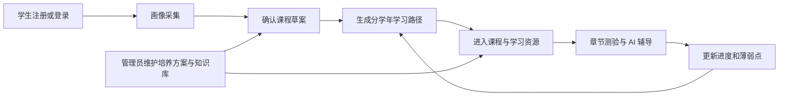

# OneTree 软件需求规格说明书

> **版本：** 2.0  
> **用途：** 《软件项目开发实战》课程设计需求分析  
> **文档定位：** 本文从学生个性化学习的业务问题出发，定义系统应具备的能力、数据和质量要求。技术路线与建模设计仅用于保证需求可落地，不作为现有实现的完成度证明。

## 1. 引言

### 1.1 项目背景

高校学生面对培养方案、课程资源、个人基础、学习目标和阶段性反馈相互割裂的问题。传统课程平台能够提供统一内容，却难以根据学生的专业、年级、目标、时间安排和薄弱点持续调整学习路径；学生也难以将“我想学什么”转化为按阶段推进、可执行、可检验的学习计划。

OneTree 是面向学生的 AI 个性化学习系统。系统以学生画像为起点，将培养方案、可审核的知识资源、学习路径、课程内容、测验和学习反馈组织为连续过程，使学生获得可执行的学习安排，使管理员能够维护培养依据、知识资产和学习服务质量。

### 1.2 建设目标

1. 建立从首次登录到学习反馈的完整学生业务闭环，而不是只提供大模型聊天功能。
2. 根据学生画像和培养要求生成分学年的个性化学习路径，并支持后续调整。
3. 建设可管理的课程知识库，为学习路径和课程内容提供可追溯的知识依据。
4. 通过 Agent、Tool Calling、结构化输出和多轮会话完成多步骤学习任务。
5. 通过测验、进度、薄弱点和资源质量反馈，持续反映学生的学习状态。
6. 满足课程设计对真实业务场景、多角色、多模块、数据库、RAG、Agent、测试和 Docker Compose 部署的要求。

### 1.3 范围与边界

本期范围包括账号与权限、学生画像、课程草案、学习路径、课程内容与资源、章节测验、学习反馈、培养方案、学习数据和知识库管理。

MCP、多智能体扩展、长期记忆、混合检索和重排序属于后续优化方向，不作为本期功能验收前置条件。系统不承担学校教务系统的成绩认定、选课、学籍变更或收费业务。

## 2. 用户与业务需求

### 2.1 目标用户

| 用户角色 | 核心问题 | 核心目标 |
|---|---|---|
| 学生 | 不清楚学习起点、目标与课程顺序；资源分散；无法及时判断掌握情况。 | 获得个人学习画像、分阶段学习路线、课程资源、测验反馈和可持续的学习建议。 |
| 管理员 | 缺少统一方式维护培养方案、账号、知识来源和学习数据；难以观察学习服务运行情况。 | 维护不同专业和班级的培养依据，管理学习账号与知识资产，查看学生学习数据。 |

### 2.2 核心业务价值

- 对学生：将模糊的学习诉求转化为“目标明确、课程有序、资源可学、结果可反馈”的行动路径。
- 对管理员：将培养方案和知识资源沉淀为可维护的数字资产，减少重复配置与人工答疑成本。
- 对课程设计：形成包含业务系统、数据库、RAG、Agent、Tool Calling、Memory、测试与部署的完整 AI 应用项目。

### 2.3 核心业务流程

学生首次使用时应完成基本画像采集。系统据此生成课程草案，学生确认后形成学习路径。学生按路径进入课程，阅读内容、观看资源、完成测验并获得反馈；学习结果应反向影响后续的学习建议。管理员维护的培养方案和已发布知识资源是上述流程的重要输入。

## 3. 功能需求

### 3.1 账号与权限管理

| 编号 | 需求 |
|---|---|
| FR-01 | 系统应支持学生注册、登录、退出和查询当前账号信息。 |
| FR-02 | 系统应区分学生与管理员两类角色，并在页面、接口和数据访问层限制各自可访问的功能。 |
| FR-03 | 管理员应能够新增、查询、更新、启用、停用、批量处理、导入和导出账号。 |
| FR-04 | 系统应保存账号的基本身份信息、所属学校、专业、班级、认证方式、状态和登录时间。 |

### 3.2 学生画像与会话

| 编号 | 需求 |
|---|---|
| FR-05 | 系统应通过对话采集学生的年级、专业、学习基础、目标方向、时间安排和偏好等信息。 |
| FR-06 | 系统应将画像结果输出为结构化信息和可读摘要，供后续学习路径与课程推荐使用。 |
| FR-07 | 系统应保存同一学生的会话上下文，支持在刷新或再次进入时恢复未结束的学习对话。 |
| FR-08 | 当画像信息不足以生成可靠建议时，系统应继续追问或提示补全，而不是直接生成不完整路径。 |

### 3.3 课程草案与个性化学习路径

| 编号 | 需求 |
|---|---|
| FR-09 | 系统应基于学生画像、培养方案和可用知识资源生成待确认的课程草案。 |
| FR-10 | 学生应能够确认课程草案后生成学习路径，并在画像或目标变化时触发路径更新。 |
| FR-11 | 学习路径应按学年或阶段组织，明确每阶段的学习主题、课程节点、先后顺序和当前状态。 |
| FR-12 | 系统应展示当前学习任务、已完成节点、待解锁节点和下一步建议。 |

### 3.4 课程内容、学习资源与测验

| 编号 | 需求 |
|---|---|
| FR-13 | 系统应为学习路径中的课程生成或维护章节结构、知识点和学习目标。 |
| FR-14 | 系统应为课程小节提供结构化学习文本、教学视频和交互式动画资源。 |
| FR-15 | 资源生成或检索失败时，系统应明确反馈失败状态和可重试方式，不得将空结果伪装为成功资源。 |
| FR-16 | 系统应支持按课程章节生成测验题目，展示题干、选项、解析和作答状态。 |
| FR-17 | 学生提交答案后，系统应完成评分，保存作答记录，并给出针对知识点的反馈。 |
| FR-18 | 系统应根据测验结果维护章节进度、最佳成绩、是否通过和薄弱知识点。 |
| FR-19 | 学生应能够查看学习进度、已掌握内容和需要复习的薄弱点，并获得与当前课程或测验上下文相关的 AI 辅导。 |

### 3.5 培养方案与学习数据管理

| 编号 | 需求 |
|---|---|
| FR-20 | 管理员应能够按学校、专业和班级创建、编辑、发布和查看培养方案。 |
| FR-21 | 系统应依据学生所属范围匹配适用培养方案，并将其作为课程草案与学习路径的约束条件。 |
| FR-22 | 管理员应能够查看学习数据概览、群体维度统计和指定学生的学习数据。 |
| FR-23 | 管理员删除学习数据时，系统应限定删除范围并给出明确结果反馈。 |

### 3.6 知识库与 RAG

| 编号 | 需求 |
|---|---|
| FR-24 | 管理员应能够创建和维护知识来源、上传或登记至少一种常见文档类型，并管理教材及其章节内容。 |
| FR-25 | 系统应对知识来源执行可追溯的审核、解析、切分、摄取和发布流程。 |
| FR-26 | 系统应将每个可检索文本块进行 Embedding，并存入可用的向量存储；应保存其所属教材、章节和来源信息。 |
| FR-27 | 用户提出课程相关问题时，系统应执行查询向量化、相似度检索和 TopK 上下文构建，再调用 LLM 生成回答。 |
| FR-28 | 系统应在回答或课程内容中展示所使用的来源文档或文本块，使学生能够追溯知识依据。 |
| FR-29 | 当没有满足条件的知识资源时，系统应记录知识缺口；学生可关注缺口，管理员可补充材料并通知相关学生。 |

## 4. AI Agent、Tool Calling 与 Memory 需求

### 4.1 Agent 任务划分

系统应采用受控工作流而非单轮 Prompt 直接回答。至少应覆盖以下任务：

| Agent 任务 | 输入 | 输出 |
|---|---|---|
| 学生画像 | 对话信息 | 结构化画像、缺失信息与画像摘要 |
| 课程草案 | 已完成画像、培养约束、知识资源 | 待确认课程集合与说明 |
| 学习路径 | 已确认课程草案、学生目标 | 分阶段学习路径和课程顺序 |
| 课程大纲 | 课程节点、知识来源 | 章节、知识点和学习目标 |
| 学习资源 | 小节目标、知识证据 | 学习文本、视频与交互动画资源 |
| 测验与反馈 | 章节内容、学生作答 | 测验题目、评分、薄弱点与辅导建议 |

### 4.2 工作流要求

1. 系统应维护任务状态、用户上下文、阶段输出和错误信息。
2. 调度 Agent 应根据用户任务和当前状态选择下一项能力，并在每项能力返回结果后判断继续、结束、重试或转人工处理。
3. Agent 的结构化输出应通过明确的数据契约校验后再写入数据库或展示给用户。
4. 系统应以流式事件向前端反馈调用、进度、结果和错误，避免长任务无响应。
5. 当模型、工具、网络或结构化输出失败时，系统应保存可诊断信息，并向用户返回可理解的失败说明。

### 4.3 业务 Tool 要求

系统至少应提供 3 个可被 Agent 调用、且真正连接业务数据或服务的 Tool，覆盖以下能力中的至少三类：

1. 读取学生画像与当前学习状态；
2. 查询已发布知识资源并返回来源证据；
3. 创建或更新学习路径及课程任务；
4. 读取测验结果并生成针对薄弱点的复习建议。

每个 Tool 必须定义输入、权限、执行逻辑、返回 Observation、失败处理和审计记录。Agent 不能只调用空壳路由函数，也不能把单纯的 Worker 跳转作为业务 Tool 验收。

### 4.4 Memory 要求

系统至少应支持同一学生的短期多轮对话记忆，保证画像采集、课程草案确认和学习辅导可引用当前会话中的已有信息。长期记忆可在后续版本中扩展为学习偏好、历史任务和稳定用户画像，但必须允许用户查看和更新其个人信息。

## 5. 数据需求与概念模型

### 5.1 数据设计原则

数据设计应围绕业务实体和可追溯关系展开，不得通过空表、无意义日志表或重复字段凑表数。核心业务表应满足课程对数据库规模的要求，并支持学生学习闭环、管理员维护和知识库治理。

### 5.2 核心实体

| 数据域 | 核心实体 | 数据需求 |
|---|---|---|
| 用户与权限 | 用户、培养方案 | 保存账号身份、角色、组织范围、账号状态及培养方案发布信息。 |
| 个性化学习 | 用户画像、学习路径、课程大纲 | 保存画像结构、学习目标、分阶段课程节点、章节和知识点。 |
| 学习评估 | 章节测验、作答记录、学习进度、薄弱点、资源质量 | 支持评分、解锁、反馈、复习建议和资源改进。 |
| 会话与知识资源 | 会话、知识来源、教材、文本块、扩展资源 | 保存多轮消息、来源审核信息、文档内容、切分块及资源关联。 |
| 任务与知识治理 | 摄取任务、任务心跳、知识缺口、关注记录、通知 | 支持后台处理、失败重试、缺口闭环和学生通知。 |

### 5.3 数据关系要求

1. 一个学生应关联一个可更新的学习画像、多个阶段学习路径、多个课程大纲、多个会话和学习记录。
2. 一次章节学习应允许多次测验尝试，并保留最新进度、最佳成绩和对应薄弱点。
3. 一个知识来源可包含多个教材，一个教材可包含多个文本块和扩展资源；每个文本块应能够追溯到教材和来源。
4. 知识缺口应允许被多个学生关注，并在材料补齐后生成通知和后续学习更新动作。
5. 数据删除、停用或归档应保留必要的审计信息，避免误删影响学生学习结果或知识来源追溯。

## 6. 接口、交互与非功能需求

### 6.1 接口与交互

系统应提供面向前端的 REST API 和 SSE 流式接口，至少覆盖认证、学生学习、管理端、知识库、测验和对话编排。请求和响应应采用明确的数据模型，禁止前后端通过未定义字段隐式耦合。

学生端应按“萌芽—路径—课程—测验—成长”呈现学习旅程，使用户了解当前阶段和下一步行动。AI 对话应显示任务进行状态、可见结果和错误信息，不应把内部异常直接暴露给用户。管理端应将账号、培养方案、学习数据和知识库管理划分为清晰模块。删除、发布、停用和重新生成等操作必须提供明确确认、结果状态和错误提示。

### 6.2 非功能需求

| 类别 | 需求 |
|---|---|
| 安全性 | 身份认证、角色授权、密码安全存储、敏感配置环境变量化；真实 API Key、Token 和生产密码不得提交到仓库。 |
| 可靠性 | 对 LLM、知识库摄取、视频搜索、工具调用和数据库异常提供日志、错误状态、重试或可恢复提示。 |
| 可用性 | 长耗时 Agent 和后台任务应提供进度反馈；健康检查应覆盖应用、数据库和必要后台服务。 |
| 可维护性 | 前后端、业务服务、编排、数据模型和部署配置应分层；接口、模型、数据库和文档应同步维护。 |
| 可测试性 | 应覆盖核心业务、接口、权限、RAG、Agent、Tool、异常与部署场景，并形成测试报告。 |
| 可部署性 | 应提供 Dockerfile、Docker Compose、环境变量模板、迁移/初始化说明、端口说明和部署文档；核心服务应能统一编排启动。 |
| 性能 | 应在部署环境中定义并实测页面访问、SSE 首次反馈、RAG 检索、Agent 完成和后台摄取等关键指标。 |

## 7. 验收标准

| 验收项 | 验收标准 |
|---|---|
| 业务闭环 | 可现场完成“登录→画像→课程草案→学习路径→课程资源→测验→反馈”的完整学生流程。 |
| 用户角色 | 学生与管理员只能访问对应职责范围内的页面和接口。 |
| 功能模块 | 账号、画像会话、学习路径、课程资源、测验成长、培养方案/数据、知识库等模块均可演示。 |
| 数据库 | 提交 ER 图、表清单、字段说明和关系说明；每张核心表具有明确业务用途。 |
| RAG | 现场演示文档接入、解析、切分、向量化、向量检索、TopK 上下文、回答与来源引用。 |
| Agent 与 Tool | 现场说明任务选择、状态流转、至少 3 个业务 Tool 的真实执行、Observation、结束条件和异常处理。 |
| Memory | 在同一会话内能够连续引用已提供的画像或学习信息，并支持基本会话恢复。 |
| 测试与部署 | 提交业务、接口、RAG、Agent、异常和部署测试记录，并使用 Docker Compose 编排核心服务。 |
| 答辩 | 小组成员能够解释核心业务、数据模型、RAG、Agent、Tool 与关键代码，不以 AI 生成代码替代说明。 |

## 8. 实施优先级

### P0：课程硬性验收

- 完成双角色与至少五个一级功能模块。
- 完成完整学生学习闭环和核心数据建模。
- 完成真实 LLM、结构化输出、基础多轮会话、Agent 工作流和至少 3 个业务 Tool。
- 完成可演示的端到端 RAG。
- 完成测试材料、Git 协作记录和 Docker Compose 交付。

### P1：交付质量提升

- 完善来源引用、资源质量反馈、知识缺口通知和异常恢复。
- 补齐性能、并发、安全、跨浏览器和真实模型调用的测试证据。
- 提升管理端数据分析与学生成长可视化。

### P2：加分扩展

- 根据跨系统需求接入 MCP。
- 增加长期记忆、混合检索、重排序、RAG/Agent 评测和多智能体协同。

## 9. 结论

OneTree 的需求核心不是“让模型回答问题”，而是围绕学生学习成长建立一个能够理解用户、组织课程、调用业务能力、利用知识资源、记录学习过程并持续反馈的 AI 智能体应用系统。后续设计、编码、测试和答辩均应以本说明书中的业务目标、功能需求、数据关系、RAG 闭环和验收标准为依据；实现是否完成应由独立的测试报告和验收记录判断，而不应反过来替代需求本身。
