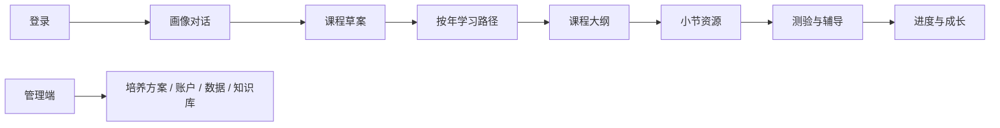

# OneTree 项目现状

> 源码核对日期：2026-07-15。本文用于新成员快速建立仓库地图；具体字段和行为以代码、测试和生成的 OpenAPI 为准。

## 产品闭环

OneTree 面向学生提供个性化学习路径：用户登录后通过破冰对话建立画像，系统生成课程草案和按年学习路径；进入课程后生成小节文档、视频和 HTML 动画资源；Forest 页面负责章节测验、批改、薄弱点和 AI 辅导；Canopy 展示成长结果。管理端负责培养方案、账户、学习数据和知识库。



## 代码地图

| 目录 | 责任 | 主要入口 |
|---|---|---|
| `frontend/src/App.tsx` | 路由、角色门禁、页面宿主 | `/login`、`/onboarding`、学生端和管理端路由 |
| `frontend/src/api/` | 前端 API 客户端 | 认证、路径、课程、测验、知识库等模块 |
| `backend/app/main.py` | FastAPI 应用装配 | 路由、CORS、请求 ID、数据库初始化 |
| `backend/app/api/` | HTTP/SSE 路由 | 按认证、路径、课程、Forest、管理端拆分 |
| `backend/app/services/` | 业务服务和持久化协调 | 知识库、画像、路径、课程、测验 |
| `backend/app/orchestration/` | LangGraph 单轮编排 | Supervisor、7 个 Worker、规则、事件和恢复 |
| `backend/app/workers/` | 独立后台任务 | 教材知识库整理任务 |
| `backend/app/models.py` | SQLModel 数据模型 | PostgreSQL 生产、SQLite 测试 |
| `deploy/` | 生产运行面 | Docker Compose、Nginx、迁移、备份、证书、smoke |

## Agent 编排

当前 LangGraph Worker 的确定标识符如下：

`profile_agent`、`learning_path_intake_agent`、`learning_path_agent`、`course_knowledge_agent`、`section_markdown_agent`、`section_video_search_agent`、`section_html_animation_agent`。

课程资源链路由 `course_resource_plan` 驱动，按 `markdown`、`video`、`animation`、`compose` 阶段生成。视频阶段包含 URL/来源校验；动画阶段包含 HTML 结构校验；资源结果通过质量契约后才进入组合结果。SSE 事件由 `backend/app/orchestration/graph.py` 暴露给聊天 API。

知识库整理不在上述 LangGraph 图内。它由 `python -m app.workers` 消费 `KnowledgeBaseIngestionJob`，使用租约、心跳和重试处理长任务。

## 页面与接口入口

学生端页面路由定义在 `frontend/src/App.tsx`：`/onboarding`、`/sprout`、`/branch`、`/leaf/:courseNodeId`、`/forest/:courseNodeId`、`/canopy`、`/canvas`。管理端路由包括 `/admin/programs`、`/admin/accounts`、`/admin/data` 和 `/admin/knowledge-base`。

后端路由由 `backend/app/main.py` 装配，按 `auth`、`orchestration`、`profile`、`learning_path`、`branch`、`leaf`、`forest`、`student`、`teacher`、`admin`、`admin_data`、`knowledge_base` 和 `health` 分组。字段示例以 `docs/api-specs/` 与 `frontend/openapi.json` 为准。

## 本地开发与验证

后端需要 PostgreSQL、`uv` 和 OpenAI-compatible LLM 配置；前端需要 Node.js 和 npm。

```bash
cd backend
uv run uvicorn app.main:app --reload --port 8000

cd frontend
npm install
npm run dev
```

常用验证：

```bash
cd backend && uv run pytest -q
cd frontend && npm test && npm run build
cd frontend && npm run e2e
```

生产部署只使用 `deploy/bin/bootstrap`、`deploy/bin/deploy` 等脚本，完整流程见 [`docs/deployment/docker-production.md`](deployment/docker-production.md)。

## 文档维护

- 修改 API schema 后在 `frontend/` 运行 `npm run gen:api`，并检查 `frontend/openapi.json` 与 `frontend/src/types/api.ts`。
- 修改编排节点、事件或资源契约时同步更新 [`docs/backend/backend-tech-stack.md`](backend/backend-tech-stack.md) 和 [`docs/backend/agent逻辑.md`](backend/agent逻辑.md)。
- 修改数据库模型或迁移时同步更新 [`docs/database/数据库表结构.md`](database/数据库表结构.md)。
- 历史验收、方案和实验资料保留在 `docs/superpowers/`，不把计划内容当作当前实现。
