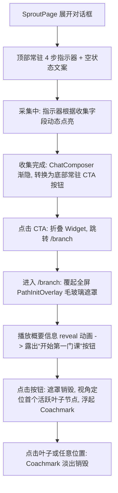

# Onboarding Profile to Learning Path Transition Guidance Design

本文档定义了基础画像（Profile）到自适应学习路径（Learning Path）的衔接引导重构技术方案。本方案旨在解决用户在画像完成后面临的下一步指引缺失、流程生硬的问题，提供高度故事化、连贯且视觉统一的过渡设计。

---

## 1. 业务流程与架构设计 (Architecture & Flow)

整个优化引导流程分为四个阶段，具体架构如下：



---

## 2. 详细交互与核心组件设计 (Detailed Component Specs)

### 2.1. 聊天面板顶部常驻指示器 (Sticky Progress Bar)
* **组件位置**：位于 `AiGreetingInput.tsx` 内的 `.chat-flow` 头部或其上方，常驻固定。
* **状态定义**：进度指示器包含 4 个物理节点，由细线相连：
  1. `基础信息` (字段: `current_grade`, `major`)
  2. `学习偏好` (字段: `learning_stage`, `has_clear_goal`, `learning_method_preference`, `learning_pace_preference`, `content_preference`, `need_guidance`)
  3. `能力基础` (字段: `knowledge_foundation`, `strengths`, `weaknesses`, `experience`)
  4. `目标约束` (字段: `short_term_goal`, `long_term_goal`, `weekly_available_time`, `constraints`)
* **动态更新机制**：通过计算 `confirmed_info` 中字段的填写比例，动态计算出当前所处阶段并高亮。
* **空状态文案**：当会话无消息时，指示器高亮步骤 1，并在下方渲染引导文案：
  > “🌱 欢迎！告诉我你的年级、专业或学习方向。定制你的自适应课程藤蔓仅需约 1-2 分钟。”

### 2.2. 画像完成时底部常驻 CTA 控制台 (Sticky Bottom CTA Panel)
* **组件位置**：替换 `AiGreetingInput.tsx` 内的 `chat-composer` 表单。
* **触发时机**：当检测到当前会话的 `has_profile` 为 `true`（且处于 `generated` 阶段）时。
* **交互逻辑**：
  * 原有文本框及发送按钮（`chat-composer`）使用 `framer-motion` 播放淡出（Fade-out）并从布局中完全收起。
  * 常驻底部控制台（包含唯一的横向醒目按钮 **“开启我的学习路径 ➔”**）以滑入（Slide-up）加淡入效果占位。
  * **锁定输入**：画像一旦生成，在此状态下不接受直接打字输入，防止用户产生冗余对话行为，并使按钮绝对常驻于可视区域底部，避免滚动遮挡。

### 2.3. [NEW] 路径生成概要遮罩 (PathInitOverlay)
* **新文件路径**：`frontend/src/components/onboarding/PathInitOverlay.tsx`
* **交互细节**：
  * 该组件是一个全屏固定层，位于 `/branch` 路由页面上方，初始可见。
  * **视觉风格**：承袭 `SproutInitOverlay` 的极简轻量美学（毛玻璃效果：`backdrop-filter: blur(56px);`，温润淡雅暖白底色：`oklch(97% 0.02 75 / 0.36)`）。
  * **Revealing 动画**：概要文字按照阶段由上至下流畅淡入：
    > “你的自适应学习路径已顺利编织完成。
    > 
    > 系统已根据你的画像基础，为你自动**剪枝精简了 2 门**已知的基础课程，并针对你的薄弱点**融入了 1 门**专项强化课。”
  * **按钮唤起**：文本揭示完成后，淡入显现 **“开始第一门课”** 按钮。点击后调用回调，组件播放 `exit` 动画淡出并彻底销毁。

### 2.4. 叶子节点引导气泡 (First Leaf Coachmark)
* **组件位置**：位于 `frontend/src/pages/branch/` 的 SVG 藤蔓地图页面上。
* **交互逻辑**：
  * `PathInitOverlay` 销毁后，计算第一个活跃状态的课程叶子节点的位置坐标。
  * 在该节点上方弹出微型提示气泡：`✨ 点击此处，开启第一章学习`。
  * 气泡使用温和的呼吸阴影特效，在用户进行点击节点或页面其他区域后，随事件自动播放淡出并安全解挂销毁。

---

## 3. 设计规范与动效配置 (Design System & Motion)

本重构全量调用项目既有的视觉 Token：
* **颜色 Token**：
  * 激活节点光晕：`var(--color-primary-soft)` / `oklch(92% 0.06 140 / 0.6)`
  * 进度文字与按钮：`var(--color-primary)`
* **圆角与阴影**：
  * 控制台圆角：`var(--radius-lg)`
  * 气泡阴影：`var(--shadow-md)` (多层叠加阴影)
* **动效物理参数**：
  * 开屏淡入/淡出：使用 `motionTokens.editorial` 或缓动曲线 `var(--ease-editorial)`
  * 对话框淡出与 CTA 滑入：`duration: var(--duration-lazy-hover)`，缓动：`var(--ease-lazy)`
  * 减缓动效偏好：针对 `@media (prefers-reduced-motion: reduce)` 执行无 transition/transform 降级处理。

---

## 4. 验证与测试方案 (Verification Plan)

为确保流程重构不引发功能退化，需添加/更新以下测试用例：

### 4.1. 单元测试
1. **指示器测试 (`AiGreetingInput.test.tsx`)**：
   - 验证根据 `confirmed_info` 的状态，指示器是否高亮了正确的步骤。
   - 验证在空状态下是否能正确渲染预设的引导文本。
2. **底部控制台测试 (`AiGreetingInput.test.tsx`)**：
   - 模拟画像生成（`has_profile: true`），验证 `chat-composer` 消失且“开启我的学习路径”按钮显现。
   - 验证点击按钮能正确调用路由跳转和 Widget 状态折叠上下文。
3. **概要遮罩测试 (`PathInitOverlay.test.tsx`)** [NEW]：
   - 测试概要文字的渐进展示逻辑以及在动画结束后触发“开始第一门课”按钮的渲染。
   - 测试点击该按钮后是否能正确调用完成回调函数。

### 4.2. 集成测试
- 在 `frontend` 下执行全局测试命令验证：
  ```bash
  npm run test -- onboarding
  ```
