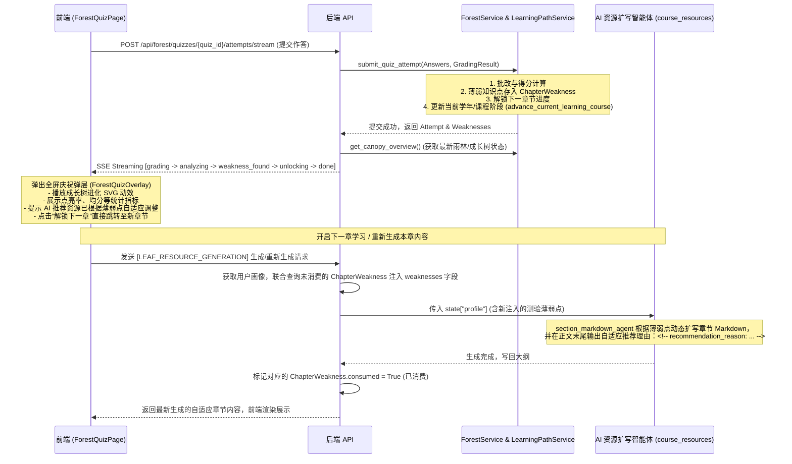

# Forest 测验页学习效果评估闭环设计文档

## 目标与背景
Forest 测验页提交后没有把结果明确反馈到“成长树 / 成森进度 / 下一章解锁 / 资源推荐调整”。为了补全评估闭环，实现“根据评估结果动态调整资源推送策略和学习计划”，我们需要对前后端进行改造。

## 系统架构与数据流

## 变更设计

### 1. 后端 (Backend)
* **`backend/app/services/forest_service.py`**:
  * 改进 `_analyze_weakness` 函数，支持从课程大纲（`outline`）的 `core_knowledge_points` 列表中匹配对应的 `knowledge_point_id` 并将中文名称（`name`）保存到 `ChapterWeakness.knowledge_point_name` 字段，避免名称为空。
* **`backend/app/api/forest.py`**:
  * 在 `submit_quiz_attempt_stream` 接口的 `done` 事件负载中，附加当前章节更新后的 `progress` 和用户全局的 `canopy` 数据（通过 `get_canopy_overview(session, current_user.uid)` 获及）。
* **`backend/app/api/orchestration.py`**:
  * 在 `_stream_chat_events` 函数中，加载 `profile` 字典后，若存在 `current_course_id`，查询该用户在当前课程下所有 `consumed == False` 的 `ChapterWeakness`。
  * 将这些薄弱点格式化为文本（例如：`"最近测验薄弱点：[知识点名称]"`）并合并追加到 `profile["weaknesses"]` 中，再存入 `state["profile"]`，使下游 AI 生成智能体感知。
  * 在 `stream_chapter_resource_generation` 成功生成内容后，执行 SQL 更新将对应的 `ChapterWeakness.consumed` 标记为 `True`。

### 2. 前端 (Frontend)
* **`frontend/src/api/forest.ts`**:
  * 添加 `submitForestQuizAttemptStream` 函数，支持通过 `fetch` 的 `reader` 模式流式读取接口数据，并触发相应的回调通知事件。
* **`frontend/src/pages/forest/ForestQuizPage.tsx`**:
  * 修改 `handleSubmit`，调用流式提交函数。
  * 添加提交中间状态的 UI 提示，展现 AI 动态分析的过程。
  * 引入 `ForestQuizOverlay` 并在测验通过时弹出。
* **`frontend/src/pages/forest/ForestQuizOverlay.tsx` [NEW]**:
  * 新建全屏半透明磨砂玻璃层，使用 LXGW WenKai 字体和 OKLCH 配色，展示：
    1. 得分与是否通过状态。
    2. 全局雨林统计数据变化（点亮率、平均分）。
    3. `GrowthTreeSVG` 动画呈现当前成长树状态。
    4. 薄弱点分析及 AI 动态调整提示。
    5. 返回雨林及解锁下一章节的引导按钮。

## 验证计划
1. **单元测试**:
   * 编写前端组件测试 `ForestQuizOverlay.test.tsx` 验证其在接收到结果数据后的渲染行为。
   * 编写后端接口测试，在 `backend/tests/test_forest_api.py` 中测试 `submit_quiz_attempt_stream` 接口对 canopy 数据的正确序列化与返回。
2. **集成测试**:
   * 模拟测验提交并通关过程，在页面上验证是否成功触发庆祝弹窗，成长树状态是否更新，下一章链接是否正确跳转。
   * 验证在新章节生成时，AI 生成的 Markdown 是否包含根据该薄弱点输出的 `recommendation_reason`。
