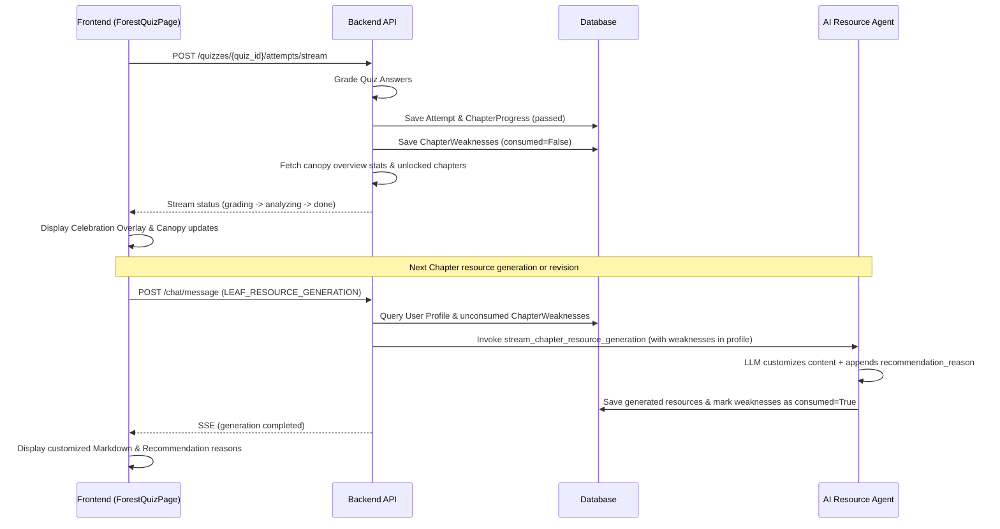

# Forest Quiz Feedback Loop and Adaptive Learning Design Spec

This specification describes the design for closing the learning evaluation loop in the Forest Quiz page. It ensures quiz results dynamically update the user's growth tree, canopy progress, unlock next chapters, and adapt AI resource recommendations.

## 1. Goal Description
Currently, when a student submits a chapter quiz, the quiz attempt is graded and saved, but the results are not visibly integrated back into the learning experience. The student does not see canopy statistics updates, growth tree evolution, or next chapter unlock status. Furthermore, the quiz weaknesses are stored in the database but never utilized to adjust subsequent learning resources.

This design introduces:
- A streaming submission interface in the frontend that reflects grading steps.
- An animated celebration overlay showing score, unlocked chapters, growth tree progression, and canopy stats updates.
- An adaptive feedback loop that injects quiz weaknesses into the user profile context, dynamically prompting downstream AI agents to customize learning materials.

## 2. Design System Tokens & Guidelines (Hard Rules)

### 2.1 Colors (OKLCH)
All colors must use OKLCH. No HEX or RGB values are allowed:
- Main Page Background: `oklch(16% 0.015 220)` (Deep grey-green)
- Glassmorphic Overlay Card Background: `oklch(98% 0.005 120 / 0.03)` with backdrop filter blur
- Border / Hairline: `oklch(98% 0.005 120 / 0.1)`
- Primary Growth Green: `oklch(62% 0.16 142)` (Warm leaf green)
- Interactive Accent Green (Hover): `oklch(68% 0.18 142)`
- Weakness / Warning Accent: `oklch(68% 0.14 65)` (Soft warm orange)
- Text Primary: `oklch(92% 0.005 120)`
- Text Secondary: `oklch(75% 0.01 120)`

### 2.2 Typography
- Only use **LXGW WenKai** (霞鹜文楷) font.
- Pinned to 3 font weights: Light (300), Regular (400), and Medium (500).
- Absolutely NO bold weights (e.g. `font-bold` or `700`) are allowed. Use Medium (500) for headers.

### 2.3 Spacing
- Spacing must be selected strictly from the `--space-*` Scale (multiples of 4px).
- Typical inner container padding: `--space-6` (24px) or `--space-8` (32px).

### 2.4 Motion
- Animations must only animate `transform` and `opacity` properties. No layout-altering properties (width, height, margin) can be animated.
- Spring physics via Framer Motion for smooth, organic growth tree SVG scaling.
- Media query `@media (prefers-reduced-motion)` must be respected (disabling translation/scaling animations and falling back to simple opacity fades).

## 3. Technical Architecture & Components

### 3.1 Backend Changes
1. **API Enhancement (`POST /api/forest/quizzes/{quiz_id}/attempts/stream`)**:
   - Update the Done SSE event payload to include:
     - `canopy_overview`: The recalculated canopy stats (growth stage, 点亮率 / active rate, avg score, milestones).
     - `next_unlocked_chapter_id`: The ID of the next unlocked chapter (if attempt passed).
     - `next_course_id`: The ID of the next unlocked course (if course completed).
2. **Dynamic Weakness Injection (`backend/app/api/orchestration.py`)**:
   - When loading user profile context in `_stream_chat_events`, fetch unconsumed weaknesses (`consumed == False`) for the current user from the `ChapterWeakness` table.
   - Format and append these weaknesses into the profile's `weaknesses` field.
3. **Adaptive Resource Generation (`backend/app/orchestration/agents/course_resources.py`)**:
   - On successful generation and persistence of next chapter resources, mark the weaknesses for this course as consumed (`consumed = True`).
4. **Weakness Name Mapping (`backend/app/services/forest_service.py`)**:
   - In `_analyze_weakness`, map the knowledge point ID to its actual name by querying the course outline sections' `key_knowledge_points` or the learning path's `core_knowledge_points`.

### 3.2 Frontend Changes
1. **Streaming Quiz Submission (`frontend/src/pages/forest/ForestQuizPage.tsx`)**:
   - Use text event-stream reader to consume `/attempts/stream`.
   - Show streaming progress phases (`grading` -> `analyzing` -> `unlocking` -> `done`).
2. **Celebration Overlay Component (`frontend/src/components/forest/ForestQuizOverlay.tsx`)**:
   - A glassmorphic overlay modal popping up on `done`.
   - Render growth tree SVG with scale/opacity animation on growth stage advancement.
   - Display dynamic score, passed/failed status, updated canopy metrics (点亮率, avg score), and list weaknesses found.
   - CTAs: "返回雨林" (back to Canopy) and "解锁下一章" (go to next chapter).

## 4. Data Flow Diagram

