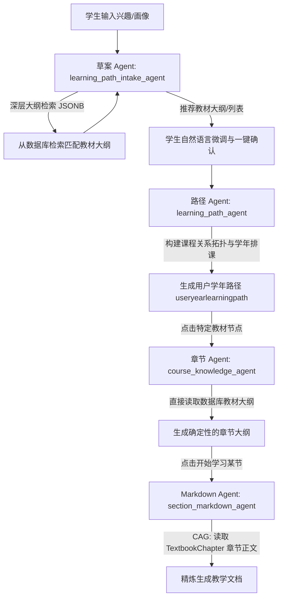

# RAG 知识库与多智能体教材集成设计规格说明书

本设计文档旨在为“一棵树 (OneTree)”系统引入一套基于 **PostgreSQL 特性 (JSONB + pgvector + tsvector)** 的原生 RAG/CAG 教材集成方案。本方案旨在消除原智能体链中依靠“大模型参数盲猜（Parametric Guessing）”生成课程及教学大纲的缺陷，将所有推荐与生成限制在管理员/教师审核通过的高质量教材范围内。

---

## 1. 业务流程与多智能体职责流转

修改后的业务流程完全围绕**教材（Textbooks）**与**章节（Chapters）**展开：



### 1.1 智能体职责调整说明
* **`learning_path_intake_agent` (草案 Agent)**：
  根据学生特征，在数据库 `Textbook` 表中进行深层目录检索，查找包含对应技术栈或主题的教材，形成推荐清单。支持对话微调（换课、删课），直到用户确认。
* **`learning_path_agent` (路径 Agent)**：
  将确认的教材列表组织为 4 年路径。在 `course_nodes` 中增加 `textbook_id` 属性，指向知识库对应的教材，作为强引用的锚点。
* **`course_knowledge_agent` (章节 Agent)**：
  不再调用大语言模型猜测大纲，直接通过 `textbook_id` 读取 `Textbook.outline` 字段，格式化输出给前端。
* **`section_markdown_agent` (小节 Markdown Agent)**：
  从数据库取出 `TextbookChapter.content`（整章正文），以此文本为唯一的事实来源（Context）进行教学设计和总结排版，不脑补概念。

---

## 2. 数据库设计 (PostgreSQL Schema)

使用 `SQLModel` 声明两张新表，专门用于教材的管理与检索：

```python
from datetime import datetime
from typing import Optional, List, Dict, Any
from sqlmodel import SQLModel, Field, Column
from sqlalchemy.dialects.postgresql import JSONB

class Textbook(SQLModel, table=True):
    """教材主表（存储元数据及大纲结构）"""
    __tablename__ = "textbook"

    id: str = Field(primary_key=True, index=True)
    title: str = Field(index=True, nullable=False, description="教材书名")
    author: Optional[str] = Field(default=None, description="作者")
    tags: List[str] = Field(default_factory=list, sa_column=Column(JSONB), description="专业/方向标签")
    outline: Dict[str, Any] = Field(default_factory=dict, sa_column=Column(JSONB), description="教材大纲目录结构 JSON")
    status: str = Field(default="processing", index=True, description="解析状态: pending_approval/processing/success/failed")
    source_link: Optional[str] = Field(default=None, description="下载/采购来源链接")
    created_at: datetime = Field(default_factory=datetime.utcnow, nullable=False)
    updated_at: datetime = Field(default_factory=datetime.utcnow, nullable=False)

class TextbookChapter(SQLModel, table=True):
    """教材章节内容表（按章切割存储，用于 CAG 生成）"""
    __tablename__ = "textbook_chapter"

    id: str = Field(primary_key=True, index=True)
    textbook_id: str = Field(foreign_key="textbook.id", index=True, nullable=False)
    chapter_number: int = Field(index=True, nullable=False, description="章节编号")
    title: str = Field(nullable=False, description="章节名称")
    content: str = Field(nullable=False, description="章节完整 Markdown 内容")
    created_at: datetime = Field(default_factory=datetime.utcnow, nullable=False)
    updated_at: datetime = Field(default_factory=datetime.utcnow, nullable=False)
```

---

## 3. PostgreSQL 专属检索方案设计

本方案不依赖外部向量数据库（如 ChromaDB/Qdrant），完全跑在 PostgreSQL 内部。

### 3.1 深度大纲检索 (JSONB GIN)
为教材的 `outline` JSONB 字段建立 **GIN 索引**。
```sql
CREATE INDEX idx_textbook_outline_gin ON textbook USING gin (outline);
```
当学生搜索 `FastAPI` 时，草案 Agent 可以使用 SQL 直接快速匹配大纲中包含该知识点的教材：
```sql
SELECT id, title, outline FROM textbook 
WHERE outline @> '{"chapters": [{"sections": [{"title": "FastAPI"}]}]}';
```

### 3.2 混合检索 (pgvector + tsvector)
在 `TextbookChapter` 表上实现混合检索：
1. **向量特征检索 (pgvector)**:
   在 `TextbookChapter` 中新增 `embedding` 列（类型为 `vector(1536)` 或对齐 Qwen 模型的 `vector` 维度），并建立 `HNSW` 索引。
   ```sql
   CREATE INDEX idx_textbook_chapter_embedding_hnsw ON textbook_chapter USING hnsw (embedding vector_cosine_ops);
   ```
2. **全文检索 (tsvector)**:
   为教材正文建立 `tsvector` 全文检索索引。
   ```sql
   CREATE INDEX idx_textbook_chapter_content_fts ON textbook_chapter USING gin (to_tsvector('chinese', content));
   ```
3. **混合召回排序 (RRF)**:
   通过 SQL 拼接全文检索评分与向量相似度评分，利用倒数排序融合 (Reciprocal Rank Fusion) 算法合并召回。

---

## 4. 管理员教材解析管道与管理后台设计

### 4.1 教材解析与切片 Pipeline
当教师或管理员上传教材 PDF 时，后台启动异步任务：
```
[管理员上传 PDF] 
     │
     ▼
[调用 阿里云百炼文档解析 API] ──► 获得高保真 Markdown 纯文本
     │
     ▼
[大纲抽取与分章切片 (Python Regex + LLM)] 
     ├─► 根据 Markdown 标题标识 (如 ^# 第.*章) 正则切分章节
     ├─► 使用 with_structured_output 提取大纲目录 JSON
     └─► 异步存入数据库 `textbook` 和 `textbook_chapter` 表
```

### 4.2 管理端 UI (`/admin/knowledge-base`)
后台页面由 `admin` 和 `teacher` 共同管理，功能包含：
1. **教材列表与状态追踪**：查看处理中、成功或失败的解析任务。
2. **待审教材队列 (KB Agent 联动)**：
   * 学生发出未覆盖的知识点请求时，`admin_kb_agent` 会通过**百炼内置联网搜索**寻找公开教材或文档。
   * KB Agent 预整理大纲后在此队列生成“待审工单”。教师一键同意后，系统自动下载解析并上架。
3. **可视化大纲编辑器 (TOC Editor)**：
   * 在界面展示树状大纲，教师可以直接在网页上拖拽章节、重命名或添加知识点，一键更新 `Textbook.outline` 字段以纠正大模型识别误差。

---

## 5. 验证与测试方案

### 5.1 自动化测试
* **契约测试 (`test_textbook_parser.py`)**：验证 PDF 上传后，阿里云文档解析 API 的 mock 返回能够被 Python 正则正确解析并写入数据库。
* **检索准确度测试 (`test_postgres_retrieval.py`)**：构造假数据写入 `Textbook` 的 `outline` 字段，验证 GIN 索引查询与 tsvector 全文检索能准确命中 FastAPI/数据结构等章节。
* **Agent 联调测试 (`test_cag_agents.py`)**：模拟学生请求，验证 `section_markdown_agent` 在入参中成功附带了 `TextbookChapter.content` 完整正文，且生成的 Markdown 不包含参数外编造的信息。

### 5.2 手动验证
* 部署后，登录教师端，上传一本 50 页的公开 PDF 教材，查看控制台解析日志，进入大纲编辑器微调其中一章名称，保存。
* 登录学生端，发起对话让 AI 推荐课程，在推荐清单中看到刚刚上架的教材；点击学习该课程，验证章节生成与小节 Markdown 完全符合上传教材的内容。
