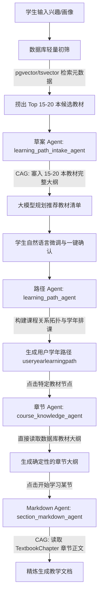

# RAG 知识库与多智能体教材集成设计规格说明书

本设计文档旨在为“一棵树 (OneTree)”系统引入一套基于 **PostgreSQL 特性 (JSONB + pgvector + tsvector)** 的原生 RAG/CAG 教材集成方案。本方案通过**“检索引导的 CAG（Retrieval-guided CAG）”**机制，消除原智能体链中依靠“大模型参数盲猜”生成课程及大纲的缺陷，将所有推荐与生成限制在管理员/教师审核通过的高质量教材范围内。

---

## 1. 业务流程与多智能体职责流转

修改后的业务流程完全围绕**教材（Textbooks）**与**章节（Chapters）**展开：



### 1.1 智能体职责与 CAG 塞入内容映射
* **`learning_path_intake_agent` (草案 Agent)**：
  * **塞入内容**：经初筛后的 **Top 15-20 本教材的【书名 + 完整大纲目录 JSON】**。
  * **职责**：在精简后的候选教材大纲中进行全局决策，匹配学生特征，输出课程推荐草稿，并支持自然语言对话微调（换课、删课）。
* **`learning_path_agent` (路径 Agent)**：
  * **塞入内容**：用户选定的教材大纲。
  * **职责**：梳理教材先后置依赖关系，将教材分配到大一至大四学年中，并在 `course_nodes` 中保存 `textbook_id` 指向知识库。
* **`course_knowledge_agent` (章节 Agent)**：
  * **塞入内容**：单个教材的 **`Textbook.outline` 大纲 JSON**（直接从数据库读取）。
  * **职责**：**无需大模型猜测**，直接将大纲转换为系统的章节目录。
* **`section_markdown_agent` (小节 Markdown Agent)**：
  * **塞入内容**：对应章节的 **`TextbookChapter.content`（整章正文全文，约 1-3 万字）**。
  * **职责**：以该章节正文为唯一事实来源，精炼总结生成教学 Markdown 结构文档，严禁臆造外部概念。

---

## 2. 数据库设计 (PostgreSQL Schema)

使用 `SQLModel` 声明两张新表，以及数据库原生 SQL 结构声明：

### 2.1 SQL DDL 结构
```sql
-- 启用向量扩展及模糊查询扩展
CREATE EXTENSION IF NOT EXISTS vector;
CREATE EXTENSION IF NOT EXISTS pg_trgm;

-- 教材主表
CREATE TABLE textbook (
    id VARCHAR(64) PRIMARY KEY,
    title VARCHAR(256) NOT NULL,
    author VARCHAR(128),
    tags JSONB DEFAULT '[]',
    outline JSONB DEFAULT '{}',
    status VARCHAR(32) NOT NULL DEFAULT 'processing',
    source_link TEXT,
    embedding VECTOR(1536), -- 用于教材元数据的初筛检索
    created_at TIMESTAMP WITHOUT TIME ZONE NOT NULL,
    updated_at TIMESTAMP WITHOUT TIME ZONE NOT NULL
);

-- 教材章节内容表
CREATE TABLE textbook_chapter (
    id VARCHAR(64) PRIMARY KEY,
    textbook_id VARCHAR(64) REFERENCES textbook(id) ON DELETE CASCADE,
    chapter_number INTEGER NOT NULL,
    title VARCHAR(256) NOT NULL,
    content TEXT NOT NULL,
    created_at TIMESTAMP WITHOUT TIME ZONE NOT NULL,
    updated_at TIMESTAMP WITHOUT TIME ZONE NOT NULL
);

-- 建立索引
CREATE INDEX idx_textbook_title ON textbook (title);
CREATE INDEX idx_textbook_status ON textbook (status);
CREATE INDEX idx_textbook_outline_gin ON textbook USING gin (outline);
CREATE INDEX idx_textbook_embedding_hnsw ON textbook USING hnsw (embedding vector_cosine_ops);
CREATE INDEX idx_textbook_chapter_textbook_id ON textbook_chapter (textbook_id);
```

### 2.2 ORM 模型声明
```python
from datetime import datetime
from typing import Optional, List, Dict, Any
from sqlmodel import SQLModel, Field, Column
from sqlalchemy.dialects.postgresql import JSONB

class Textbook(SQLModel, table=True):
    """教材主表（存储元数据及大纲结构）"""
    __tablename__ = "textbook"

    id: str = Field(primary_key=True, index=True)
    title: str = Field(index=True, nullable=False, description="教材书名")
    author: Optional[str] = Field(default=None, description="作者")
    tags: List[str] = Field(default_factory=list, sa_column=Column(JSONB), description="专业/方向标签")
    outline: Dict[str, Any] = Field(default_factory=dict, sa_column=Column(JSONB), description="教材大纲目录结构 JSON")
    status: str = Field(default="processing", index=True, description="解析状态: pending_approval/processing/success/failed")
    source_link: Optional[str] = Field(default=None, description="下载/采购来源链接")
    embedding: Optional[List[float]] = Field(default=None, sa_column=Column(JSONB), description="教材元数据向量")
    created_at: datetime = Field(default_factory=datetime.utcnow, nullable=False)
    updated_at: datetime = Field(default_factory=datetime.utcnow, nullable=False)

class TextbookChapter(SQLModel, table=True):
    """教材章节内容表（按章切割存储，用于 CAG 生成）"""
    __tablename__ = "textbook_chapter"

    id: str = Field(primary_key=True, index=True)
    textbook_id: str = Field(foreign_key="textbook.id", index=True, nullable=False)
    chapter_number: int = Field(index=True, nullable=False, description="章节编号")
    title: str = Field(nullable=False, description="章节名称")
    content: str = Field(nullable=False, description="章节完整 Markdown 内容")
    created_at: datetime = Field(default_factory=datetime.utcnow, nullable=False)
    updated_at: datetime = Field(default_factory=datetime.utcnow, nullable=False)
```

---

## 3. PostgreSQL 专属初筛检索设计

初筛仅针对教材的**“元数据（书名、标签）”**进行相似度检索，不涉及大体积的正文 Chunks 切片，保障系统的高响应与低存储开销。

### 3.1 混合粗筛检索 (pgvector + tsvector)
草案 Agent 通过 SQL 拼接全文检索与向量相似度，对教材进行粗筛：
```sql
WITH vector_search AS (
    SELECT id, title, outline,
           ROW_NUMBER() OVER (ORDER BY embedding <=> :query_embedding) as rank
    FROM textbook
    WHERE embedding IS NOT NULL AND status = 'success'
    LIMIT 30
),
fts_search AS (
    SELECT id, title, outline,
           ROW_NUMBER() OVER (ORDER BY ts_rank(to_tsvector('chinese', title || ' ' || tags::text), to_tsquery('chinese', :query_fts)) DESC) as rank
    FROM textbook
    WHERE to_tsvector('chinese', title || ' ' || tags::text) @@ to_tsquery('chinese', :query_fts) AND status = 'success'
    LIMIT 30
)
SELECT COALESCE(v.id, f.id) as id,
       COALESCE(v.title, f.title) as title,
       COALESCE(v.outline, f.outline) as outline,
       (1.0 / (60.0 + COALESCE(v.rank, 100)) + 1.0 / (60.0 + COALESCE(f.rank, 100))) as rrf_score
FROM vector_search v
FULL OUTER JOIN fts_search f ON v.id = f.id
ORDER BY rrf_score DESC
LIMIT :limit; -- 返回 Top 15-20 本候选教材给草案 Agent 塞入上下文
```

---

## 4. 后端 API 路由设计 (RESTful API)

在 `backend/app/api/admin.py` 或独立的 `admin_kb.py` 中新增路由，保证 `admin` 和 `teacher` 权限可访问：

* **`POST /api/admin/knowledge-base/upload`**：
  * **Payload**：Multipart/Form-data (PDF 文件、书名、专业/方向标签)
  * **逻辑**：将 PDF 保存至临时目录，并将任务放入后台队列，返回 `task_id` 和初始化 `textbook` 实体。
* **`GET /api/admin/knowledge-base/textbooks`**：
  * **返回**：`List[TextbookRead]`（包含元数据、状态、大纲及采购来源）。
* **`GET /api/admin/knowledge-base/textbooks/{id}`**：
  * **返回**：特定教材大纲及其对应的章节列表。
* **`PUT /api/admin/knowledge-base/textbooks/{id}/outline`**：
  * **Payload**：`outline` JSON 结构
  * **逻辑**：管理员/教师微调大纲并保存，覆盖数据库 `textbook.outline` 字段。
* **`POST /api/admin/knowledge-base/textbooks/{id}/approve`**：
  * **逻辑**：审批通过 `admin_kb_agent` 搜集上来的“待审教材”，从 source_link 下载、触发百炼解析、完成分章后正式发布。
* **`DELETE /api/admin/knowledge-base/textbooks/{id}`**：
  * **逻辑**：物理删除教材以及联级删除章节正文。

---

## 5. 管理员教材解析管道与自治采购设计

### 5.1 阿里云百炼文档解析 API 接入
在后台任务中，使用 `alibabacloud-docmind-api` 对 PDF 进行高保真 Markdown 提取：
```python
from alibabacloud_docmind_api20220711.client import Client
from alibabacloud_docmind_api20220711.models import SubmitDocStructureJobRequest
from alibabacloud_tea_openapi.models import Config

def init_docmind_client() -> Client:
    config = Config(
        access_key_id=os.getenv("ALIBABA_CLOUD_ACCESS_KEY_ID"),
        access_key_secret=os.getenv("ALIBABA_CLOUD_ACCESS_KEY_SECRET"),
        endpoint="docmind-api.cn-hangzhou.aliyuncs.com"
    )
    return Client(config)
```
任务提交后轮询直至获取 Markdown 文本。

### 5.2 自动分章切片与大纲整理
1. **正则拆分章节**：解析返回的 Markdown，根据一级/二级标题进行文本段落分割：
   ```python
   # 正则匹配类似于 "# 第一章 介绍" 或 "## 第1章 基础" 作为切片锚点
   chapters = re.split(r'(?m)^#\s+(第[一二三四五六七八九十\d]+章\s+.*)$', markdown_text)
   ```
2. **生成大纲结构与向量化**：
   * 使用百炼大模型输出合法的目录 JSON 存入 `textbook.outline`。
   * 对“书名+标签+前言/介绍”生成一次性向量，存入 `textbook.embedding` 以供初筛使用。

### 5.3 智能体自主采购机制 (`admin_kb_agent`)
* 当学生发起“知识库目前无覆盖”的主题学习时，后台异步调用 `admin_kb_agent`。
* Agent 绑定 `get_search_worker_llm()`，并启用 `enable_search=True` 在全网检索相应的 PDF 文档或技术官网（如 Github/GitBook）。
* Agent 定位到文档地址后，在 `textbook` 表插入一条记录，设定 `status="pending_approval"`，并填充 `source_link` 及预测大纲，等待教师审批。

---

## 6. 管理端与学生端前端界面设计

遵循 `AGENTS.md` 中 LXGW WenKai 字体规范与暗色模式/间距 Scale 要求。

### 6.1 管理员页面 (`/admin/knowledge-base`)
* **教材列表与状态看板 (`TextbookList.tsx`)**：
  采用暗色面板设计（`oklch(16% ...)`），展示教材元数据、当前状态（解析中/已发布/待审批）、以及下载链接。
* **可视化大纲编辑器 (`OutlineEditor.tsx`)**：
  提供树状大纲展示（使用 React 递归组件呈现）。教师可直接点击章节节点进行重命名、拖拽排序、增删小节等微调操作，修正大模型解析的边缘误差，最后一键保存。

### 6.2 学生对话面板交互
* **草案确认展示**：
  聊天流中输出匹配检索到的教材清单及推荐理由。底部渲染「一键确认学习路径」与「修改画像方向」按钮。如果学生打字修改（如换教材），草案 Agent 再次搜索后在聊天流更新该卡片内容。

---

## 7. 验收与验证方案

### 7.1 自动化单元测试
* **`test_textbook_parser.py`**：Mock 阿里 Docmind 返回，测试正则切割能保证段落不丢失，分章无乱序。
* **`test_postgres_retrieval.py`**：测试 `outline` GIN 索引查询的 SQL 性能，及 pgvector 结合 tsvector 的 RRF SQL 语法正确性。
* **`test_cag_agents.py`**：构造真实 `TextbookChapter.content` 正文，验证 `section_markdown_agent` 在大模型输入被完整填充（CAG），无臆造内容。

### 7.2 手动集成验证
1. 教师端上传教材 PDF，进入后台编辑器修正第 3 章标题，确认无误后保存。
2. 学生端输入兴趣词，在大模型草案中推荐了该教材；确认路径后点亮章节，章节生成大纲与后台编辑器的大纲完全对齐。
3. 点击开始学习，生成的小节 Markdown 严格以对应章节正文为唯一来源。
